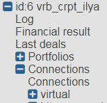

# **3. Начало работы**

Изначально, робот, созданный для клиента, не имеет активных маркетдата и транзакционных подключений к биржам и не содержит ни одного портфеля (это не касается тестовых роботов для виртуальной торговли, там сразу доступно получение маркетдаты со всех поддерживаемых бирж). Поэтому первым делом необходимо настроить подключения для получения маркетдаты, а так же добавить транзакционные подключения.

## **3.1. Настройка подключений**

Видео, наглядно объясняющее процесс настройки подключений:

<iframe width="920" height="516" src="https://www.youtube.com/embed/s412pbSalGo" title="YouTube video player" frameborder="0" allow="accelerometer; autoplay; clipboard-write; encrypted-media; gyroscope; picture-in-picture" allowfullscreen></iframe>

Для настройки подключений в древовидной структуре слева выбираем нужного робота, далее заходим во вкладку `Connections -> Connections`:

В открытом окне видим две таблицы `Data connections` и `Trade connections`.
Первая таблица отвечает за получение рыночных данных с бирж, вторая отвечает за транзакционные подключения.
В `Data connections` выбираем необходимые вам биржи, поставив галки напротив них. Затем в `Action` выбираем пункт `Disable / Enable -> Enable`:

В `Trade connections` выбираем пункт `Add`, откроется окно создания нового транзакционного подключения `Add connection`. В поле `Exchange` выбираете необходимую Вам биржу и заполняете параметры транзакционного подключения.

Когда параметры заполнены, нужно нажать `Add connection`.Теперь транзакционное подключение создано.

## **3.2. Тelegram-бот**

Кроме управления роботом через стандартный web-интерфейс, существует возможность задавать основные параметры робота через Telegram bot. Кроме того, в Telegram bot можно получать [Уведомления](https://fkviking.github.io/bot-doc/docs/05-params/5-4-notifications.html#_5-4-%D0%BF%D0%B0%D1%80%D0%B0%D0%BC%D0%B5%D1%82%D1%80%D1%8B-%D1%83%D0%B2%D0%B5%D0%B4%D0%BE%D0%BC%D0%BB%D0%B5%D0%BD%D0%B8%D0%B8) о работе робота. Настоятельно рекомендуется настроить возможность управления роботом через Telegram bot, так как он является резервным каналом управления роботом (Telegram bot подключается к роботу напрямую и сохраняет возможность управления роботом даже при неработоспособности сайта).

В Telegram найдите бота [VikingTradeBot](https://t.me/VikingTradeBot) и нажмите `/start` вам покажут ваш Telegram ID.

Идите на [https://bot.fkviking.com/#p=telegram](https://bot.fkviking.com/#p=telegram). Впишите ваш Telegram ID и нажмите `Apply`.

После этого подождите несколько минут.

Телеграм-бот подключен к вашему роботу.

Нажмите `/start` снова, чтобы начать работу.

## **3.3. Настройка портфелей**

Видео, наглядно объясняющее процесс создания торгового портфеля:

<iframe width="920" height="516" src="https://www.youtube.com/embed/m6tkfY9KQ_g" title="Создание портфеля" frameborder="0" allow="accelerometer; autoplay; clipboard-write; encrypted-media; gyroscope; picture-in-picture; web-share" allowfullscreen></iframe>

Для того, чтобы добавить портфель в древовидной структуре слева выбираем нужного робота, далее переходим во вкладку `Portfolios -> Portfolios`.
В открывшемся окне нажимаем на кнопку создания нового портфеля `Add`:

В открытом окне даём название портфелю в поле `Name`.
В поле `Exchanges` выбираем биржу, на которой будем искать бумаги и нажимаем кнопку `Reload security list from exchanges` чтобы обновить список доступных на бирже бумаг.
Ниже выбираем необходимые бумаги из списка:

Для упрощения поиска можете использовать фильтр. Просто впишите имя бумаги, например, "USD" и в списке останутся только те бумаги, где присутствует "USD".
Чтобы добавить интересующую бумагу в портфель, необходимо сделать даблклик по зеленому плюсику в строчке соответствующей бумаги. Убедиться, что бумага добавилась, можно посмотрев на список бумаг портфеля `Portfolio securities` чуть выше на странице. В дальнейшем можно будет вернуться на этот шаг и отредактировать бумаги портфеля, удалив лишние и добавив нужные.
Как только бумаги добавлены, можно нажимать кнопку `Add portfolio`. Откроется окно с настройками портфеля. Здесь задаются торговые параметры портфеля и инструментов портфеля, почитать о них можно, нажав на знак вопроса рядом с интересующим параметром, или по ссылкам [Параметры портфеля](https://fkviking.github.io/bot-doc/docs/05-params/5-2-portfolios.html) и [Параметры инструментов портфеля](https://fkviking.github.io/bot-doc/docs/05-params/5-3-securities.html):

Для реальной торговли (не виртуальной) не забудьте в поле `Client code` поменять значение с `virtual`, на то подключение, что вы создали.
Так же внизу страницы можно настроить расписание портфеля:

Можно обозначить начало и конец периода и что в это время должно происходить.
После всех настроек нажмите `Apply` внизу страницы. Теперь портфель создан. Если расписание не было задано, то необходимо включать торговлю по портфелю вручную с помощью флагов `re_sell/re_buy`.

## **3.4. Управление портфелями**

Над таблицей портфелей находится блок кнопок, обеспечивающих управление портфелями.

Кнопка "**►**" - включает торговлю по выбранным портфелям.

Кнопка "**■**" - выключает торговлю по выбранным портфелям.

Заявки по первой ноге снимаются, заявки второй ноги остаются висеть в рынке и переставляются в соответствии с настройками [SL](https://fkviking.github.io/bot-doc/docs/05-params/5-3-securities.html#_5-3-15-sl) и [Timer](https://fkviking.github.io/bot-doc/docs/05-params/5-3-securities.html#_5-3-17-timer).

Кнопка `Action` открывает меню действий, применимых к портфелям. Там содержатся следующие пункты:

**Hard stop** - останавливает торговлю по выбранным портфелям (снимаются галочки `re_sell, re_buy`), пытается снять выставленные заявки по обеим ногам и отключает расписание (снимается флаг `Нет пункта 5.2.24` [Use timetable]()). Это полная остановка торговли по выбранным портфелям, после которой не будет никаких выставлений или переставлений заявок ни по одному из инструментов портфелей.

**Clone portfolio** - клонирует выбранный портфель.

**Reset statuses** - сброс `Sell_status` и `Buy_status` выделенных портфелей. 
Бывают ситуации, например, когда происходят сбои в работе биржи, и получается так, что заявка выставляется роботом, а потом снимается биржей, но никак не информируя робот о снятии. В таком случае заявка зависает в своем текущем, внутреннем для робота, статусе.
Пользоваться это кнопкой можно **ТОЛЬКО В КРАЙНИХ СЛУЧАЯХ**, когда торговля по портфелю отключена и вы уверены что нет ни одной активной заявки по данному портфелю, в противном случае робот потеряет активные заявки, что приведет к неправильной позиции по бумагам в роботе.

**Stop formulas** - останавливает торговлю по выбранным портфелям (снимаются галочки `re_sell, re_buy`), пытается снять выставленные заявки по обеим ногам и отключает расписание (снимается флаг `Нет пункта 5.2.24` [Use timetable]()). Так же отключаются все расчёты по формулам, т.е. снимаются флаги портфеля `Custom_trade` и `Extra_formulas` и для каждого из инструментов портфеля в полях `Count_type` и `Ratio_type` устанавливается тип, соответствующий константному значению. Для дальнейшего использования формул включать их нужно самостоятельно.

**Remove** - удаляет выделенные портфели.

**Disable/Enable** - исключает портфель из расчётов или возвращает портфель обратно в обычный режим работы. Не стоит путать эту возможность с включением и выключением торговли по портфелю. Использование `Disable` позволяет исключить не используемый в данный момент портфель из расчётов, по всем инструментам портфеля перестанут получаться цены и строиться стаканы (только если инструменты не используются в других портфелях). Редактирование параметров `Disabled` портфеля невозможно. Будьте внимательны, перед тем, как перевести портфель в режим `Disabled`, убедитесь, что поля портфеля и его инструменты не используются в формулах других портфелей. Так же следует учитывать, что возвращение инструмента из состояния `Disabled` в рабочее состояние, может привести к переоткрытию торгового стакана.

**Export/Import** - экспортировать выбранный портфель из робота на компьютер в виде `.ini` файла или импортировать портфель в робота.

Кнопка **Table** открывает меню действий, применимых к таблице. Там содержатся следующие пункты: `Columns` - меню редактирования параметров таблицы портфелей. В нём можно скрывать столбцы, перемещать их местами.

**Filter** - включение и отключение окошка фильтра над таблицей. Пункт `Show` показывает окошко фильтра, пункт `Hide` скрывает его. Фильтр служит для поиска среди своих портфелей по параметрам.

### **3.4.1. Клонирование, экспорт и импорт портфелей**

При необходимости создать портфель с минимальными отличиями от существующего, есть возможность клонировать существующий портфель, а потом поменять те настройки, которые должны отличаться. Так же можно использовать возможность клонирования портфеля для переименования (склонировать, задать нужное имя, удалить исходный портфель). Новый портфель всегда создаётся с выключенной торговлей и выключенным расписанием.

Экспорт портфелей позволяет сохранить настройки одного или нескольких портфелей у себя на компьютере в виде ini-файла.

Импорт позволяет добавить портфели из существующего у вас на устройстве ini-файла в робота. Если портфель с таким именем уже существует, то новый портфель не будет импортирован.

### **3.4.2. Замена инструмента портфеля**

Если требуется поменять один из инструментов портфеля, то лучше использовать функцию замены инструмента, а не удаления с последующим добавлением нового инструмента. При замене инструмента будет отображен список всех формул всех портфелей, где используется данный инструмент. Благодаря этому, можно в полуавтоматическом режиме поменять один инструмент на новый во всех формулах. Этот механизм может быть полезен, например, при замене одного фьючерса в портфеле другим. Для того чтобы воспользоваться функцией замены инструмента, нужно зайти в настройки портфеля, в таблице `Securitie`s выбрать инструмент, который следует заменить, далее в меню `Action` выбрать пункт `Replace`.

### **3.4.3. Сброс статусов заявок робота**

В торговом роботе есть механизм отслеживания заявок. Бывают ситуации, например, при сбоях в работе биржи, когда робот не получает от биржи сообщение об изменении статуса заявки (предположим, что заявка снята биржей, а сообщения об этом в робот не поступило). В таких случаях заявка в роботе зависает в своем текущем, внутреннем для робота, статусе. Если пользователь уверен, что ни одной активной заявки по данному портфелю на самом деле нет, а робот ведет себя странно (например, выставляет вторую ногу неправильным объёмом), то пользователь может сбросить статусы всех заявок портфеля кнопкой `Reset statuses`. Пользоваться этой кнопкой можно **ТОЛЬКО В КРАЙНИХ СЛУЧАЯХ**, когда торговля по портфелю отключена, и Вы уверены что нет ни одной активной заявки по данному портфелю, в противном случае робот потеряет активные заявки, что приведет к неправильной позиции по бумагам в роботе.

### **3.4.4. Перевод портфелей в состояние Disabled**

В роботе есть [возможность](https://fkviking.github.io/bot-doc/docs/03-getting-started.html#_3-4-%D1%83%D0%BF%D1%80%D0%B0%D0%B2%D0%BB%D0%B5%D0%BD%D0%B8%D0%B5-%D0%BF%D0%BE%D1%80%D1%82%D1%84%D0%B5%D0%BB%D1%8F%D0%BC%D0%B8) перевести неиспользуемые портфели в неактивное состояние - `Disabled`. Такие портфели исключаются из расчётов. По всем инструментам неактивных портфелей перестанут получаться цены и строиться стаканы (только если инструменты не используются в других портфелях). Пока портфель в неактивном состоянии, торговлю по нему включить нельзя, автоматическое включение торговли по расписанию так же не будет работать.