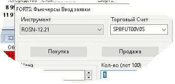
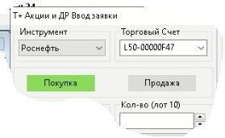
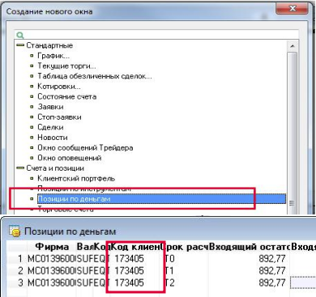

# **4. Добавление подключений**

В данном разделе описаны подключения к биржам/брокерам, рынкам, поддерживаемым роботом, и описаны все параметры, используемые при создании каждого подключения.

## **4.1. MOEX FORTS**

### **4.1.1. TWIME**

При заказе данного подключения следует учесть, что 2 логина по 30 транзакций/сек будут работать лучше, чем один на 60 транзакций/сек (см. [Round robin](/docs/05-params-description.html#_5-3-24-client-code)).

#### **4.1.1.1. Name**

Поле для задания имени подключения. Это значение задается для удобства, чтобы потом в списке транзакционных подключений было проще ориентироваться. Разрешенные символы: `_ a-z A-Z 0-9`

#### **4.1.1.2. Credentials**

Credentials предоставляются брокером.

#### **4.1.1.3. Trading account(s)**

Торговый счёт, предоставляется брокером. Также его можно посмотреть в терминале (если счетов несколько, то они указываются через запятую):

#### **4.1.1.4. Comment**

Уникальный идентификатор для всех заявок для данного подключения, задаётся пользователем для собственного удобства. Представляет из себя целое число от 0 до 1023. Если не используется, оставляем 0. 

#### **4.1.1.5. Round robin**

По-умолчанию включен. Для увеличения производительности можно использовать несколько TWIME подключений с одинаковым [Trading account(s)](/docs/04-creating-connection.html#_4-1-1-3-trading-account-s). При заказе TWIME подключения следует учесть, что 2 логина по 30 транзакций/сек к одному торговому счету в режиме `Round robin` будут работать лучше, чем один логин на 60 транзакций/сек. В этом режиме робот будет бросать заявки в несколько логинов по-очереди.

#### **4.1.1.6. Max trans**

Лимит транзакций в секунду. В анкете пользователя указана производительность логина, где одна единица равна 30 транзакциям в секунду.

#### **4.1.1.7. Reserved trans**

По-умолчанию 0. Количество зарезервированных транзакций в секунду для заявок на удаление. Использование данного параметра уменьшает количество выставлений заявки, доступных за одну секунду [Max trans](/docs/04-creating-connection.html#_4-1-1-6-max-trans), но позволяет увеличить вероятность того, что робот успеет снять заявку при уходе цен.

#### **4.1.1.8. Move order**

По-умолчанию разрешено. Разрешить или запретить использование приказов на переставление (изменение) заявки для данного подключения.

#### **4.1.1.9. Bind IP**

IP-адрес, с которого будет происходить подключение к бирже. IP адрес должен быть указан в договоре с брокером.

### **4.1.2. FAST (FIX Adapted for STreaming)**

Данное подключение имеет в своем составе 4 потока. Это сделано для того, чтобы отделить часто не используемые опционы. А также отделить ресурсоемкий, но быстрый Orderlog от чуть более медленного, но лёгкого потока Best prices.

#### **4.1.2.1. Definitions**

Поток определений финансовых интсрументов. Для того, чтобы подключение работало, нужно обязательно выставить статус Enable для данного потока. Кроме определений инструментов, в нем также ходят их торговые статусы и лимиты цен.

#### **4.1.2.2. Best prices**

Поток лучших цен. Не является обязательным. Автоматически отключается при статусе Enable потока Orderlog, т.к биржа не предусмотрела возможности объединения потоков на FAST срочного рынке.

#### **4.1.2.3. Orderlog**

Поток всех заявок, на его основании строится стакан. Является более быстрым по сравнению с потоком Best prices. При статусе Enable данного потока автоматически отключается поток Best prices, т.к биржа не предусмотрела возможности их объединения.

#### **4.1.2.4. Options definitions**

Для того, чтобы торговать опционами, необходимо перевести данный поток в статус Enable.

## **4.2. MOEX Spot**

### **4.2.1. FIX (Financial Information eXchange)**

При подключении к фондовому рынку советуем заказать сразу 3 (три) логина к одному торговому счету, т.к на фондовом рынке 3 (три) фикс сервера, и иногда один или два могут выйти из строя. Таким образом будет повышена отказоустойчивость вашей торговли [см. Round robin](/docs/05-params-description.html#_5-3-24-client-code).

#### **4.2.1.1. Name**

Поле для задания имени подключения. Это значение задается для удобства, чтобы потом в списке транзакционных подключений было проще ориентироваться. Разрешенные символы: `_ a-z A-Z 0-9`

#### **4.2.1.2. Server**

Адрес FIX-сервера биржи, к которому будет выполняться подключение.

#### **4.2.1.3. SenderCompID**

Значение данного параметра предоставляется брокером.

#### **4.2.1.4. Password**

Пароль для данного FIX-подключения. Если не меняли, то используйте стандартный, указанный в поле для ввода.

Важно: при создании нового подключения, если пароль не удовлетворяет определенным критериям, робот может автоматически сменить пароль. Информацию о смене пароля можно найти в логе робота.
Текущий пароль подключения находится в “дереве” по адресу: ID: XX -> Connections -> astsxxxx_send_XXXX -> Params.

Для транзакционных подключений Московской биржи робот автоматически меняет пароль не чаще, чем один раз в месяц. Уведомление о смене пароля можно найти в логе робота.

#### **4.2.1.5. Trading account(s)**

Торговый счёт, предоставляется брокером. Также его можно посмотреть в терминале (если счетов несколько, то они указываются через запятую):

#### **4.2.1.6. Round robin**

По умолчанию включен.
Для отказоустойчивости советуем использовать сразу три FIX подключения к фондовому рынку с одинаковым [Trading account(s)](/docs/04-creating-connection.html#_4-2-1-5-trading-account-s). В режиме `Round robin` робот будет изпользовать их по-очереди, и внештатное отключение одного из FIX серверов биржи не приведет к остановке торговли.

#### **4.2.1.7. Client code**

Код клиента можно посмотреть в привязанном к счёту терминале (нажать F7 и открыть таблицу "Позиции по деньгам") или запросить у брокера:

#### **4.2.1.8. Firm level account**

Галочка, выставленная в чек-боксе означает, что аккаунт клиента является уровнем фирмы.

#### **4.2.1.9. Bind IP**

IP-адрес, с которого будет происходить подключение к бирже. IP адрес должен быть указан в договоре с брокером.

### **4.2.2. FAST**

Данное подключение имеет в своем составе 3 потока. Это сделано для того, чтобы отделить Orderlog от потока Best prices. Они имеют одинаковомю скорость и биржа предусмотрела возможность их объединения, поэтому их можно включать одновременно. Но Best prices, очевидно, менее ресурсоемкий.

#### **4.2.2.1. Definitions**

Поток определений финансовых интсрументов. Для того, чтобы подключение работало, нужно обязательно выставить статус Enable для данного потока. Кроме определений инструментов, в нем также ходят их торговые статусы и лимиты цен.

#### **4.2.2.2. Best prices**

Поток лучших цен. Советуем включать его одновременно с потоком Orderlog.

#### **4.2.2.3. Orderlog**

Поток всех заявок. Советуем включать его одновременно с потоком Best prices.

## **4.3. MOEX Currency**

### **4.3.1. FIX**

При подключении к валютному рынку советуем заказать сразу 5 (пять) логинов к одному торговому счету, т.к на валютном рынке 5 (пять) фикс серверов, и иногда один или два могут выйти из строя. Таким образом будет повышена отказоустойчивость вашей торговли ([см. Round robin](/docs/05-params-description.html#_5-3-24-client-code)).

#### **4.3.1.1. Name**

Поле для задания имени подключения. Это значение задается для удобства, чтобы потом в списке транзакционных подключений было проще ориентироваться. Разрешенные символы: `_ a-z A-Z 0-9`.

#### **4.3.1.2. Server**

Адрес FIX-сервера биржи, к которому будет выполняться подключение. Для повышения отказоустойчивости следует выбирать разные.

#### **4.3.1.3. SenderCompID**

Значение данного параметра предоставляется брокером.

#### **4.3.1.4. Password**

Пароль для данного FIX-подключения. Если не меняли, то используйте стандартный, указанный в поле для ввода.

Важно: при создании нового подключения, если пароль не удовлетворяет определенным критериям, робот может автоматически сменить пароль. Информацию о смене пароля можно найти в логе робота.
Текущий пароль подключения находится в “дереве” по адресу: ID: XX -> Connections -> astsxxxx_send_XXXX -> Params.

Для транзакционных подключений Московской биржи робот автоматически меняет пароль не чаще, чем один раз в месяц. Уведомление о смене пароля можно найти в логе робота.

#### **4.3.1.5. Trading account(s)**

Торговый счёт, предоставляется брокером, так же можно посмотреть в терминале.
Если счетов несколько, то они указываются их через запятую.

#### **4.3.1.6. Round robin**

Включение и выключение `Round robin`'a для данного коннекта.
Для отказоустойчивости советуем использовать сразу 5 (пять) FIX подключений к валютному рынку с одинаковым [Trading account(s)](/docs/04-creating-connection.html#_4-3-1-5-trading-account-s). В режиме `Round robin` робот будет изпользовать их по-очереди, и внештатное отключение одного из FIX серверов биржи не приведет к остановке торговли.

#### **4.3.1.7. Client code**

Код клиента можно посмотреть в привязанном к счёту терминале (нажать F7 и открыть таблицу "Позиции по деньгам") или запросить у брокера.
При вводе нужно добавить два слеша '//' в конце. В зависимости от инструкций брокера возможно один в конце и один в середине. Если инструкций не было, оставьте два в конце.

#### **4.3.1.8. Firm level account**

Указание на то, что аккаунт пользователя является аккаунтом уровня фирмы. Обычно брокер не знает, какого уровня аккаунт, так что приходится подбирать

#### **4.3.1.9. Bind IP**

IP-адрес, с которого будет происходить подключение к бирже. IP адрес должен быть указан в договоре с брокером.

### **4.3.2. FAST**

Данное подключение имеет в своем составе 3 потока. Это сделано для того, чтобы отделить Orderlog от потока Best prices. Они имеют одинаковомю скорость и биржа предусмотрела возможность их объединения, так что их можно включать одновременно. Но Best prices, очевидно, менее ресурсоемкий.

#### **4.3.2.1. Definitions**

Поток определений финансовых интсрументов. Для того, чтобы подключение работало, нужно обязательно выставить статус Enable для данного потока. Кроме определений инструментов, в нем также ходят их торговые статусы и лимиты цен.

#### **4.3.2.2. Best prices**

Поток лучших цен. Советуем включать его одновременно с потоком Orderlog.

#### **4.3.2.3. Orderlog**

Поток всех заявок. Советуем включать его одновременно с потоком Best prices.

### **4.3.3. FAST Indexes**

Чтобы увидеть и добавить индексы в портфель, необходимо данный поток перевести в статус Enable. Цены по индексам ходят в потоках FAST FUT Best prices и Orderlog срочного рынка. Поэтому должен быть включен один из этих двух потоков.

## **4.4. SPBEX**

### **4.4.1. Рыночные данные (бинарный протокол)**

Маркетдата подключение состоит из нескольких потоков данных. Можно активировать только те потоки, которые необходимы, и отключить ненужные.
Если имя инструмента начинается на SPB_MM_, то это инструмент только СПб ликвидности (заявки и сделки непосредственно с СПб биржи), если же имя начинается на SPB_AGGR_, то это инструмент агрегированной ликвидности с различных бирж. Если вы являетесь маркет-мейкером, то скорее всего вам доступна торговля только в СПб ликвидность.

#### **4.4.1.1. Definitions**

Поток определений финансовых интсрументов. Для того, чтобы подключение работало, нужно обязательно выставить статус Enable для данного потока. Кроме определений инструментов, в нем также ходят их торговые статусы и лимиты цен.

#### **4.4.1.2. Commons**

Поток статистических рыночных параметров. В алгоритме робота никак не используется, но доступен в [C++ интерфейсе](/docs/08-c-api.html#_8-3-%D0%B4%D0%BE%D1%81%D1%82%D1%83%D0%BF-%D0%BA-%D0%B1%D0%B8%D1%80%D0%B6%D0%B5%D0%B2%D1%8B%D0%BC-%D0%B4%D0%B0%D0%BD%D0%BD%D1%8B%D0%BC-%D0%BF%D0%BE-%D1%84%D0%B8%D0%BD%D0%B0%D0%BD%D1%81%D0%BE%D0%B2%D1%8B%D0%BC-%D0%B8%D0%BD%D1%81%D1%82%D1%80%D1%83%D0%BC%D0%B5%D0%BD%D1%82%D0%B0%D0%BC).

#### **4.4.1.3. Top of book**

Поток лучших цен покупки и продажи. Советуем включать его одновременно с потоком Orderbok.

#### **4.4.1.4. Orderbook**

Поток торгового стакана. Советуем включать его одновременно с потоком Top of book.

### **4.4.2. Транзакционный шлюз бинарного протокола**

Убедитесь, что заказали именно бинарный, а не FIX логин. На один логин невозможно добавление нескольких одновременных подключений.

#### **4.4.2.1. Name**

Поле для задания имени подключения. Это значение задается для удобства, чтобы потом в списке транзакционных подключений было проще ориентироваться. Разрешенные символы: `_ a-z A-Z 0-9`.

#### **4.4.2.2. Connection type**

Direct - это обычное подключение, которое напрямую подключается к бирже.
Proxy - используется для торговли несколькими роботами через одно подключение.

#### **4.4.2.3. Login**

Логин для доступа к бирже, берется из договора с биржей.

#### **4.4.2.4. Password**

Пароль для доступа к бирже, берется из договора с биржей.

#### **4.4.2.5. Trading account(s)**

Торговый счёт, берется из договора с биржей. Можно добавить несколько через запятую.

#### **4.4.2.6. Member ID**

Идентификатор участника торгов, по умолчанию равен 0. Если не подойдет, то нужно уточнять у биржи.

#### **4.4.2.7. Client ID**

Идентификатор клиентского кода, берется из договора с биржей.

#### **4.4.2.8. Market ID**

Идентификатор пула ликвидности. Допустимые значения: 0 (ликвидность определяется автоматически по финансовому инструменту), 1000 (для адресных инструментов, ликвидность только СПб биржи) и 1001 (для анонимных инструментов, агрегированная ликвидность).

#### **4.4.2.9. Comment**

Клиентский комментарий к заявкам.

#### **4.4.2.10. Bind IP**

IP-адрес, с которого будет происходить подключение к бирже. IP адрес должен быть указан в договоре.

### **4.4.3. Прокси подключение к транзакционному шлюзу бинарного протокола**

Используется в случае, когда нескольким роботам необходимо торговать через одно и то же транзакционное подключение (т.е. с одного логина). Настраивается службой поддержки по предоставленным пользователем параметрам, параметры те же, что и для [Бинарный торговый](/docs/04-creating-connection.html#_4-4-2-%D0%B1%D0%B8%D0%BD%D0%B0%D1%80%D0%BD%D1%8B%D0%B8-%D1%82%D0%BE%D1%80%D0%B3%D0%BE%D0%B2%D1%8B%D0%B8).

#### **4.4.3.1. Name**

Это значение должно соответствовать названию разделенной области памяти, через которую будет идти обмен сообщениями. Уточняется у службы поддержки.

## **4.5. ALOR OPEN API MOEX**

## **4.6. ALOR OPEN API SPBEX**

## **4.7. EXANTE**

В роботе поддерживается только FIX-подключение к брокеру EXANTE. При добавлении транзакционного подключения создаются два FIX-подключения: маркетдата и транзакционное. Активировать и деактивировать такую пару подключений можно только вместе, т.е. при попытке деактивировать маркетдата подключение будет деактивировано соответствующее транзакционное подключение и наоборот. Так как брокер EXANTE может предоставлять рыночные данные с большого числа бирж, то поле [Exchange filter](/docs/04-creating-connection.html#_4-5-11-exchange-filter), с указанием списка необходимых бирж, является обязательным для заполнения. Настоятельно рекомендуется указывать только те биржи, инструментами с которых действительно планируется пользоваться.

### **4.7.1. Name**

Поле для задания имени подключения. Это значение задается для удобства, чтобы потом в списке транзакционных подключений было проще ориентироваться. Разрешенные символы: `_ a-z A-Z 0-9`.

### **4.7.2. Conn type**

Выбор сервера, к которому будет осуществляться подключение. Все сервера идентичны с точки зрения протокола и предоставляемой информации. Разница только в их местоположении.

### **4.7.3. SenderCompID (trade)**

Уникальный идентификатор клиента для торгового подключения, предоставляется брокером.

### **4.7.4. Password (trade)**

Пароль для торгового подключения, предоставляется брокером. Если брокер предоставил только один пароль, то, скорее всего пароли маркетдата и торгового подключений совпадают.

### **4.7.5. Trading account(s)**

Идентификатор аккаунта клиента, берется у брокера. Можно добавить несколько через запятую.

### **4.7.6. Max trans**

Один из параметров системы предупреждения флуда. Чтобы не натыкаться на флуд-контроль со стороны брокера, мы сами считаем отправляемые сообщения. Этот параметр определяет количество сообщений за промежуток времени. Если количество сообщений за временной промежуток [Max trans interval](/docs/04-creating-connection.html#_4-5-7-max-trans-interval) выше данного значения, то робот перестаёт отправлять сообщения брокеру.

### **4.7.7. Max trans interval**

Один из параметров системы предупреждения флуда. Чтобы не натыкаться на флуд-контроль со стороны брокера, мы сами считаем отправляемые сообщения. Этот параметр определяет промежуток времени. Если количество сообщений за этот временной промежуток выше значения [Max trans](/docs/04-creating-connection.html#_4-5-6-max-trans), то робот перестаёт отправлять сообщения брокеру.

### **4.7.8. Transactions reserved**

Один из параметров системы предупреждения флуда. Этот параметр определяет сколько транзакций зарезервировано под снятие заявок во временной промежуток [Max trans interval](/docs/04-creating-connection.html#_4-5-7-max-trans-interval). Т.е. даже если выставление заявок будет нарываться на внутренний флуд контроль робота, робот сможет отправить заявки на снятие в количестве Transactions reserved штук.

### **4.7.9. SenderCompID (feed)**

Уникальный идентификатор клиента для маркетдата подключения, предоставляется брокером.

### **4.7.10. Password (feed)**

Пароль для маркетдата подключения, предоставляется брокером. Если брокер предоставил только один пароль, то, скорее всего пароли маркетдата и торгового подключений совпадают.

### **4.7.11. Exchange filter**

Список бирж (через запятую), данные с которых планируется получать. Необходимо указать хотя бы одну биржу. На текущий момент известно о возможности получения данных со следующих рынков:  
`a3ecs, absv, adc, af, ai, aicf, aig, aix, altimaam, am1, amex, apis, arca, arg, argo, asc, ascg, asn, asx, asyl, ath, aud, audc, avm, avtf, bats, bist, blackbox, bm, bmf, bmi, bostonzechiel, btm, c.index, cad, carf, cboe, cbot, ccf, chf, cme, comex, courant, cpf, cpm, dam, dcm, diadema, diamageca, dim, dml, dnci, dominion, dsl, e, eam, ec, egam, emea, enam, esplanade, eur, eurex, euronext, exante, fiscoam, forts, fqf, fqifl, fwb, gbp, geist, gk, ham, hkex, htf, ice, inc, index, ipo, iq69, iqsf, jordancap, jse, kgrcap, kif, ky, laif, lat, lcm, lgml, libor, liffe, llcp, lme, lse, lseaim, lseiob, lux, lvam, micex, mifm, mil, moex.tom, mpi, mse, mtg, muskokacap, nasdaq, ncc, ncl, nf, niton, nnps, nomx, ns, nse, nymex, nyse, nzx, oameur, oamusd, oe, oef, oic, omxc, omxh, ose, otcbb, otcmkts, paf, pils, pl, pse, pvb, quan, rig, rub, sb, sek, sgx, sicav, six, smn, somx, ssh, tase, tmx, tocom, tse, tsf, uah, us, uscorp, usd, vse, wcf, wse, xetra, xpira`.

### **4.7.12. Bind IP**

Для уточнения IP адреса необходимо обратиться в поддержку. Адрес, указанный в этом поле, не следует предоставлять бирже, как адрес сервера.

## **4.8. CQG**

В роботе поддерживается только транзакционное FIX-подключение к брокеру CQG. Транзакционное подключение CQG может работать только в паре с маркетдата подключением EXANTE. Так как на EXANTE и CQG имена тикеров не совпадают, то при добавлении подключения CQG следует заполнить словарь соответствия имён тикеров [Securities dictionary](/docs/04-creating-connection.html#_4-6-7-securities-dictionary), добавив туда те инструменты, которыми планируется пользоваться.

### **4.8.1. Name**

Поле для задания имени подключения. Это значение задается для удобства, чтобы потом в списке транзакционных подключений было проще ориентироваться. Разрешенные символы: `_ a-z A-Z 0-9`.

### **4.8.2. Server**

Выбор сервера, к которому будет осуществляться подключение. Все сервера идентичны с точки зрения протокола и предоставляемой информации. Разница только в их местоположении.

### **4.8.3. SenderCompID**

Уникальный идентификатор клиента, предоставляется брокером.

### **4.8.4. Password**

Пароль для подключения, предоставляется брокером.

### **4.8.5. SenderSubID**

Дополнительный идентификатор подключения. Следует оставить значение по умолчанию, если брокером не предоставлено другое значение.

### **4.8.6. Client code**

Код клиента, предоставляется брокером.

### **4.8.7. Securities dictionary**

Словарь соответствия имён тикеров EXANTE:CQG. Заполняется в соответствии с примером.

### **4.8.8. Add market-data connection**

Необходимо выставить галочку в чек-боксе. Если есть своё (не шареное) подключение Exante, то эту галочку ставить не надо.

### **4.8.9. Market-data key**

Параметр появлется после высавления галочки [Add market-data connection](/docs/04-creating-connection.html#_4-6-8-add-market-data-connection)

### **4.8.10. Bind IP**

Для уточнения IP адреса необходимо обратиться в поддержку. Адрес, указанный в этом поле, не следует предоставлять бирже, как адрес сервера.

## **4.9. KRAKEN**

Подключение к рынку Spot биржи KRAKEN. В роботе поддерживается только подключение на основе Websocket и REST API. Маркетдата подключение активируется как описано в  разделе [3.1 Настройка подключений](/docs/03-getting-started.html#_3-1-%D0%BD%D0%B0%D1%81%D1%82%D1%80%D0%BE%D0%B8%D0%BA%D0%B0-%D0%BF%D0%BE%D0%B4%D0%BA%D0%BB%D1%8E%D1%87%D0%B5%D0%BD%D0%B8%D0%B8). Параметры транзакционного подключения описаны ниже.

### **4.9.1. Name**

Поле для задания имени подключения. Это значение задается для удобства, чтобы потом в списке транзакционных подключений было проще ориентироваться. Разрешенные символы: `_ a-z A-Z 0-9`.

### **4.9.2. API Key**

Публичный ключ для доступа к API биржи, создаётся в личном кабинете на сайте биржи вместе с соотвествующим секретным ключом. Находится в настройках в разделе API. Для ключа следует установить следующие разрешения: "Query Funds", "Query Open Orders & Trades", "Query Closed Orders & Trades", "Create & Modify Orders", "Cancel/Close Orders", "Access WebSockets API", "Export Data". Ключ должен быть новым, не использованным нигде ранее.

### **4.9.3. Secret**

Секретный ключ для доступа к API биржи, создаётся в личном кабинете на сайте биржи. Создаётся вместе с соотвествующим публичным ключом. Находится в настройках в разделе API. Для ключа следует установить следующие разрешения: "Query Funds", "Query Open Orders & Trades", "Query Closed Orders & Trades", "Create & Modify Orders", "Cancel/Close Orders", "Access WebSockets API", "Export Data". Ключ должен быть новым, не использованным нигде ранее.

### **4.9.4. Cancel on disconnect**

Флаг, отвечающий за автоматическое снятие заявок биржей, при разрыве связи между биржей и роботом.

### **4.9.5. Bind IP**

Если в договоре не прописано подключение с фиксированного IP-адреса, то следует указать значение `Automatic`. В противном случае следует обратиться в поддержку для уточнения адреса сервера. Адрес, указанный в этом поле, не следует предоставлять бирже, как адрес сервера.

## **4.10. BITFINEX**

В роботе поддерживается только подключение на основе Websocket и REST API. В транзакционном подключении используется две пары ключей для доступа к API, эти ключи должны быть различными. Маркетдата подключение активируется как описано в главе [Настройка подключений](/docs/03-getting-started.html#_3-1-%D0%BD%D0%B0%D1%81%D1%82%D1%80%D0%BE%D0%B8%D0%BA%D0%B0-%D0%BF%D0%BE%D0%B4%D0%BA%D0%BB%D1%8E%D1%87%D0%B5%D0%BD%D0%B8%D0%B8). Параметры транзакционного подключения описаны ниже.

### **4.10.1. Name**

Поле для задания имени подключения. Это значение пользователь задаёт для своего удобства, чтобы потом в списке транзакционных подключений ему было проще ориентироваться. Разрешенные символы: `_ a-z A-Z 0-9`

### **4.10.2. Margin account**

Указатель на то, что ваш аккаунт является маржинальным.

### **4.10.3. API key#0**

Первый публичный ключ для доступа к API биржи, создаётся в личном кабинете на сайте биржи. Создаётся вместе с соотвествующим секретным ключом. Находится в настройках в разделе API. Для ключа следует установить все возможные разрешения на чтение и запись. Ключ должен быть новым, не использованным нигде ранее.

### **4.10.4. API key secret#0**

Первый секретный ключ для доступа к API биржи, создаётся в личном кабинете на сайте биржи. Создаётся вместе с соотвествующим публичным ключом. Находится в настройках в разделе API. Для ключа следует установить все возможные разрешения на чтение и запись. Ключ должен быть новым, не использованным нигде ранее.

### **4.10.5. API key#1**

Второй публичный ключ для доступа к API биржи, создаётся в личном кабинете на сайте биржи. Создаётся вместе с соотвествующим секретным ключом. Находится в настройках в разделе API. Для ключа следует установить все возможные разрешения на чтение и запись. Ключ должен быть новым, не использованным нигде ранее.

### **4.10.6. API key secret#1**

Второй секретный ключ для доступа к API биржи, создаётся в личном кабинете на сайте биржи. Создаётся вместе с соотвествующим публичным ключом. Находится в настройках в разделе API. Для ключа следует установить все возможные разрешения на чтение и запись. Ключ должен быть новым, не использованным нигде ранее.

### **4.10.7. Bind IP**

Если в договоре не прописано подключение с фиксированного IP-адреса, то следует указать значение `Automatic`. В противном случае следует обратиться в поддержку для уточнения адреса сервера. Адрес, указанный в этом поле, не следует предоставлять бирже, как адрес сервера.

## **4.11. HitBTC**

В роботе поддерживается только подключение к секции Spot биржи HitBTC на основе Websocket и REST API. Маркетдата подключение активируется как описано в главе [Настройка подключений](/docs/03-getting-started.html#_3-1-%D0%BD%D0%B0%D1%81%D1%82%D1%80%D0%BE%D0%B8%D0%BA%D0%B0-%D0%BF%D0%BE%D0%B4%D0%BA%D0%BB%D1%8E%D1%87%D0%B5%D0%BD%D0%B8%D0%B8). Параметры транзакционного подключения описаны ниже.

### **4.11.1. Name**

Поле для задания имени подключения. Это значение пользователь задаёт для своего удобства, чтобы потом в списке транзакционных подключений ему было проще ориентироваться. Разрешенные символы: `_ a-z A-Z 0-9`

### **4.11.2. API Key**

Публичный ключ для доступа к API биржи, создаётся в личном кабинете на сайте биржи. Создаётся вместе с соотвествующим секретным ключом. Находится в настройках аккаунта в разделе API keys. Для ключа следует установить следующие разрешения: "Order book, History, Trading balance", "Place/cancel orders", "Payment information". Ключ должен быть новым, не использованным нигде ранее.

### **4.11.3. Secret**

Секретный ключ для доступа к API биржи, создаётся в личном кабинете на сайте биржи. Создаётся вместе с соотвествующим публичным ключом. Находится в настройках аккаунта в разделе API keys. Для ключа следует установить следующие разрешения: "Order book, History, Trading balance", "Place/cancel orders", "Payment information". Ключ должен быть новым, не использованным нигде ранее.

### **4.11.4. Bind IP**

Если в договоре не прописано подключение с фиксированного IP-адреса, то следует указать значение `Automatic`. В противном случае следует обратиться в поддержку для уточнения адреса сервера. Адрес, указанный в этом поле, не следует предоставлять бирже, как адрес сервера.

## **4.12. BITMEX**

Подключение к рынку Spot биржи KRAKEN. В роботе поддерживается только подключение на основе Websocket и REST API. В транзакционном подключении используется две пары ключей для доступа к API, эти ключи должны быть различными. Маркетдата подключение активируется как описано в главе [Настройка подключений](/docs/03-getting-started.html#_3-1-%D0%BD%D0%B0%D1%81%D1%82%D1%80%D0%BE%D0%B8%D0%BA%D0%B0-%D0%BF%D0%BE%D0%B4%D0%BA%D0%BB%D1%8E%D1%87%D0%B5%D0%BD%D0%B8%D0%B8). Параметры транзакционного подключения описаны ниже.

### **4.12.1. Name**

Поле для задания имени подключения. Это значение пользователь задаёт для своего удобства, чтобы потом в списке транзакционных подключений ему было проще ориентироваться. Разрешенные символы: `_ a-z A-Z 0-9`

### **4.12.2. ID#0**

Первый публичный ключ для доступа к API биржи, создаётся в личном кабинете на сайте биржи. Создаётся вместе с соотвествующим секретным ключом. Находится в настройках в разделе API Keys. Для ключа следует установить разрешение "Order". Ключ должен быть новым, не использованным нигде ранее.

### **4.12.3. Secret#0**

Первый секретный ключ для доступа к API биржи, создаётся в личном кабинете на сайте биржи. Создаётся вместе с соотвествующим публичным ключом. Находится в настройках в разделе API Keys. Для ключа следует установить разрешение "Order". Ключ должен быть новым, не использованным нигде ранее.

### **4.12.4. ID#1**

Второй публичный ключ для доступа к API биржи, создаётся в личном кабинете на сайте биржи. Создаётся вместе с соотвествующим секретным ключом. Находится в настройках в разделе API Keys. Для ключа следует установить разрешение "Order". Ключ должен быть новым, не использованным нигде ранее.

### **4.12.5. Secret#1**

Второй секретный ключ для доступа к API биржи, создаётся в личном кабинете на сайте биржи. Создаётся вместе с соотвествующим публичным ключом. Находится в настройках в разделе API Keys. Для ключа следует установить разрешение "Order". Ключ должен быть новым, не использованным нигде ранее.

### **4.12.6. Bind IP**

Если в договоре не прописано подключение с фиксированного IP-адреса, то следует указать значение `Automatic`. В противном случае следует обратиться в поддержку для уточнения адреса сервера. Адрес, указанный в этом поле, не следует предоставлять бирже, как адрес сервера.

## **4.13. BINANCE**

Подключение к рынку Spot биржи Binance в режимах Spot или Margin. В роботе поддерживается только подключение на основе Websocket и REST API. Маркетдата подключение активируется как описано в главе [Настройка подключений](/docs/03-getting-started.html#_3-1-%D0%BD%D0%B0%D1%81%D1%82%D1%80%D0%BE%D0%B8%D0%BA%D0%B0-%D0%BF%D0%BE%D0%B4%D0%BA%D0%BB%D1%8E%D1%87%D0%B5%D0%BD%D0%B8%D0%B8). Параметры транзакционного подключения описаны ниже.

### **4.13.1. Name**

Поле для задания имени подключения. Это значение задается для удобства, чтобы потом в списке транзакционных подключений было проще ориентироваться. Разрешенные символы: `_ a-z A-Z 0-9`

### **4.13.2. Margin account**

Указатель на то, что ваш аккаунт является маржинальным. Если устанавливаете данный флаг, убедитесь, что ваш ключ имеет разрешение "Enable Margin".

### **4.13.3. API Key**

Публичный ключ для доступа к API биржи, создаётся в личном кабинете на сайте биржи. Создаётся вместе с соотвествующим секретным ключом. Находится в настройках аккаунта в разделе API Management. Для ключа следует установить разрешения "Read Info", "Enable Trading". Если предполагается маржинальная торговля, то следует так же установить разрешение "Enable Margin". Ключ должен быть новым, не использованным нигде ранее.

### **4.13.4. Secret**

Первый секретный ключ для доступа к API биржи, создаётся в личном кабинете на сайте биржи. Создаётся вместе с соотвествующим публичным ключом. Находится в настройках аккаунта в разделе API Management. Для ключа следует установить разрешения "Read Info", "Enable Trading". Если предполагается маржинальная торговля, то следует так же установить разрешение "Enable Margin". Ключ должен быть новым, не использованным нигде ранее.

### **4.13.5. Bind IP**

Если в договоре не прописано подключение с фиксированного IP-адреса, то следует указать значение `Automatic`. В противном случае следует обратиться в поддержку для уточнения адреса сервера. Адрес, указанный в этом поле, не следует предоставлять бирже, как адрес сервера.

## **4.14. BINANCEFUT**

Подключение к рынку USD-M Futures биржи Binance. В роботе поддерживается только подключение на основе Websocket и REST API. Маркетдата подключение активируется как описано в главе [Настройка подключений](/docs/03-getting-started.html#_3-1-%D0%BD%D0%B0%D1%81%D1%82%D1%80%D0%BE%D0%B8%D0%BA%D0%B0-%D0%BF%D0%BE%D0%B4%D0%BA%D0%BB%D1%8E%D1%87%D0%B5%D0%BD%D0%B8%D0%B8). Параметры транзакционного подключения описаны ниже.

### **4.14.1. Name**

Поле для задания имени подключения. Это значение задается для удобства, чтобы потом в списке транзакционных подключений было проще ориентироваться. Разрешенные символы: `_ a-z A-Z 0-9`

### **4.12.2. Conn type**

Выбор типа подключения. Если никаких договоренностей с биржей по поводу прямого подключения нет, то стоит выбрать тип REGULAR. Если есть договоренности с биржей по прямому подключению, то предварительно нужно обратиться в поддержку и узнать IP-адрес сервера, с которого будет осуществляться торговля, после этого при создании подключения стоит выбрать один из вариантов WHITELIST.

### **4.12.3. API Key**

Публичный ключ для доступа к API биржи, создаётся в личном кабинете на сайте биржи. Создаётся вместе с соотвествующим секретным ключом. Находится в настройках аккаунта в разделе API Management. Для ключа следует установить разрешения "Read Info", "Enable Trading" и "Enable Future".

### **4.12.4. Secret**

Первый секретный ключ для доступа к API биржи, создаётся в личном кабинете на сайте биржи. Создаётся вместе с соотвествующим публичным ключом. Находится в настройках аккаунта в разделе API Management. Для ключа следует установить разрешения "Read Info", "Enable Trading" и "Enable Future".

### **4.12.5. Bind IP**

Если в договоре не прописано подключение с фиксированного IP-адреса, то следует указать значение `Automatic`. В противном случае следует обратиться в поддержку для уточнения адреса сервера. Адрес, указанный в этом поле, не следует предоставлять бирже, как адрес сервера.

## **4.13. BINANCECM**

Подключение к рынку COIN-M Futures биржи Binance. В роботе поддерживается только подключение на основе Websocket и REST API. Маркетдата подключение активируется как описано в главе [Настройка подключений](/docs/03-getting-started.html#_3-1-%D0%BD%D0%B0%D1%81%D1%82%D1%80%D0%BE%D0%B8%D0%BA%D0%B0-%D0%BF%D0%BE%D0%B4%D0%BA%D0%BB%D1%8E%D1%87%D0%B5%D0%BD%D0%B8%D0%B8). Параметры транзакционного подключения описаны ниже.

### **4.13.1. Name**

Поле для задания имени подключения. Это значение задается для удобства, чтобы потом в списке транзакционных подключений было проще ориентироваться. Разрешенные символы: `_ a-z A-Z 0-9`

### **4.13.2. API Key**

Публичный ключ для доступа к API биржи, создаётся в личном кабинете на сайте биржи. Создаётся вместе с соотвествующим секретным ключом. Находится в настройках аккаунта в разделе API Management. Для ключа следует установить разрешения "Read Info", "Enable Trading" и "Enable Future".

### **4.13.3. Secret**

Первый секретный ключ для доступа к API биржи, создаётся в личном кабинете на сайте биржи. Создаётся вместе с соотвествующим публичным ключом. Находится в настройках аккаунта в разделе API Management. Для ключа следует установить разрешения "Read Info", "Enable Trading" и "Enable Future".

### **4.13.4. Bind IP**

Если в договоре не прописано подключение с фиксированного IP-адреса, то следует указать значение `Automatic`. В противном случае следует обратиться в поддержку для уточнения адреса сервера. Адрес, указанный в этом поле, не следует предоставлять бирже, как адрес сервера.

## **4.14. BINANCEOPT**

Подключение к рынку Vanilla Options биржи Binance. В роботе поддерживается только подключение на основе Websocket и REST API. В связи с особенностями данного API восстановление состояния заявок при разрывах связи не гарантируется, поэтому использовать транзакционное подключение не рекомендуется. Маркетдата подключение активируется как описано в главе [Настройка подключений](/docs/03-getting-started.html#_3-1-%D0%BD%D0%B0%D1%81%D1%82%D1%80%D0%BE%D0%B8%D0%BA%D0%B0-%D0%BF%D0%BE%D0%B4%D0%BA%D0%BB%D1%8E%D1%87%D0%B5%D0%BD%D0%B8%D0%B8). Параметры транзакционного подключения описаны ниже.

### **4.14.1. Name**

Поле для задания имени подключения. Это значение задается для удобства, чтобы потом в списке транзакционных подключений было проще ориентироваться. Разрешенные символы: `_ a-z A-Z 0-9`

### **4.14.2. API Key**

Публичный ключ для доступа к API биржи, создаётся в личном кабинете на сайте биржи. Создаётся вместе с соотвествующим секретным ключом. Находится в настройках аккаунта в разделе API Management. Для ключа следует установить разрешения "Read Info", "Enable Trading" и "Enable Vanilla Options".

### **4.14.3. Secret**

Первый секретный ключ для доступа к API биржи, создаётся в личном кабинете на сайте биржи. Создаётся вместе с соотвествующим публичным ключом. Находится в настройках аккаунта в разделе API Management. Для ключа следует установить разрешения "Read Info", "Enable Trading" и "Enable Vanilla Options".

### **4.14.4. Bind IP**

Если в договоре не прописано подключение с фиксированного IP-адреса, то следует указать значение `Automatic`. В противном случае следует обратиться в поддержку для уточнения адреса сервера. Адрес, указанный в этом поле, не следует предоставлять бирже, как адрес сервера.

## **4.15. DERIBIT**

В роботе поддерживается только подключение на основе Websocket API. Возможны два варианта добавления маркетдата подключения:

1. Публичное маркетдата подключение активируется как описано в главе [Настройка подключений](/docs/03-getting-started.html#_3-1-%D0%BD%D0%B0%D1%81%D1%82%D1%80%D0%BE%D0%B8%D0%BA%D0%B0-%D0%BF%D0%BE%D0%B4%D0%BA%D0%BB%D1%8E%D1%87%D0%B5%D0%BD%D0%B8%D0%B8);
2. Если Вы создаёте транзакционное подключение, то можете установить флаг [Create fast data connection](/docs/04-creating-connection.html#_4-15-5-create-fast-data-connection), в таком случае будет создано маркетдата подключение, использующее для авторизации те же ключи, что и торговое подключение. Маркетдата подключение, созданное по второму варианту, будет несколько быстрее реагировать на рыночную ситуацию, кроме того, активировать и деактивировать такое пару подключение можно только вместе с транзакционным подключением. Параметры транзакционного подключения описаны ниже.

### **4.15.1. Name**

Поле для задания имени подключения. Это значение задается для удобства, чтобы потом в списке транзакционных подключений было проще ориентироваться. Разрешенные символы: `_ a-z A-Z 0-9`

### **4.15.2. Server**

Выбор между боевым и тестовым контурами. По умолчанию подключение создаётся к боевому контуру.

### **4.15.3. Access Key**

Публичный ключ для доступа к API биржи, создаётся в личном кабинете на сайте биржи. Создаётся вместе с соотвествующим секретным ключом. Находится в настройках аккаунта в разделе API. Для ключа следует установить разрешение read_write в поле Trade и read для остальных полей.

### **4.15.4. Access secret**

Секретный ключ для доступа к API биржи, создаётся в личном кабинете на сайте биржи. Создаётся вместе с соотвествующим публичным ключом. Находится в настройках аккаунта в разделе API. Для ключа следует установить разрешение read_write в поле Trade и read для остальных полей.

### **4.15.5. Create fast data connection**

Поставьте данный флаг, если хотите создать быстрое маркетдата подключение с той же парой ключей, что и транзакционное подключение.

### **4.15.6. Bind IP**

Если в договоре не прописано подключение с фиксированного IP-адреса, то следует указать значение `Automatic`. В противном случае следует обратиться в поддержку для уточнения адреса сервера. Адрес, указанный в этом поле, не следует предоставлять бирже, как адрес сервера.

## **4.16. OKEX**

Подключение к площадкам SPOT, SWAP, FUTURES, OPTION биржи OKEX в режимах cross, isolated, cash. В роботе поддерживается только подключение на основе Websocket и REST API. Маркетдата подключение активируется как описано в главе [Настройка подключений](/docs/03-getting-started.html#_3-1-%D0%BD%D0%B0%D1%81%D1%82%D1%80%D0%BE%D0%B8%D0%BA%D0%B0-%D0%BF%D0%BE%D0%B4%D0%BA%D0%BB%D1%8E%D1%87%D0%B5%D0%BD%D0%B8%D0%B8). Параметры транзакционного подключения описаны ниже.

### **4.16.1. Name**

Поле для задания имени подключения. Это значение задается для удобства, чтобы потом в списке транзакционных подключений было проще ориентироваться. Разрешенные символы: `_ a-z A-Z 0-9`

### **4.16.2. Conn type**

Выбор сервера, к которому будет осуществляться подключение. Если вы планируете осуществлять торговлю с сервера, размещенного на AWS, то стоит вырать вариант AMAZON.

### **4.16.3. API Key**

Публичный ключ для доступа к API биржи, создаётся в личном кабинете на сайте биржи. Создаётся вместе с соотвествующим секретным ключом. Находится в настройках аккаунта в разделе API. Для ключа следует установить разрешения на чтение и торговлю. В поле "Order placement mode" должен быть выбран режим "Net". Ключ должен быть новым, не использованным нигде ранее.

### **4.16.4. Secret Key**

Секретный ключ для доступа к API биржи, создаётся в личном кабинете на сайте биржи. Создаётся вместе с соотвествующим публичным ключом. Находится в настройках аккаунта в разделе API. Для ключа следует установить разрешения на чтение и торговлю. В поле "Order placement mode" должен быть выбран режим "Net". Ключ должен быть новым, не использованным нигде ранее.

### **4.16.5. Password**

Пароль для доступа к бирже.

### **4.16.6. Bind IP**

Если в договоре не прописано подключение с фиксированного IP-адреса, то следует указать значение `Automatic`. В противном случае следует обратиться в поддержку для уточнения адреса сервера. Адрес, указанный в этом поле, не следует предоставлять бирже, как адрес сервера.

## **4.17. BEQUANT**

В роботе поддерживаются подключения к BEQUANT как на основе Websocket и REST API, так и на базе FIX протокола. Публичное маркетдата подключение на основе Websocket и REST API активируется как описано в главе [Настройка подключений](/docs/03-getting-started.html#_3-1-%D0%BD%D0%B0%D1%81%D1%82%D1%80%D0%BE%D0%B8%D0%BA%D0%B0-%D0%BF%D0%BE%D0%B4%D0%BA%D0%BB%D1%8E%D1%87%D0%B5%D0%BD%D0%B8%D0%B8). При создании транзакционного подключения можно выбрать какой из вариантов подключений использовать. При добавлении транзакционного FIX-подключения создаются два FIX-подключения: маркетдата и транзакционное. Активировать и деактивировать такую пару подключений можно только вместе, т.е. при попытке деактивировать маркетдата подключение будет деактивировано соответствующее транзакционное подключение и наоборот. Параметры транзакционного подключения описаны ниже.

### **4.17.1. Name**

Поле для задания имени подключения. Это значение задается для удобства, чтобы потом в списке транзакционных подключений было проще ориентироваться. Разрешенные символы: `_ a-z A-Z 0-9`

### **4.17.2. Conn type**

Тип подключения. Доступные варианты FIX и WEBSOCKET. Подключение WEBSOCKET можно использовать с ключами, сгенерированными самостоятельно в личном кабинете на сайте биржи. Подключение FIX требует обращения в поддержку биржи для получения доступа.

#### **4.17.2.1. Поля для подключения FIX**

FIX подключение требует создания VPN-соединения, поэтому, перед добавлением подключения обратитесь в поддержку и предоставьте параметры VPN-соединения.

##### **4.17.2.1.1. Server**

Выбор сервера для подключения. Если нужного адреса нет в списке, обратитесь в поддержку.

##### **4.17.2.1.2. Exchange account id**

Идентификатор пользователя на бирже, может быть найден в личном кабинете пользователя, либо запрошен у поддержки биржи. Следует указывать сам идентификатор без префиксов "login_", "user_" и т.д.

##### **4.17.2.1.3. Password**

Пароль для FIX-подключения. Присылается биржей вместе с остальными параметрами FIX-подключения.

#### **4.17.2.2. Поля для подключения WEBSOCKET**

##### **4.17.2.2.1. API**

Публичный ключ для доступа к API биржи, создаётся в личном кабинете на сайте биржи. Создаётся вместе с соотвествующим секретным ключом. Находится в настройках аккаунта в раделе "API keys". Для ключа следует установить разрешения "Order book, History, Trading balance", "Place/cancel orders", "Payment information". Ключ должен быть новым, не использованным нигде ранее.

##### **4.17.2.2.2. Secret**

Секретный ключ для доступа к API биржи, создаётся в личном кабинете на сайте биржи. Создаётся вместе с соотвествующим публичным ключом. Находится в настройках аккаунта в раделе "API keys". Для ключа следует установить разрешения "Order book, History, Trading balance", "Place/cancel orders", "Payment information". Ключ должен быть новым, не использованным нигде ранее.

### **4.17.3. Bind IP**

Если в договоре не прописано подключение с фиксированного IP-адреса, то следует указать значение `Automatic`. В противном случае следует обратиться в поддержку для уточнения адреса сервера. Адрес, указанный в этом поле, не следует предоставлять бирже, как адрес сервера.

## **4.18. KRAKENFUT**

Подключение к рынку Futures биржи KRAKEN. В роботе поддерживается только подключение на основе Websocket и REST API. Маркетдата подключение активируется как описано в главе [Настройка подключений](/docs/03-getting-started.html#_3-1-%D0%BD%D0%B0%D1%81%D1%82%D1%80%D0%BE%D0%B8%D0%BA%D0%B0-%D0%BF%D0%BE%D0%B4%D0%BA%D0%BB%D1%8E%D1%87%D0%B5%D0%BD%D0%B8%D0%B8). Параметры транзакционного подключения описаны ниже.

### **4.18.1. Name**

Поле для задания имени подключения. Это значение задается для удобства, чтобы потом в списке транзакционных подключений было проще ориентироваться. Разрешенные символы: `_ a-z A-Z 0-9`

### **4.18.2. Conn type**

Выбор типа подключения. Если никаких договоренностей с биржей по поводу прямого подключения нет, то стоит выбрать тип REGULAR. Если есть договоренности с биржей по прямому подключению, то предварительно нужно обратиться в поддержку и узнать IP-адрес сервера, с которого будет осуществляться торговля, после этого при создании подключения стоит выбрать тип DIRECT.

### **4.18.3. API Key**

Публичный ключ для доступа к API биржи, создаётся в личном кабинете на сайте биржи. Создаётся вместе с соотвествующим секретным ключом. Находится в настройках в разделе API. Для ключа следует установить уровень доступа "Full access". Ключ должен быть новым, не использованным нигде ранее.

### **4.18.4. Secret**

Секретный ключ для доступа к API биржи, создаётся в личном кабинете на сайте биржи. Создаётся вместе с соотвествующим публичным ключом. Находится в настройках в разделе API. Для ключа следует установить уровень доступа "Full access". Ключ должен быть новым, не использованным нигде ранее.

### **4.18.5. Cancel on disconnect**

Флаг, отвечающий за автоматическое снятие заявок биржей, при разрыве связи между биржей и роботом.

### **4.18.6. Bind IP**

Если в договоре не прописано подключение с фиксированного IP-адреса, то следует указать значение `Automatic`. В противном случае следует обратиться в поддержку для уточнения адреса сервера. Адрес, указанный в этом поле, не следует предоставлять бирже, как адрес сервера.

## **4.19. KUCOIN**

В роботе поддерживается только подключение на основе Websocket и REST API. Маркетдата подключение активируется как описано в главе [Настройка подключений](/docs/03-getting-started.html#_3-1-%D0%BD%D0%B0%D1%81%D1%82%D1%80%D0%BE%D0%B8%D0%BA%D0%B0-%D0%BF%D0%BE%D0%B4%D0%BA%D0%BB%D1%8E%D1%87%D0%B5%D0%BD%D0%B8%D0%B8). Параметры транзакционного подключения описаны ниже.

### **4.19.1. Name**

Поле для задания имени подключения. Это значение задается для удобства, чтобы потом в списке транзакционных подключений было проще ориентироваться. Разрешенные символы: `_ a-z A-Z 0-9`

### **4.19.2. Passphrase**

Фраза-пароль для доступа к бирже.

### **4.19.3. Key**

Публичный ключ для доступа к API биржи, создаётся в личном кабинете на сайте биржи. Создаётся вместе с соотвествующим секретным ключом. Находится чаще всего по пути Настройки - Безопасность - API.

### **4.19.4. Secret**

Секретный ключ для доступа к API биржи, создаётся в личном кабинете на сайте биржи. Создаётся вместе с соотвествующим публичным ключом. Находится чаще всего по пути Настройки - Безопасность - API.

### **4.19.5. Bind IP**

Если в договоре не прописано подключение с фиксированного IP-адреса, то следует указать значение `Automatic`. В противном случае следует обратиться в поддержку для уточнения адреса сервера. Адрес, указанный в этом поле, не следует предоставлять бирже, как адрес сервера.

## **4.20. CEXIO**

В роботе поддерживается только подключение на основе Websocket и REST API. Маркетдата подключение активируется как описано в главе [Настройка подключений](/docs/03-getting-started.html#_3-1-%D0%BD%D0%B0%D1%81%D1%82%D1%80%D0%BE%D0%B8%D0%BA%D0%B0-%D0%BF%D0%BE%D0%B4%D0%BA%D0%BB%D1%8E%D1%87%D0%B5%D0%BD%D0%B8%D0%B8). Параметры транзакционного подключения описаны ниже.

### **4.20.1. Name**

Поле для задания имени подключения. Это значение задается для удобства, чтобы потом в списке транзакционных подключений было проще ориентироваться. Разрешенные символы: `_ a-z A-Z 0-9`

### **4.20.2. User ID**

Идентификатор пользователя.

### **4.20.3. Key**

Публичный ключ для доступа к API биржи, создаётся в личном кабинете на сайте биржи. Создаётся вместе с соотвествующим секретным ключом. Находится в настройках профиля в разделе "API Access". Не забудьте активировать ключ. Ключ должен быть новым, не использованным нигде ранее.

### **4.20.4. Secret**

Секретный ключ для доступа к API биржи, создаётся в личном кабинете на сайте биржи. Создаётся вместе с соотвествующим публичным ключом. Находится в настройках профиля в разделе "API Access". Не забудьте активировать ключ. Ключ должен быть новым, не использованным нигде ранее.

### **4.20.5. Flood timeout**

В данном параметре указывается время, в течение которого робот не будет выставлять заявки после получения ошибки REASON_FLOOD.

### **4.20.6. Cancel on disconnect**

Флаг, отвечающий за автоматическое снятие заявок биржей, при разрыве связи между биржей и роботом.

### **4.20.7. Single ADDING order**

Для каждой бумаги разрешить только одну заявку в статусе ADDING, при попытке выставления еще одной заявки возвращать ошибку выставления.

### **4.20.8. Bind IP**

Если в договоре не прописано подключение с фиксированного IP-адреса, то следует указать значение `Automatic`. В противном случае следует обратиться в поддержку для уточнения адреса сервера. Адрес, указанный в этом поле, не следует предоставлять бирже, как адрес сервера.

## **4.21. HUOBI**

Подключение к рынку Spot биржи HUOBI Global. В роботе поддерживается только подключение на основе Websocket и REST API. Маркетдата подключение активируется как описано в главе [Настройка подключений](/docs/03-getting-started.html#_3-1-%D0%BD%D0%B0%D1%81%D1%82%D1%80%D0%BE%D0%B8%D0%BA%D0%B0-%D0%BF%D0%BE%D0%B4%D0%BA%D0%BB%D1%8E%D1%87%D0%B5%D0%BD%D0%B8%D0%B8). Параметры транзакционного подключения описаны ниже.

### **4.21.1. Name**

Поле для задания имени подключения. Это значение задается для удобства, чтобы потом в списке транзакционных подключений было проще ориентироваться. Разрешенные символы: `_ a-z A-Z 0-9`

### **4.21.2. Server**

Выбор сервера, к которому будет осуществляться подключение. Если вы планируете осуществлять торговлю с сервера, размещенного на AWS, то стоит выбрать вариант api-aws.huobi.pro

### **4.21.3. Access Key**

Публичный ключ для доступа к API биржи, создаётся в личном кабинете на сайте биржи. Создаётся вместе с соотвествующим секретным ключом. Находится чаще всего по пути Настройки - Безопасность - API.

### **4.21.4. Secret Key**

Секретный ключ для доступа к API биржи, создаётся в личном кабинете на сайте биржи. Создаётся вместе с соотвествующим публичным ключом. Находится чаще всего по пути Настройки - Безопасность - API.

### **4.21.5. Bind IP**

Если в договоре не прописано подключение с фиксированного IP-адреса, то следует указать значение `Automatic`. В противном случае следует обратиться в поддержку для уточнения адреса сервера. Адрес, указанный в этом поле, не следует предоставлять бирже, как адрес сервера.

## **4.22. HUOBIFUT**

Подключение к рынку Coin-M Futures биржи HUOBI Global. В роботе поддерживается только подключение на основе Websocket и REST API. Маркетдата подключение активируется как описано в главе [Настройка подключений](/docs/03-getting-started.html#_3-1-%D0%BD%D0%B0%D1%81%D1%82%D1%80%D0%BE%D0%B8%D0%BA%D0%B0-%D0%BF%D0%BE%D0%B4%D0%BA%D0%BB%D1%8E%D1%87%D0%B5%D0%BD%D0%B8%D0%B8). Параметры транзакционного подключения описаны ниже.

### **4.22.1. Name**

Поле для задания имени подключения. Это значение задается для удобства, чтобы потом в списке транзакционных подключений было проще ориентироваться. Разрешенные символы: `_ a-z A-Z 0-9`

### **4.22.2. Server**

Выбор сервера, к которому будет осуществляться подключение. Если вы планируете осуществлять торговлю с сервера, размещенного на AWS, то стоит выбрать вариант AMAZON.

### **4.22.3. Access Key**

Публичный ключ для доступа к API биржи, создаётся в личном кабинете на сайте биржи. Создаётся вместе с соотвествующим секретным ключом. Находится чаще всего по пути Настройки - Безопасность - API.

### **4.22.4. Secret Key**

Секретный ключ для доступа к API биржи, создаётся в личном кабинете на сайте биржи. Создаётся вместе с соотвествующим публичным ключом. Находится чаще всего по пути Настройки - Безопасность - API.

### **4.22.5. Bind IP**

Если в договоре не прописано подключение с фиксированного IP-адреса, то следует указать значение `Automatic`. В противном случае следует обратиться в поддержку для уточнения адреса сервера. Адрес, указанный в этом поле, не следует предоставлять бирже, как адрес сервера.

## **4.23. HUOBIFUTCM**

Подключение к рынку Coin-M Swaps биржи HUOBI Global. В роботе поддерживается только подключение на основе Websocket и REST API. Маркетдата подключение активируется как описано в главе [Настройка подключений](/docs/03-getting-started.html#_3-1-%D0%BD%D0%B0%D1%81%D1%82%D1%80%D0%BE%D0%B8%D0%BA%D0%B0-%D0%BF%D0%BE%D0%B4%D0%BA%D0%BB%D1%8E%D1%87%D0%B5%D0%BD%D0%B8%D0%B8). Параметры транзакционного подключения описаны ниже.

### **4.23.1. Name**

Поле для задания имени подключения. Это значение задается для удобства, чтобы потом в списке транзакционных подключений было проще ориентироваться. Разрешенные символы: `_ a-z A-Z 0-9`

### **4.23.2. Server**

Выбор сервера, к которому будет осуществляться подключение. Если вы планируете осуществлять торговлю с сервера, размещенного на AWS, то стоит выбрать вариант AMAZON.

### **4.23.3. Access Key**

Публичный ключ для доступа к API биржи, создаётся в личном кабинете на сайте биржи. Создаётся вместе с соотвествующим секретным ключом. Находится чаще всего по пути Настройки - Безопасность - API.

### **4.23.4. Secret Key**

Секретный ключ для доступа к API биржи, создаётся в личном кабинете на сайте биржи. Создаётся вместе с соотвествующим публичным ключом. Находится чаще всего по пути Настройки - Безопасность - API.

### **4.23.5. Bind IP**

Если в договоре не прописано подключение с фиксированного IP-адреса, то следует указать значение `Automatic`. В противном случае следует обратиться в поддержку для уточнения адреса сервера. Адрес, указанный в этом поле, не следует предоставлять бирже, как адрес сервера.

## **4.24. HUOBIFUTUM**

Подключение к рынку USDT-M биржи HUOBI Global. В роботе поддерживается только подключение на основе Websocket и REST API. Маркетдата подключение активируется как описано в главе [Настройка подключений](/docs/03-getting-started.html#_3-1-%D0%BD%D0%B0%D1%81%D1%82%D1%80%D0%BE%D0%B8%D0%BA%D0%B0-%D0%BF%D0%BE%D0%B4%D0%BA%D0%BB%D1%8E%D1%87%D0%B5%D0%BD%D0%B8%D0%B8). Параметры транзакционного подключения описаны ниже.

### **4.24.1. Name**

Поле для задания имени подключения. Это значение задается для удобства, чтобы потом в списке транзакционных подключений было проще ориентироваться. Разрешенные символы: `_ a-z A-Z 0-9`

### **4.24.2. Server**

Выбор сервера, к которому будет осуществляться подключение. Если вы планируете осуществлять торговлю с сервера, размещенного на AWS, то стоит выбрать вариант AMAZON.

### **4.24.3. Access Key**

Публичный ключ для доступа к API биржи, создаётся в личном кабинете на сайте биржи. Создаётся вместе с соотвествующим секретным ключом. Находится чаще всего по пути Настройки - Безопасность - API.

### **4.24.4. Secret Key**

Секретный ключ для доступа к API биржи, создаётся в личном кабинете на сайте биржи. Создаётся вместе с соотвествующим публичным ключом. Находится чаще всего по пути Настройки - Безопасность - API.

### **4.24.5. Bind IP**

Если в договоре не прописано подключение с фиксированного IP-адреса, то следует указать значение `Automatic`. В противном случае следует обратиться в поддержку для уточнения адреса сервера. Адрес, указанный в этом поле, не следует предоставлять бирже, как адрес сервера.

## **4.25. PRIZMBIT**

В роботе поддерживается только подключение на основе Websocket и REST API. Маркетдата подключение активируется как описано в главе [Настройка подключений](/docs/03-getting-started.html#_3-1-%D0%BD%D0%B0%D1%81%D1%82%D1%80%D0%BE%D0%B8%D0%BA%D0%B0-%D0%BF%D0%BE%D0%B4%D0%BA%D0%BB%D1%8E%D1%87%D0%B5%D0%BD%D0%B8%D0%B8). Параметры транзакционного подключения описаны ниже.

### **4.25.1. Name**

Поле для задания имени подключения. Это значение задается для удобства, чтобы потом в списке транзакционных подключений было проще ориентироваться. Разрешенные символы: `_ a-z A-Z 0-9`

### **4.25.2. Client Id**

Публичный ключ для доступа к API биржи, создаётся в личном кабинете на сайте биржи. Создаётся вместе с соотвествующим секретным ключом. Находится в профиле пользователя, в разделе API. Ключ должен быть новым, не использованным нигде ранее.

### **4.25.3. Client Secret**

Секретный ключ для доступа к API биржи, создаётся в личном кабинете на сайте биржи. Создаётся вместе с соотвествующим публичным ключом.Находится в профиле пользователя, в разделе API. Ключ должен быть новым, не использованным нигде ранее.

### **4.25.4. Bind IP**

Если в договоре не прописано подключение с фиксированного IP-адреса, то следует указать значение `Automatic`. В противном случае следует обратиться в поддержку для уточнения адреса сервера. Адрес, указанный в этом поле, не следует предоставлять бирже, как адрес сервера.

## **4.26. XENA**

В роботе поддерживается только подключение на основе Websocket и REST API. Маркетдата подключение активируется как описано в главе [Настройка подключений](/docs/03-getting-started.html#_3-1-%D0%BD%D0%B0%D1%81%D1%82%D1%80%D0%BE%D0%B8%D0%BA%D0%B0-%D0%BF%D0%BE%D0%B4%D0%BA%D0%BB%D1%8E%D1%87%D0%B5%D0%BD%D0%B8%D0%B8). Параметры транзакционного подключения описаны ниже.

### **4.26.1. Name**

Поле для задания имени подключения. Это значение задается для удобства, чтобы потом в списке транзакционных подключений было проще ориентироваться. Разрешенные символы: `_ a-z A-Z 0-9`

### **4.26.2. Conn type**

Выбор типа подключения. Если никаких договоренностей с биржей по поводу прямого подключения нет, то стоит выбрать тип REGULAR. Если есть договоренности с биржей по прямому подключению, то предварительно нужно обратиться в поддержку и узнать IP-адрес сервера, с которого будет осуществляться торговля, после этого при создании подключения стоит выбрать тип DIRECT.

### **4.26.3. API key**

Публичный ключ для доступа к API биржи, создаётся в личном кабинете на сайте биржи. Создаётся вместе с соотвествующим секретным ключом. Находится чаще всего по пути Настройки - Безопасность - API. Ключ должен иметь разрешение на торговлю. Ключ должен быть новым, не использованным нигде ранее.

### **4.26.4. API secret**

Секретный ключ для доступа к API биржи, создаётся в личном кабинете на сайте биржи. Создаётся вместе с соотвествующим публичным ключом. Находится чаще всего по пути Настройки - Безопасность - API. Ключ должен иметь разрешение на торговлю. Ключ должен быть новым, не использованным нигде ранее.

### **4.26.5. Bind IP**

Если в договоре не прописано подключение с фиксированного IP-адреса, то следует указать значение `Automatic`. В противном случае следует обратиться в поддержку для уточнения адреса сервера. Адрес, указанный в этом поле, не следует предоставлять бирже, как адрес сервера.

## **4.27. VIKINGTRADE**

В роботе поддерживается только подключение на основе Websocket API. Маркетдата подключение активируется как описано в главе [Настройка подключений](/docs/03-getting-started.html#_3-1-%D0%BD%D0%B0%D1%81%D1%82%D1%80%D0%BE%D0%B8%D0%BA%D0%B0-%D0%BF%D0%BE%D0%B4%D0%BA%D0%BB%D1%8E%D1%87%D0%B5%D0%BD%D0%B8%D0%B8). Параметры транзакционного подключения описаны ниже.

### **4.27.1. Name**

Поле для задания имени подключения. Это значение задается для удобства, чтобы потом в списке транзакционных подключений было проще ориентироваться. Разрешенные символы: `_ a-z A-Z 0-9`

### **4.27.2. Conn type**

Выбор между боевым и тестовым контурами. По умолчанию подключение создаётся к боевому контуру.

### **4.27.3. Public key id**

Публичный ключ для доступа к API биржи, создаётся в личном кабинете на сайте биржи. Создаётся вместе с соотвествующим секретным ключом. Находится по пути Аккаунт - API. При создании ключа следует установить разрешение на торговлю.

### **4.27.4. Access secret**

Секретный ключ для доступа к API биржи, создаётся в личном кабинете на сайте биржи. Создаётся вместе с соотвествующим публичным ключом. Находится по пути Аккаунт - API. При создании ключа следует установить разрешение на торговлю.

### **4.27.5. Bind IP**

Если в договоре не прописано подключение с фиксированного IP-адреса, то следует указать значение `Automatic`. В противном случае следует обратиться в поддержку для уточнения адреса сервера. Адрес, указанный в этом поле, не следует предоставлять бирже, как адрес сервера.

## **4.28. BYBITPERP**

Подключение к рынкам Inverse Perpetual, USDT Perpetual и Inverse Futures биржи Bybit. В роботе поддерживается только подключение на основе Websocket и REST API. Маркетдата подключение активируется как описано в главе [Настройка подключений](/docs/03-getting-started.html#_3-1-%D0%BD%D0%B0%D1%81%D1%82%D1%80%D0%BE%D0%B8%D0%BA%D0%B0-%D0%BF%D0%BE%D0%B4%D0%BA%D0%BB%D1%8E%D1%87%D0%B5%D0%BD%D0%B8%D0%B8). Параметры транзакционного подключения описаны ниже.

### **4.28.1. Name**

Поле для задания имени подключения. Это значение задается для удобства, чтобы потом в списке транзакционных подключений было проще ориентироваться. Разрешенные символы: `_ a-z A-Z 0-9`

### **4.28.2. Public key id**

Публичный ключ для доступа к API биржи, создаётся в личном кабинете на сайте биржи. Создаётся вместе с соотвествующим секретным ключом. Находится чаще всего по пути Настройки - Безопасность - API.

### **4.28.3. Access secret**

Секретный ключ для доступа к API биржи, создаётся в личном кабинете на сайте биржи. Создаётся вместе с соотвествующим публичным ключом. Находится чаще всего по пути Настройки - Безопасность - API.

### **4.28.4. Bind IP**

Если в договоре не прописано подключение с фиксированного IP-адреса, то следует указать значение `Automatic`. В противном случае следует обратиться в поддержку для уточнения адреса сервера. Адрес, указанный в этом поле, не следует предоставлять бирже, как адрес сервера.

## **4.29. LMAX**

В роботе поддерживается только FIX-подключение к бирже LMAX. При добавлении транзакционного подключения создаются два FIX-подключения: маркетдата и транзакционное. Активировать и деактивировать такую пару подключений можно только вместе, т.е. при попытке деактивировать маркетдата подключение будет деактивировано соответствующее транзакционное подключение и наоборот.

### **4.29.1. Name**

Поле для задания имени подключения. Это значение задается для удобства, чтобы потом в списке транзакционных подключений было проще ориентироваться. Разрешенные символы: `_ a-z A-Z 0-9`

### **4.29.2. Trading account(s)**

Идентификатор аккаунта клиента, предоставляется биржей. Можете добавить несколько через запятую.

### **4.29.3. SenderCompID (trade)**

Уникальный идентификатор клиента для торгового подключения, предоставляется биржей.

### **4.29.4. Password (trade)**

Пароль для торгового подключения, предоставляется биржей. Если брокер предоставил только один пароль, то, скорее всего пароли маркетдата и торгового подключений совпадают.

### **4.29.5. SenderCompID (feed)**

Уникальный идентификатор клиента для маркетдата подключения, предоставляется биржей.

### **4.29.6. Password (feed)**

Пароль для маркетдата подключения, предоставляется биржей. Если биржа предоставила только один пароль, то, скорее всего пароли маркетдата и торгового подключений совпадают.

### **4.29.7. Bind IP**

Если в договоре не прописано подключение с фиксированного IP-адреса, то следует указать значение `Automatic`. В противном случае следует обратиться в поддержку для уточнения адреса сервера. Адрес, указанный в этом поле, не следует предоставлять бирже, как адрес сервера.
