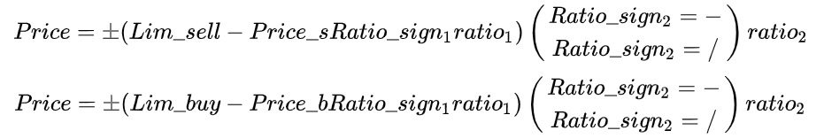
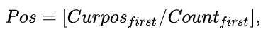
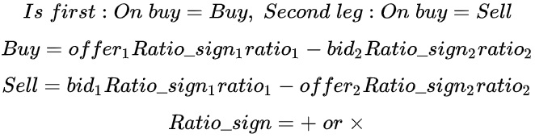
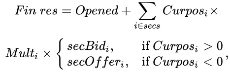
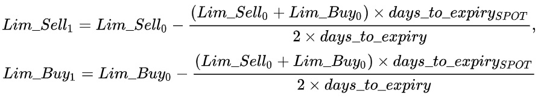
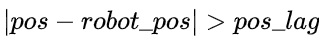

# 5. Описание параметров

## 5.1. **Параметры транзакционных подключений**

При добавлении нового транзакционного подключения необходимо заполнить ряд полей. Количество и тип полей зависят от биржи/рынка, к которым выполняется подключение. Далее дано описание полей для поддерживаемых бирж и рынков.

### **5.1.1. Московская биржа: фьючерсы и опционы**

В настоящее время для подключения к рынку фьючерсов и опционов Московской биржи используются только подключения по протоколу TWIME, проколы FIX и Plaza II не поддерживаются.

#### **5.1.1.1. Name**

Поле для задания имени подключения. Это значение пользователь задаёт для своего удобства, чтобы потом в списке транзакционных подключений ему было проще ориентироваться. Разрешенные символы: `_ a-z A-Z 0-9`

#### **5.1.1.2. Conn type**

Тип подключения. Поддерживаются варианты TWIME и TWIME_on_moves. Второй тип подключения является экспериментальным. В нём в одно подключение по факту добавляется несколько подключений. Заявки выставляются заранее по краям стакана, а при появлении приказа на выставление заявки, заранее выставленные заявки переставляются на заданную цену с заданным объёмом. Не используйте режим TWIME_on_moves, если вы не осведомлены о работе подключения в данном режиме. Для получения дополнительной информации о данном режиме вы можете обратиться в поддержку.

#### **5.1.1.3. TWIME server**

Адрес TWIME-сервера биржи, к которому будет выполняться подключение.

#### **5.1.1.4. TWIME credentials**

Credentials предоставляются брокером.

#### **5.1.1.5. Number of movable orders**

Количество заявок, которые робот будет держать по краям стакана, чтобы при необходимости использовать для переставлений. Этот параметр задает количество заявок на инструмент. В случае, если все заявки в данный момент использованы, то робот будет бросать по алгоритму Round robin.

#### **5.1.1.6. Min steps to pull**

Отступ от цен, на которых стоят заявки для перемещения по краям стакана, при достижении которого лучшей ценой, эти заявки снимаются чтобы избежать их исполнения. Если все же они исполнятся, то сделки по ним не будут учтены в алгоритме, и произойдет расхождение позиции в роботе и на бирже.

#### **5.1.1.7. Trading account(s)**

Торговый счёт, его можно найти в привязанном к счёту терминале или запросить у брокера.

#### **5.1.1.8. TWIME comment**

Уникальный идентификатор для всех заявок для данного подключения, задаётся пользователем для собственного удобства (если не используется, оставляйте пустым).

#### **5.1.1.9. Round robin**

Включение и выключение режима `Round robin` для данного подключения.
Подробнее о `Round robin` - [здесь](/docs/05-params-description.html#_5-3-24-client-code).

#### **5.1.1.10. Max trans**

Лимит транзакций в секунду. В анкете пользователя указана производительность логина в единицах производительности, где 1 единица равна 30 транзакциям в секунду.

#### **5.1.1.11. Reserved trans**

Количество зарезервированных транзакций в секунду для заявок на удаление. Использование данного параметра уменьшает количество выставлений заявки, доступных за одну секунду, но позволяет увеличить вероятность того, что робот успеет отдернуть (снять) заявку при уходе цен.

#### **5.1.1.12. Move order**

Разрешить или запретить использование приказов на переставление (изменение) заявки для данного подключения.

#### **5.1.1.13. Bind IP**

IP-адрес, с которого будет проходить подключение к бирже. IP должен быть указан в договоре. Если не указан, то обратитесь в поддержку.

### **5.1.2. Московская биржа: фондовый и валютный рынки**

В настоящее время для подключения к фондовому и валютному рынкам Московской биржи используются только подключения по протоколу FIX, другие протоколы не поддерживаются.

#### **5.1.2.1. Name**

Поле для задания имени подключения. Это значение пользователь задаёт для своего удобства, чтобы потом в списке транзакционных подключений ему было проще ориентироваться. Разрешенные символы: `_ a-z A-Z 0-9`

#### **5.1.2.2. Conn type**

Тип подключения. Поддерживаются варианты FIX и FIX_on_moves. Второй тип подключения является экспериментальным. нём в одно подключение по факту добавляется несколько подключений. Заявки выставляются заранее по краям стакана. А при появлении приказа на выставление заявки, заранее выставленные заявки переставляются на заданную цену с заданным объёмом. Не используйте режим TWIME_on_moves, если вы не осведомлены о работе подключения в данном режиме. Для получения дополнительной информации о данном режиме вы можете обратиться в поддержку.

#### **5.1.2.3. Server**

Адрес FIX-сервера биржи, к которому будет выполняться подключение.

#### **5.1.2.4. SenderCompID**

Значение данного параметра предоставляется брокером.

#### **5.1.2.5. Password**

Пароль для данного FIX-подключения. Если не меняли, то используйте стандартный, указанный в поле для ввода.

#### **5.1.2.6. Trading account(s)**

Торговый счёт, предоставляется брокером, так же можно посмотреть в терминале.

#### **5.1.2.7. Round robin**

Включение и выключение режима `Round robin` для данного подключения.
Подробнее о Round robin - [здесь](/docs/05-params-description.html#_5-3-24-client-code).

#### **5.1.2.8. Client code**

Код клиента можно посмотреть в привязанном к счёту терминале (нажать F7 и открыть таблицу "Позиции по деньгам") или запросить у брокера.

#### **5.1.2.9. Firm level account**

Указание на то, что аккаунт является аккаунтом уровня фирмы. Неверное задание данного параметра приводит к ошибкам снятия и переставления заявок.

#### **5.1.2.10. Number of movable orders**

Количество заявок, которые робот будет держать по краям стакана, чтобы при необходимости использовать для переставлений. Этот параметр задает количество заявок на инструмент. В случае, если все заявки в данный момент использованы, то робот будет бросать по алгоритму [Round robin](/docs/05-params-description.html#_5-3-24-client-code).

#### **5.1.2.11. Min steps to pull**

Отступ от цен, на которых стоят заявки для перемещения по краям стакана, при достижении которого лучшей ценой, эти заявки снимаются чтобы избежать их исполнения. Если все же они исполнятся, то сделки по ним не будут учтены в алгоритме, и произойдет расхождение позиции в роботе и на бирже.

#### **5.1.2.12. Bind IP**

IP-адрес, с которого будет проходить подключение к бирже. IP должен быть указан в договоре. Если не указан, то обратитесь в поддержку.

### **5.1.3. Санкт-Петербургская биржа**

#### **5.1.3.1. Name**

Поле для задания имени подключения. Это значение пользователь задаёт для своего удобства, чтобы потом в списке транзакционных подключений ему было проще ориентироваться. Разрешенные символы: `_ a-z A-Z 0-9`

#### **5.1.3.2. Server**

Адреса для подключения к серверу биржи.

#### **5.1.3.3. Login**

Логин для доступа к бирже, берется из договора с биржей.

#### **5.1.3.4. Password**

Пароль для доступа к бирже, берется из договора с биржей.

#### **5.1.3.5. Memder ID**

Идентификатор участника торгов, берется из договора с биржей.

#### **5.1.3.6. Trading account(s)**

Идентификатор торгово-клирингового счёта участника, берется у брокера. Можете добавить несколько через запятую.

#### **5.1.3.7. Client ID**

Идентификатор клиентского кода, берется из договора с биржей.

#### **5.1.3.8. Bind IP**

IP-адрес, с которого будет проходить подключение к бирже. IP должен быть указан в договоре. Если не указан, то обратитесь в поддержку.

### **5.1.4. Криптовалютные биржи**

На большинстве криптовалютных бирж для подключения достаточно одной или нескольких пар ключей (API Keys). Пара ключей - это публичный и секретный ключи. На разных биржах они могут называться немного по-разному. Сгенерировать пару ключей обычно можно самостоятельно на сайте биржи. Раздел управления ключами чаще всего можно найти в Настройки - Безопасность - API. На некоторых биржах у пар ключей есть понятие разрешений/привилегий, при создании ключей не забывайте указывать ключам разрешение на выполнение торговых операций.

#### **5.1.4.1. Name**

Поле для задания имени подключения. Это значение пользователь задаёт для своего удобства, чтобы потом в списке подключений ему было проще ориентироваться.

#### **5.1.4.2. API Key/API/ID/Access Key/Public Key/Key**

Публичный API-ключ для доступа к бирже, берется на бирже. Находится чаще всего в Настройки - Безопасность - API.

#### **5.1.4.3. API key secret/Secret/Access Secret/Private Key/Secret Key**

Секретный API-ключ для доступа к бирже, берется на бирже. Находится чаще всего в Настройки - Безопасность - API.

#### **5.1.4.4. Bind IP**

IP-адрес, с которого будет проходить подключение к бирже. Можете оставить Automatic или, при необходимости, установите определенный IP для подключения.

#### **5.1.4.5. Margin account**

Указатель на то, что ваш аккаунт является маржинальным. Применяется не на всех криптобиржах.

#### **5.1.4.6. Passphrase**

Фраза-пароль для доступа к бирже, применяется только для Kukoin.

#### **5.1.4.7. Flood timeout**

В данном параметре указывается время, которое мы будем выжидать и не выставлять заявки после получения ошибки REASON_FLOOD (только для биржи Cex.io).

#### **5.1.4.8. User ID**

Это ID пользователя (только для биржи Cex.io).

#### **5.1.4.9. COD**

Cancel on disconnect - включить механизм снятия заявок при разрыве связи (только для биржи Cex.io).

#### **5.1.4.10. Create fast data connection**

Поставьте данный флаг, если хотите создать быстрое маркетдата подключение с той же парой ключей (только для биржи Deribit).

#### **5.1.4.11. Subaccount**

В данном поле указывается имя субаккаунта. Если суббакаунты не используются, то поле нужно оставить пустым.

#### **5.1.4.12. Single ADDING order**

Для каждой бумаги разрешить только одну заявку в статусе ADDING, при попытке выставления еще одной заявки возвращать ошибку выставления. (Только для биржи Cex.io).

## **5.2. Параметры портфеля**

Далее дано описание параметров портфеля. Все параметры являются редактируемыми, если прямо не указано иное. Описания некоторых параметров портфеля объединены в группы для удобства восприятия.

### **5.2.1. Name**

Имя портфеля. В данном поле можно использовать латинские буквы и цифры, максимум 30 символов. Имя не редактируется. Для изменения имени можете выключить торговлю, склонировать портфель, изменить имя склонированного портфеля и удалить предыдущий портфель.

### **5.2.2. re_sell/re_buy**

Разрешена продажа/покупка (при взведении флага включает робот на продажу/покупку).

**Важно :** при снятии галок `re_sell` и `re_buy` происходит сброс счетчика ошибок робота.

### **5.2.3. Type**

Тип торгового алгоритма портфеля:

- `Arbitrage` - обычная арбитражная торговля с использованием всех заданных параметров. Сначала выставляется заявка по [Is first](/docs/05-params-description.html#_5-3-11-is-first) на  инструменту, при её сведении в сделку выставляются заявки по остальным инструментам портфеля.

- `Option hedge` - режим хеджирования, `count` всех инструментов кроме [Is first](/docs/05-params-description.html#_5-3-11-is-first) равен единице, `count` для [Is first](/docs/05-params-description.html#_5-3-11-is-first) инструмента задается как delta - "грек", вычисляемый с использованием модели Блека-Шоулза, [Is first](/docs/05-params-description.html#_5-3-11-is-first) инструмент в таком режиме должен быть опционом.

- `Test algo` - тестовый режим для проверки скорости работы "движков" подключений на получение рыночных данных и на выставление заявок, использовать данный режим без обращения к технической поддержке НЕ рекомендуется, прибыли он НЕ приносит.

- `TP algo` - режим работы с выставлением "take profit" заявки по главному инструменту. По главному инструменту держится только одна TP заявка, после прохождения не TP заявок в сделку, заявка TP снимается и выставляется новым объёмом. Заявки по второй ноге при этом не выставляются.

- 'TP algo 2' - режим работы с выставлением "take profit" заявки по главному инструменту. После каждой сделки по не TP заявке, выставляется новая TP заявка. У выставленной заявки есть [Timer](/docs/05-params-description.html#_5-3-17-timer) и [SL](/docs/05-params-description.html#_5-3-15-sl). Заявки по второй ноге выставляются так же, как и в режиме `Arbitrage`.

**Важно:** Если включен [Hedge (sec)](/docs/05-params-description.html#_5-2-8-hedge-sec), то каждые [Hedge (sec)](/docs/05-params-description.html#_5-2-8-hedge-sec) секунд если позиция по главному инструменту портфеля ненулевая и нет выставляющихся или стоящих заявок, сводящих эту позицию к нулю, будет выставляться заявка, сводящая позицию к нулю; описанное выше распространяется и на позиции, открытые кликером; закрытие по [Hedge (sec)](/docs/05-params-description.html#_5-2-8-hedge-sec) возможно только после того, как были сделки по главной бумаге по алгоритму (не по кликеру). Пока сделок не было, нет цен от которых откладывать тейк.

### **5.2.4. Type trade**

Тип торговли, используется при расчете цен [Sell/Buy](/docs/05-params-description.html#_5-2-39-sell-buy), [Price_s/Price_b](/docs/05-params-description.html#_5-2-40-price-s-price-b):

- `Price` - режим торговли с расчетом вышеперечисленных цен по ценам инструментов на покупку и продажу.

- IV - режим торговли с расчетом вышеперечисленных цен по "implied volatility" инструментов с использованием модели Блека-Шоулза.

### **5.2.5. Type price**

Тип определения цены инструмента:

- `Bid/offer`- использовать лучшую цену на покупку и лучшую цену на продажу.

- `Orderbook` - параметр позволяет искать цену в стакане, таким образом, чтобы набрать необходимый объем. Цены на покупку и продажу набираются среди цен в стакане, начиная от лучшей цены в нужном направлении и далее вглубь стакана. Поиск необходимого объема происходит с помощью данной формулы:

- `Orderbook+filter` - аналогично Orderbook, но вычитать из набираемого объема цены своих заявок (если на соответствующих ценах присутствуют свои заявки).

### **5.2.6. Quote**

Параметр позволяет котировать инструмент. Если включен, то заявка всегда держится в стакане, если выключено, то заявка на продажу выставляется когда [Sell](/docs/05-params-description.html#_5-2-39-sell-buy) ≥ [Lim_sell](/docs/05-params-description.html#_5-2-18-lim-sell-lim-buy)
, а заявка на покупку выставляется когда [Buy](/docs/05-params-description.html#_5-2-39-sell-buy) ≤ [Lim_buy](/docs/05-params-description.html#_5-2-18-lim-sell-lim-buy).

Видео объясняющее работу данного параметра:

<iframe width="735" height="415" src="https://www.youtube.com/embed/CfY5ZeS8aJM" title="Описание параметра Quote" frameborder="0" allow="accelerometer; autoplay; clipboard-write; encrypted-media; gyroscope; picture-in-picture; web-share" allowfullscreen></iframe>

### **5.2.7. Order ID**

`Order ID` - идентификатор всех заявок портфеля, так же определяет приоритет вызова торгового алгоритма портфеля.

_Пример_:  
Пусть есть несколько портфелей и во всех этих портфелях есть один и тот же инструмент. При изменении цены или объема лучшей цены на покупку или продажу по данному инструменту вызывается алгоритм торговли по всем портфелям, в которых этот инструмент присутствует. Торговый алгоритм портфелей будет вызываться в порядке возрастания Order ID, т.е. самым первым вызовется торговый алгоритм портфеля с Order ID = a, а самым последним с Order ID = z. При совпадении Order ID у разных портфелей порядок вызова торгового алгоритма портфелей НЕ определен и будет произвольным.

### **5.2.8. Hedge (sec)**

`Hedge (sec)` - интервал времени в секундах по прошествии которого автоматически хеджировать незахеджированную позицию в случаях, когда заявка по второй ноге не выставилась по алгоритму (случаи связанные с техническими проблемами на самой бирже, ограничениями по рейтлимиту и другими не рыночными ситуациями). Если задать значение "-1", то проверка по таймеру на незахеджированность не осуществляется.

**Неочевидный момент:**  
Если позиция, с учетом прохождения текущих активных заявок, расходится больше чем на значение [Overlay](/docs/05-params-description.html#_5-2-17-overlay) (активные заявки могут быть), то подравняется позиция не трогая текущих активных заявок. Если подравнивающая заявка выставилась, то скинется счетчик ошибок для данной бумаги. Расхождение считается отдельно для каждого из инструментов второй ноги. Выравнивание также осуществляется по каждому из инструментов второй ноги отдельно. В один момент времени на каждом из инструментов второй ноги может висеть не более одной выравнивающей заявки. Выравнивающая заявка, в случае если она не прошла в сделку, переставляется раз в секунду (поведение совпадает со стоп лосс заявкой).

### **5.2.9. Simply first**

`Simply first` - если параметр включен, то когда цены [Price_s/Price_b](/docs/05-params-description.html#_5-2-40-price-s-price-b) попадают в спред или на противоположную сторону стакана, то они всегда будут выставляться не глубже, чем на один шаг цены в спред:

где `bid`, `offer`, `step` - это бид, оффер и шаг цены по [Is first](/docs/05-params-description.html#_5-3-11-is-first) бумаге, нижний индекс "0" означает текущее значение параметра, нижний индекс "1" означает новое значение параметра.  
Если у [Is first](/docs/05-params-description.html#_5-3-11-is-first) бумаги взведен флаг `Maker` и текущий спред в стакане равен одному шагу цены, то заявка на продажу будет выставлена по цене offer, а на покупку по цене bid (в противном случае заявка просто не смогла бы выставиться и "спамила" бы биржу).

**Важно:** если наша заявка является бидом или оффером и при этом является единственной заявкой на данном ценовом уровне, то в качестве бида и оффера в предыдущей формуле используются бид и оффер без учета нашей заявки в стакане.

### **5.2.10. Equal prices**

Если галка не стоит, то цена второй ноги определяется исходя из цен, которые дали сигнал. Если галка стоит, то заявка по второй ноге будет выставлена по такой цене, чтобы `Sell = Lim_Sell` и `Buy = Lim_Buy` (работает только для портфелей с двумя бумагами).  
Таким образом цены в заявках будут строго соответствовать `Lim_sell`, даже если в моменте были лучшие цены.
Включение параметра способствует меньшему числу проскальзываний по второй ноге, но и уменьшает количество положительных проскальзываний (когда купили по цене лучшей, чем хотели).

_Пример_: в первой ноге стоит цена 100, в второй цена 95. Мы хотим купить в первой ноге по 100, если в второй тоже будет цена сто, т.е. раздвижка будет ноль. В моменте во второй ноге резко рынок дергается вверх и достигает 110.
Если галка стоит, то мы купим первую ногу по сто, и попытаемся продать вторую по 100 (т.к. нас устраивала раздвижка ноль).
Если галка НЕ стоит, то мы кинем на цену которые дали сигнал к сделке , т.е. первую также купим по сто, вторую попытаемся продать по 110.

Формула для цены второй ноги для покупки и продажи:

Знак ± - зависит от того, какое выставлено значение параметра  [On_buy](/docs/05-params-description.html#_5-3-10-On-buy) на 2-й ноге. Если  Buy, тогда "+",если  Sell, то "-".

### **5.2.11. Volumes**

`Volumes` - группа параметров отвечающих за объем выставляемых заявок. Группу можно разделить на две пары параметров: [v_in_left/v_in_right](/docs/05-params-description.html#_5-2-11-2-v-in-left-v-in-right) и [v_out_left/v_out_right](/docs/05-params-description.html#_5-2-11-3-v-out-left-v-out-right), а так же параметры [Virt_0_pos](/docs/05-params-description.html#_5-2-11-4-virt-0-pos) и [n_perc_fill](/docs/05-params-description.html#_5-2-11-5-n-perc-fill).

#### **5.2.11.1. v_min/v_max**

`v_min/v_max` - минимальная/максимальная разрешенная позиция для главного инструмента портфеля. Измеряется в лотах.

#### **5.2.11.2. v_in_left/v_in_right**

`v_in_left/v_in_right` - отвечает за минимальный/максимальный разрешенный объем для однократного входа в позицию (в штуках портфелей);  
Если тип определения цены [Type price](/docs/05-params-description.html#_5-2-5-type-price) выбран `Orderbook` или `Orderbook+filter` то в качестве объема для однократного входа в позицию `v_in_right` не используется.

#### **5.2.11.3. v_out_left/v_out_right**

`v_out_left/v_out_right` - отвечает за минимальный/максимальный разрешенный объем для однократного выхода из позиции (в штуках портфелей);  
Если тип определения цены [Type price](/docs/05-params-description.html#_5-2-5-type-price) выбран `Orderbook` или `Orderbook+filter` то в качестве объема для однократного выхода из позиции `v_out_right` не используется.

#### **5.2.11.4. Virt_0_pos**

`Virt_0_pos` - параметр позволяет [Is first](/docs/05-params-description.html#_5-3-11-is-first) заявке, выставленной по алгоритму, по бумаге с направлением в сторону закрытия позиции не только сводить позицию к нулю, но и сразу открывать новую позицию с противоположным направлением, кроме того объем заявки никогда не может быть меньше `v_in_left` и `v_out_left`.

**Важно:** если установлен флаг [To0](/docs/05-params-description.html#_5-2-26-to0), то можно получить такое поведение робота, что позиция никогда не попадает ровно в 0, а все время переворачивается то в одну, то в другую сторону.

#### **5.2.11.5. n_perc_fill**

`n_perc_fill` - параметр отвечает за связь позиции по главной бумаге и позиции по портфелю. Исходя из этого параметра осуществляется округление отношения позиции ([Curpos](/docs/05-params-description.html#_5-3-6-curpos)) по главному инструменту к параметру [Count](/docs/05-params-description.html#_5-3-8-count) того же инструмента. Значение `n_perc_fill` равное нулю отключает механизм округления, в результате позиция всегда округляется по модулю вниз. Во всех остальных случаях работают следующие правила:

- если при изменении позиции по главному инструменту портфеля целая часть позиции не изменилась, а остаток от деления нацело [Curpos](/docs/05-params-description.html#_5-3-6-curpos) на [Count](/docs/05-params-description.html#_5-3-8-count) находится в диапазоне от `(100 - n_perc_fill)` до `n_perc_fill` процентов от [Count](/docs/05-params-description.html#_5-3-8-count), то позиция по портфелю не меняется, если остаток слева от диапазона, то округление идет по модулю вниз, если остаток справа от диапазона, то округление идет по модулю вверх. Из вышесказанного следует, что параметр`n_perc_fill` может принимать значения от 50 до 100;

- если при увеличении позиции целая часть от деления нацело [Curpos](/docs/05-params-description.html#_5-3-6-curpos)[Curpos](/docs/05-params-description.html#_5-3-6-curpos) на [Count](/docs/05-params-description.html#_5-3-8-count) увеличилась, а модуль остатка от деления нацело [Curpos](/docs/05-params-description.html#_5-3-6-curpos) на [Count](/docs/05-params-description.html#_5-3-8-count) больше или равен `n_perc_fill` процентов от [Count](/docs/05-params-description.html#_5-3-8-count), то позицию по портфелю округляем по модулю вверх, иначе вниз;

- если при уменьшении позиции целая часть от деления нацело [Curpos](/docs/05-params-description.html#_5-3-6-curpos) на [Count](/docs/05-params-description.html#_5-3-8-count) уменьшилась, а модуль остатка от деления нацело [Curpos](/docs/05-params-description.html#_5-3-6-curpos) на [Count](/docs/05-params-description.html#_5-3-8-count) меньше или равен `(100 - n_perc_fill)` процентов от [Count](/docs/05-params-description.html#_5-3-8-count), то позицию по портфелю округляем по модулю вниз, иначе вверх.

### **5.2.12. Delta**

`Delta` - минимальное отклонение `Price_s` и `Price_b` от цены выставленной заявки на продажу или покупку, соответственно, при превышении которого необходимо переставить котируемую заявку, то есть заявку по [Is first](/docs/05-params-description.html#_5-3-11-is-first) инструменту (используется только при включенном режиме [Quote](/docs/05-params-description.html#_5-2-6-quote));

_Пример_:  
Delta = 10, Price_s = 95. Если котирующая заявка на продажу выставлена, то она переставится по новой цене в случае, если ее цена меньше 85 или больше 105.

### **5.2.13. First delta**

`First delta` – задается в процентах (%), котируемая заявка переставляется если ее текущий не исполненный объем меньше, чем `First delta` процентов от первоначального выставленного объема (используется только при включенном режиме [Quote](/docs/05-params-description.html#_5-2-6-quote)).

_Пример_:  
First delta = 20. Вы котируете на продажу объёмом 100, в вас ударяются и выкупают по частям. Заявка висит до тех пор, пока её неисполненный объём больше или равен 20. Как только он становится меньше 20, заявка снимается и, если может, выставляется новая по цене `Price_s` в полном объёме.

### **5.2.14. Market volume**

`Market volume` - максимальное количество лотов по лучшей цене на продажу или покупку (или суммарное количество лотов в стакане до "нашей" предполагаемой цены если [Type price](/docs/05-params-description.html#_5-2-5-type-price) = 'Orderbook` или [Type price](/docs/05-params-description.html#_5-2-5-type-price) = 'Orderbook + filter`), соответственно, при котором выставляется заявка по [Is first](/docs/05-params-description.html#_5-3-11-is-first) бумаге, при условии, что заявка выставляется не в спред, если цена заявки попадает в спред то значение данного параметра не используется.

### **5.2.15. Price check**

`Price check` – если предполагаемая цена выставления заявки по [Is first](/docs/05-params-description.html#_5-3-11-is-first) бумаге попадает в стакан глубже, чем на `Price check` пунктов, то заявка не выставляется.
То есть, если `offer + Price check < Price_s`, где `offer` – лучшая цена на продажу [Is first](/docs/05-params-description.html#_5-3-11-is-first) инструмента, то заявка выставлена не будет.
Для покупки аналогично.

### **5.2.16. Max not hedged**

`Max not hedged` - значение равное сумме допустимых незахеджированных открытий по [Is first](/docs/05-params-description.html#_5-3-11-is-first) инструменту (т.е. когда по любому из не [Is first](/docs/05-params-description.html#_5-3-11-is-first) инструментов "висит" в рынке не менее, чем `Max not hedged` активных заявок) и ошибок выставления (все ошибки, кроме кроссов), после которой торговля по [Is first](/docs/05-params-description.html#_5-3-11-is-first) инструменту будет остановлена до тех пор пока хотя бы одна из незахеджированных позиций не захеджируется или не сбросится счетчик ошибок.

**Важно:** необходимо использовать параметр `Max not hedged` в связке с [Hedge (sec)](/docs/05-params-description.html#_5-2-8-hedge-sec), так как иначе при накоплении определенного количества ошибок произойдет остановка торговли.
Используя в портфеле инструменты некоторых площадок с типами инструментов "купить/закрыть покупку", "продать/закрыть продажу" Max not hedged может иметь значение только "1".

### **5.2.17. Overlay**

`Overlay` – хеджировать только если разница (в портфелях) между [Is first](/docs/05-params-description.html#_5-3-11-is-first) бумагой и остальными инструментами портфеля больше или равна значению данного параметра (в штуках портфелей, то есть в той же размерности, что и [v_in_left/v_in_right](/docs/05-params-description.html#_5-2-11-2-v-in-left-v-in-right)).

### **5.2.18. Lim_sell/Lim_buy**

`Lim_Sell` – сигнальная цена на продажу, заявка по [Is first](/docs/05-params-description.html#_5-3-11-is-first) бумаге выставляется если `Sell ≥ Lim_Sell` вне зависимости от того включен или нет режим [Quote](/docs/05-params-description.html#_5-2-6-quote).

`Lim_Buy` – сигнальная цена на покупку, заявка по [Is first](/docs/05-params-description.html#_5-3-11-is-first) бумаге выставляется если `Buy ≤ Lim_Buy` вне зависимости от того включен или нет режим [Is first](/docs/05-params-description.html#_5-3-11-is-first).

Работа данных параметров наглядно продемонстрирована в этом видео:

<iframe width="735" height="415" src="https://www.youtube.com/embed/DxLdFeUU_bM" title="Описание параметра Lim-sell и Lim-buy" frameborder="0" allow="accelerometer; autoplay; clipboard-write; encrypted-media; gyroscope; picture-in-picture; web-share" allowfullscreen></iframe>

### **5.2.19. Trading signal shift**

`Trading signal shift` - группа параметров, отвечающих за создание арбитражного канала.

#### **5.2.19.1. K**

`К` - коэффициент сдвига заявки, что улучшает цену для каждого последующего входа.  
На параметр `К` будут сдвинуты заявки 'Lim_Sell' в случае продажи или 'Lim_Buy' в случае покупки при наборе позиции. Другими словами, на сколько улучшится положение заявки после удара на вход (ударом считается сделка объемом не меньше 'v_in_left').

Видео объясняющее работу параметра `К`:

<iframe width="735" height="415" src="https://www.youtube.com/embed/2qUPvspTQq4" title="Описание параметра K" frameborder="0" allow="accelerometer; autoplay; clipboard-write; encrypted-media; gyroscope; picture-in-picture; web-share" allowfullscreen></iframe>

#### **5.2.19.2. ТР**

`ТР` - уровень противоположной заявки после удара. С помощью параметра `ТР` вы указываете где будет выставлена противоположная заявка после удара (работает только после первого удара).
Если нас ударили по 'Lim_Sell' = 150, то при 'ТР' = 50, 'Lim_Buy' будет выставлен на 150 – 50 = 100.

Видео объясняющее работу параметра `ТР`:

<iframe width="735" height="415" src="https://www.youtube.com/embed/R2nuoUpGq9c" title="Описание параметра TP" frameborder="0" allow="accelerometer; autoplay; clipboard-write; encrypted-media; gyroscope; picture-in-picture; web-share" allowfullscreen></iframe>

#### **5.2.19.3. K1**

`К1` - коэффициент указывает на сколько будет сдвинута противоположная заявка после второго удара.
`Lim_Buy' = 100 из предыдущего примера, при `К1' = 5, будет установлена на 100 + 5 = 105, после второго удара по `Lim_Sell`.

Видео объясняющее работу параметра `К1`:

<iframe width="735" height="415" src="https://www.youtube.com/embed/nYSPQR2LFhE" title="Описание параметра K1" frameborder="0" allow="accelerometer; autoplay; clipboard-write; encrypted-media; gyroscope; picture-in-picture; web-share" allowfullscreen></iframe>

#### **5.2.19.4. K2**

`К2` - коэффициент сдвига заявки, что улучшает цену заявки каждого последующего выхода.
На параметр `К2` будут сдвинуты заявки `Lim_Sell` или `Lim_Buy` в случае продажи или покупки, соответственно, при выходе из позиции. Другими словами, на сколько улучшится положение следующей заявки на выход после предыдущего удара (ударом считается сделка объемом не меньше `v_out_left`).
Из примера ранее где `Lim_Buy' = 105 при `К2' = 3. При ударе по `Lim_Buy` его значение станет равным 105 - 3 = 102.

Видео объясняющее работу параметра К2:

<iframe width="735" height="415" src="https://www.youtube.com/embed/9RbN893_eD0" title="Описание параметра K2" frameborder="0" allow="accelerometer; autoplay; clipboard-write; encrypted-media; gyroscope; picture-in-picture; web-share" allowfullscreen></iframe>

### **5.2.20. Limits timer**

`Limits timer` – время таймера (задается в секундах), таймер включается если торговля включена и проходит сигнал на покупку или продажу, но торговля запрещена из-за того, что робот уже набрал максимальную позицию (по [v_min/v_max](/docs/05-params-description.html#_5-2-11-1-v-min-v-max)).

### **5.2.21. Percent**

`Percent` – процент от [Limits timer](/docs/05-params-description.html#_5-2-20-limits-timer) после которого происходит сдвиг. Если сигнал на торговлю продержался указанный процент времени от значения [Limits timer](/docs/05-params-description.html#_5-2-20-limits-timer), то [Lim_sell/Lim_buy](/docs/05-params-description.html#_5-2-18-lim-sell-lim-buy)) передвигаются на [K](/docs/05-params-description.html#_5-2-19-1-k), не смотря на отсутствие сделок по [Is first](/docs/05-params-description.html#_5-3-11-is-first) бумаге.

### **5.2.22. Always timer**

Включенный `Always timer` позволяет всегда использовать [Limits timer](/docs/05-params-description.html#_5-2-20-limits-timer), даже тогда когда можно торговать и происходит выставление заявок.

### **5.2.23. Pos**

Текущая позиция портфеля (в штуках портфелей), вычисляется по формуле:

где Curposfirst и Countfirst - это параметры [Curpos](/docs/05-params-description.html#_5-3-6-curpos) и [Count](/docs/05-params-description.html#_5-3-8-count) для инструмента портфеля с взведенным флагом [Is first](/docs/05-params-description.html#_5-3-11-is-first), и округляется вверх или вниз в зависимости от значения параметра [n_perc_fill](/docs/05-params-description.html#_5-2-11-5-n-perc-fill). Изменяется роботом, но может быть отредактирована пользователем вручную.

### **5.2.24. Use timetable**

Использовать торговлю по расписанию, расписание представляет собой список групп параметров:

`Begin` - начало торгового периода.  
`End` - окончание торгового периода.  
`Close` - попытаться закрыть позицию сразу после окончания торгового периода (в течении 10 секунд).  
`To market` - попытаться выровнять позицию сразу после окончания торгового периода (в течении 10 секунд).  
`To0` - использовать [To0](/docs/05-params-description.html#_5-2-26-to0) в данный период.

если текущее локальное время на компьютере (`curTime`) попадает в один из периодов, т.е. `Begini ≤ curTime ≤ Endi`, то `re_sell` и `re_buy` включаются автоматически (кроме режима `Timetable only stop`), в противном случае (если текущее время не попадает ни в один из периодов) `re_sell` и `re_buy` выключаются автоматически.

### **5.2.25. Timetable only stop**

Автоматически выключать торговлю, если текущее время не попадает в периоды расписания, но при этом автоматически не включать торговлю если время попадает в один из периодов расписания.

### **5.2.26. To0**

Флаг, если взведен, то не открывать позицию, а только закрывать и не открываться из нулевой позиции.

**Важно:** если установлен флаг [Virt_0_pos](/docs/05-params-description.html#_5-2-11-4-virt-0-pos), то можно получить такое поведение робота, что позиция никогда не попадает ровно в 0, а все время переворачивается то в одну, то в другую сторону.

### **5.2.27. Opened**

Параметр, используемый для подсчета финансового результата, вычисляется по формуле:

где tradePricei - цена сделки;  
tradeAmounti - количество лотов в сделке;  
bought - список сделок на покупку;  
sold - список сделок на продажу;  
Multi - Fin res multiplier инструмента портфеля.

### **5.2.28. Commision sum**

Сумма комиссии по всем сделкам портфеля, используется для подсчёта финансового результата.

### **5.2.29. Decimals**

`Decimals` - параметр, определяющий сколько знаков после десятичной точки отображается в параметрах, значение которых является дробным числом.

### **5.2.31. Custom trade**

Позволяет использовать `Trade formula` для подсчета раздвижки в таблице с финансовыми результатами.

### **5.2.32. Trade formula**

Формула на языке программирования [C++](/docs/08-c-api.html#_8-c) для подсчета раздвижки в таблице с финансовыми результатами, вы пишете только тело функции и должны вернуть значение типа `double`.

### **5.2.33. Extra formulas**

Флаг, включает расчёт `Extra field#1` и `Extra field#2`.

### **5.2.34. Extra field#1 и Extra field#2**

Поля для дополнительных формул на языке программирования [C++](/docs/08-c-api.html#_8-c), вы пишете только тело функции и должны вернуть значение типа `double`.

### **5.2.35. Disabled**

Полностью выключить портфель из всех расчетов и торговли, не удаляя его.

**Важно:** при снятии этой галки и восстановлении работы портфеля возможно переоткрытие торговых стаканов и, как следствие, приостановка торговли во всех портфелях, использующих то же дата подключение, на время переоткрытия стаканов.

### **5.2.36. Sell/Buy clicker**

"Кликер", выставить заявку на продажу/покупку заданного количества портфелей. Заявки выставляются сразу по всем инструментам портфеля.

### **5.2.37. To market**

"Кликер", снять все заявки, кроме заявок первой ноги, выставленных по алгоритму, и выставить их по рыночным ценам (с учетом параметра [k_sl](/docs/05-params-description.html#_5-3-13-k-sl)), а так же выровнять позицию заявками по второй ноге (по каждому инструменту второй ноги ставится не более одной выравнивающей заявки).

### **5.2.38. Place order**

Позволяет выставить заявку по одному из инструментов портфеля, не дожидаясь срабатывания настроенных условий портфеля или при выключенной торговле портфеля. Для того, чтобы воспользоваться этой опцией необходимо сделать двойной клик по специальному символу и выбрать необходимые параметры заявки, далее нажать на кнопку `Place order`.  
При включенной торговле выставленная таким образом заявка может привести к срабатыванию параметров:  
`** Hedge (sec)`, `SLE`, `TE`.  
Для удаления выставленной таким способом заявки потребуется биржевой терминал, где вручную снимается заявка или это можно сделать в роботе с помощью кнопки **Hard stop (2.4)

### **5.2.39. Sell/Buy**

`Sell` – расчетная цена на продажу. Нередактируемый параметр.  
`Buy` – расчетная цена на покупку. Нередактируемый параметр.  
Упрощенная формула для двух бумаг:

Формулы расчета `Sell` и `Buy` для любого количества ног:

Наглядно продемонстрирована работа данных параметров в этом видео:

<iframe width="735" height="415" src="https://www.youtube.com/embed/p69X-3l-VLc" title="Описание параметра Sell Buy" frameborder="0" allow="accelerometer; autoplay; clipboard-write; encrypted-media; gyroscope; picture-in-picture; web-share" allowfullscreen></iframe>

### **5.2.40. Price_s/Price_b**

`Price_s` – цена выставления заявки на продажу по [Is first](/docs/05-params-description.html#_5-3-11-is-first) бумаге, вычисляется как обратная функция для [Sell](/docs/05-params-description.html#_5-2-39-sell-buy), где цена [Sell](/docs/05-params-description.html#_5-2-39-sell-buy) заменяется на [Lim_Sell](/docs/05-params-description.html#_5-2-18-lim-sell-lim-buy). Нередактируемый параметр.  
`Price_b` – цена выставления заявки на покупку по [Is first](/docs/05-params-description.html#_5-3-11-is-first) бумаге, вычисляется как обратная функция для [Buy](/docs/05-params-description.html#_5-2-39-sell-buy), где цена [Buy](/docs/05-params-description.html#_5-2-39-sell-buy) заменяется на [Lim_Buy](/docs/05-params-description.html#_5-2-18-lim-sell-lim-buy). Нередактируемый параметр.

Формулы расчета `Price_s` и `Price_b` для двух бумаг:

Формулы расчета `Price_s` и `Price_b` для любого количества ног:

Видео, наглядно объясняющее работу параметров `Price_s/Price_b`:

<iframe width="735" height="415" src="https://www.youtube.com/embed/PKGbweKJbNE" title="Описание параметра Prices" frameborder="0" allow="accelerometer; autoplay; clipboard-write; encrypted-media; gyroscope; picture-in-picture; web-share" allowfullscreen></iframe>

### **5.2.41. Sell/Buy status**

Статус заявки на продажу/покупку по [Is first](/docs/05-params-description.html#_5-3-11-is-first) бумаге (не используется при выставлении заявки с помощью "кликеров").  
Для того чтобы освободить "зависшую" заявку, необходимо сделать двойной клик на ячейке таблицы. Ручная смена статуса может привести к потере заявки роботом, данную операцию рекомендуется делать только в крайних случаях.

### **5.2.42. Return first**

Оборот по [Is first](/docs/05-params-description.html#_5-3-11-is-first) бумаге, вычисляется с момента старта серверной части робота как сумма модулей количества лотов в сделках по [Is first](/docs/05-params-description.html#_5-3-11-is-first) инструменту.

### **5.2.43. Fin res**

Предполагаемый финансовый результат портфеля, вычисляется по формуле:

где secBidi - лучшая цена на покупку инструмента портфеля;  
secOfferi - лучшая цена на продажу инструмента портфеля;  
Curposi - текущая позиция инструмента портфеля;  
Mult - [Fin res multiplier](/docs/05-params-description.html#_5-3-21-fin-res-multiplier) инструмента портфеля;  
secs - список инструментов портфеля.

### **5.2.44. Fin res wo C**

`Fin res` без учета комиссии. Вычисляется по формуле:

где secBidi - лучшая цена на покупку инструмента портфеля;  
secOfferi - лучшая цена на продажу инструмента портфеля;  
Curposi - текущая позиция инструмента портфеля;  
Mult - [Fin res multiplier](/docs/05-params-description.html#_5-3-21-fin-res-multiplier) инструмента портфеля;  
secs - список инструментов портфеля.

## **5.3. Параметры инструментов портфеля**

Далее дано описание параметров инструментов портфеля. Все параметры являются редактируемыми, если прямо не указано иное.

### **5.3.1. SecKey**

'SecKey' - уникальный идентификатор инструмента портфеля. Нередактируемый параметр.

### **5.3.2. SecBoard**

"SecBoard' - режим инструмента портфеля. Нередактируемый параметр.

### **5.3.3. SecCode**

"SecCode' - код инструмента портфеля. Нередактируемый параметр.

### **5.3.4. SecType**

'SecType' - тип инструмента (например, CURR для валютного рынка). Нередактируемый параметр.

### **5.3.5. Exchange**

'Exchange' - название биржи, на которой торгуется данная бумага. Нередактируемый параметр.

### **5.3.6. Curpos**

`Curpos` - текущая позиция робота по данной бумаге в лотах.

### **5.3.7. Count type**

`Count type` - использовать [Count](/docs/05-params-description.html#_5-3-8-count) или [Count formula](/docs/05-params-description.html#_5-3-9-count-formula).

### **5.3.8. Count**

`Count` - количество лотов инструмента в одном портфеле.

**Важно:** для многих криптовалютных бирж данный параметр указывается "как бы в сатошах", т.е. чтобы купить/продать 1 лот на бирже необходимо указать количество 100 000 000 (соответственно, 0.1 лота сооветствует значение 10 000 000 и т.д.). При добавлении бумаги в порфтель обращайте внимание на столбец `Price to lot mult`.

**Важно:** если изменяете Count [Is first](/docs/05-params-description.html#_5-3-11-is-first) бумаги, не забудьте задать правильные значения для [v_min/v_max](/docs/05-params-description.html#_5-2-11-1-v-min-v-max).

### **5.3.9. Count formula**

`Count formula` - количество лотов инструмента в одном портфеле, задаётся как код на языке программирования [C++](/docs/08-c-api.html#_8-c). Вы пишете только тело функции, и должны вернуть значение типа `double`.

**Важно:** значения [Count](/docs/05-params-description.html#_5-3-8-count)
 или [Count formula](/docs/05-params-description.html#_5-3-9-count-formula) определяют соотношение именно между позициями инструментов портфеля (соотношение в конкретной сделке может отличаться). По этой же причине значение [Count formula](/docs/05-params-description.html#_5-3-9-count-formula) не зависит от направления выставляемой заявки.

**Важно:** настоятельно рекомендуется для [Is first](/docs/05-params-description.html#_5-3-11-is-first) бумаги никогда не возвращать значение 0, если вы хотите не торговать, используйте `Ratio formula` и задавайте необходимые значения для раздвижки. Если вы все-таки получили [Count](/docs/05-params-description.html#_5-3-8-count)
 равный 0 для [Is first](/docs/05-params-description.html#_5-3-11-is-first) бумаги, то портфель не будет торговать ни одной бумагой и для подсчета позиции портфеля в том месте, где необходимо поделить на [Count](/docs/05-params-description.html#_5-3-8-count)
 [Is first](/docs/05-params-description.html#_5-3-11-is-first) бумаги (который в вашем случае равен 0) будет делиться на 1.

### **5.3.10. On buy**

Определяет будем ли мы покупать или продавать инструмент при срабатывании сигнала на покупку по главному инструменту.

### **5.3.11. Is first**

Определяет, является ли бумага главным инструментом портфеля. Позиция портфеля считается по главному инструменту. [On buy](/docs/05-params-description.html#_5-3-10-on-buy) такого инструмента всегда указывается как `Buy`.

### **5.3.12. k**

`k`– задает размер искусственного проскальзывания (отступ от рыночной цены (в пунктах), т.е. при покупке цена выставления `offer + k`, при продаже цена выставления `bid−k`, где `bid` и `offer` – лучшие цены на продажу и покупку, соответственно).

### **5.3.13. k_sl**

`k_sl` - аналог параметра `k`, используется во время перестановок по стоп-лоссу и по таймеру. Задает размер искусственного проскальзывания (отступ от рыночной цены (в пунктах), т.е. для заявки на покупку цена выставления `offer + k_sl`, для заявки на продажу цена выставления `bid−k_sl`, где `bid` и `offer` – лучшие цены на продажу и покупку, соответственно).

### **5.3.14. SLE**

`SLE` – включить/выключить функцию переставления по стоп-лоссу.

### **5.3.15. SL**

`SL` – значение стоп-лосса (в пунктах), при достижении которого необходимо снимать заявку, если она не прошла до этого момента и бросать снова по новой рыночной цене (стоп-лосс откладывается от первоначальной цены выставления заявки).

### **5.3.16. TE**

`TE` - параметр отвечает за включение/выключение функции переставления по таймеру.

### **5.3.17. Timer**

`Timer` - параметр, определяющий через сколько времени снимать заявку, если она не прошла до этого момента и бросать снова по новой рыночной цене.

### **5.3.18. Percent of quantity**

Если на бирже в объеме лучшей цены на продажу или покупку (или в найденном объеме в стакане если [Type price](/docs/05-params-description.html#_5-2-5-type-price) = `Orderbook` или [Type price](/docs/05-params-description.html#_5-2-5-type-price) = `Orderbook + filter`), соответственно, есть нужное количество процентов (%) от объема заявки инструмента, не являющегося [Is first](/docs/05-params-description.html#_5-3-11-is-first), и это условие выполняется для всех не [Is first](/docs/05-params-description.html#_5-3-11-is-first) инструментов, то можно выставляться по [Is first](/docs/05-params-description.html#_5-3-11-is-first) инструменту.

### **5.3.19. Ratio sign**

`Ratio sign` – знак используемый перед коэффициентом [Ratio](/docs/05-params-description.html#_5-3-20-ratio) при расчете цен `Sell` и `Buy`, ”+” или ”×”.

### **5.3.20. Ratio**

`Ratio` – коэффициент, используемый при расчете цен `Sell` и `Buy`.

### **5.3.21. Fin res multiplier**

`Fin res multiplier` - множитель, используется для подсчета финансового результата, чтобы привести все цены к одной размерности.

### **5.3.22. Commission type**

`Commission type` - параметр, определяющий тип расчёта комиссии.

### **5.3.23. Commission**

`Commission` - комиссия по инструменту. Если [Commission type](/docs/05-params-description.html#_5-3-22-commission-type) указан как `%`, то комиссия указывается в процентах от цены сделки, а если как `pt`, то комиссия указывается в той же размерности, в которой считается финансовый результат по портфелю (например, для акции Сбербанка комиссия указывается в процентах и для большинства брокеров она равна 0.01 %, а для фьючерса на акцию Сбербанка комиссия указывается в пунктах и равна 0.25 пункта для скальперских сделок).

### **5.3.24. Client code**

`Client code` - код клиента с которого надо выставлять заявку по данной бумаге или пустая строка если необходимо выставлять с "кода по умолчанию", отображает все коды, которые прописаны в настройках робота, код virtual означает торговлю "в файл" и может быть использован для тестирования стратегий; код, начинающийся с [Round robin](/docs/05-params-description.html#_5-3-24-client-code), означает использование режима выставления заявок [Round robin](/docs/05-params-description.html#_5-3-24-client-code).

**Важно:** Режим [Round robin](/docs/05-params-description.html#_5-3-24-client-code) означает выставление и снятие заявок через все подключения к бирже с заданным клиентским кодом по некоторому алгоритму, при этом поведение этого алгоритма для Московской биржи и для криптобирж различается. Это связано с особенностями торгов и типом подключений на биржах. На криптобиржах при использовании режима [Round robin](/docs/05-params-description.html#_5-3-24-client-code) происходит поочередное выставление и снятие заявок через подключения с одинаковым клиентским кодом. Все подключения из списка используются равномерно. Для криптобирж (не всех) это позволяет поднять общую пропускную способность клиентского счёта с помощью использования нескольких подключений с разными парами ключей. На рынках Московской биржи все подключения с одним кодом клиента держатся в очереди, порядок подключений в очереди зависит от скорости выставления заявок через эти подключения (кто в данный момент быстрее, тот первый в очереди, порядок подключений в очереди меняется не чаще раза в секунду, кроме того каждую секунду движение по очереди начинается заново, т.о. загрузка подключений НЕ равномерная). При измерении скорости (Round trip-а) выставления заявок учитывается только скорость некоторых заявок, назовём их важными. Важными заявками считаются заявки, выставленные по первой ноге по алгоритму (т.е не кликером, не стопом и прочими способами), причём только в случае если котирование отключено. Так же важными заявками являются заявки по второй ноге, выставленные по основному алгоритму, т.е. после сделки по первой ноге. Значения Round trip'a обнуляются раз в час, чтобы снова была возможность оценить скорость каждого из подключений и выбрать быстрейшее. Таким образом, для Московской биржи выбирается быстрейшее подключение и по возможности заявки выставляются с него.

**Важно:** код клиента не может быть пустым для бумаг с [Count](/docs/05-params-description.html#_5-3-8-count) отличным от нуля.

### **5.3.25. MM**

`MM` - флаг, если взведен, то все заявки по инструменту выставляются с признаком "заявка маркет-мейкера" (работает не для всех подключений).

### **5.3.26. TP**

`TP` - величина тейк-профит, используется при `Type` равном `TP algo` или `TP algo 2`, откладывается от цены сделки по заявке [Is first](/docs/05-params-description.html#_5-3-11-is-first) иструмента.

### **5.3.27. Ratio type**

`Ratio type` - использовать значение [Ratio](/docs/05-params-description.html#_5-3-20-ratio) или результат вычисления `Ratio formula` при расчёте значений `Sell` и `Buy`.

### **5.3.28. Ratio buy formula**

Параметр, используемый при расчете цены `Buy`, задается как код на языке программирования [C++](/docs/08-c-api.html#_8-c). Вы пишете только тело функции и должны вернуть значение типа `double`.

### **5.3.29. Ratio sell formula**

Параметр, используемый при расчете цены `Sell`, задается как код на языке программирования [C++](/docs/08-c-api.html#_8-c). Вы пишете только тело функции и должны вернуть значение типа `double`.

### **5.3.30. FUT move limits**

Флаг, если взведен, то при каждой смене дня будет осуществляться автоматическая подвижка лимитов по формулам:

где days_to_expiry - целое количество дней до экспирации данной бумаги;  
days_to_expirySPOT - целое количество дней до экспирации бумаги, отмеченной флагом `SPOT move limits` или 1, если такая бумага не указана;  
нижний индекс 0 означает текущее значение параметра;  
нижний индекс 1 означает новое значение параметра.

### **5.3.31. SPOT move limits**

Флаг, если взведен, то данная бумага используется в формулах для FUT move limits`.

### **5.3.32. Depth OB**

`Depth OB` – максимальный уровень глубины стакана до которого включительно вычислять цены и объемы (в штуках шагов цены, считая от бида/оффера), доступен только для не [Is first](/docs/05-params-description.html#_5-3-11-is-first), используется только в режимах [Type price](/docs/05-params-description.html#_5-2-5-type-price) = `Orderbook` и [Type price](/docs/05-params-description.html#_5-2-5-type-price) = `Orderbook + filter`.  
Если у Вас выбран режим [Type price](/docs/05-params-description.html#_5-2-5-type-price) = `Orderbook` и [Type price](/docs/05-params-description.html#_5-2-5-type-price) = `Orderbook + filter`, то необходимо следить за значением `Depth OB`, при слишком низких значениях параметра робот не сможет высчитывать цены и объемы, у вас будут нули в параметрах `Sell` и `Buy`.

### **5.3.33. Calc price OB**

`Calc price OB` – тип цены, используемой для расчета `Sell`, `Buy`, 'Price_s', 'Price_b'. Доступен только для не [Is first](/docs/05-params-description.html#_5-3-11-is-first) бумаг, используется только в режимах [Type price](/docs/05-params-description.html#_5-2-5-type-price) = `Orderbook` и [Type price](/docs/05-params-description.html#_5-2-5-type-price) = `Orderbook + filter`:

- **Deepest** – цена того уровня в стакане, на котором набрали искомый объем;
- **Weighted avg.** – средневзвешенная цена до того уровня в стакане включительно, на котором набрали искомый объем.

### **5.3.34. Trading price OB**

`Trading price OB` – тип цены, используемой при торговле, доступен только для не [Is first](/docs/05-params-description.html#_5-3-11-is-first) бумаг, используется только в режимах [Type price](/docs/05-params-description.html#_5-2-5-type-price) = `Orderbook` и [Type price](/docs/05-params-description.html#_5-2-5-type-price) = `Orderbook + filter`:

- **Deepest** – цена того уровня в стакане, на котором набрали искомый объем;
- **Weighted avg.** – средневзвешенная цена до того уровня в стакане включительно, на котором набрали искомый объем.

_Пример:_  
`Trading price OB'-Deepest:  
Допустим, вы ищете в стакане на покупку 1000 лотов, по цене 100 стоит 500 лотов, потом по цене 99 стоит 490 лотов и по цене 5 стоят оставшиеся 10 лотов. При таком раскладе искомая цена будет равна 5.  
`Trading price OB' - Weighted avg.:  
Из примера выше (500 * 100 + 490 * 99 + 5 * 10)/1000 = 98.56 - искомая цена. Перед выставлением заявки робот округлит цену в соответствии с шагом цены данного инструмента. Для продажи выполняется округление вверх, для покупки - округление вниз. Т.е. если шаг цены в данном примере равен 1, то продавать будем по цене 99.

### **5.3.35. Level to0**

`Level to0` - если хотя бы для одной бумаги портфеля модуль разности [Mark price](/docs/05-params-description.html#_5-5-1-5-mark-price) и [Liquidation price](/docs/05-params-description.html#_5-5-1-6-liquidation-price) строго меньше данного значения, то взвести флаг [To0](/docs/05-params-description.html#_5-2-26-to0) и НЕ давать его снять пока условие выполняется, когда условие перестанет выполняться - снять флаг [To0](/docs/05-params-description.html#_5-2-26-to0) (имеет смысл только для бумаг с BitMEX, Deribit, некоторых других).

### **5.3.36. Level close**

`Level close` - если хотя бы для одной бумаги портфеля модуль разности [Mark price](/docs/05-params-description.html#_5-5-1-5-mark-price) и [Liquidation price](/docs/05-params-description.html#_5-5-1-6-liquidation-price) строго меньше данного значения, то взвести флаг [To0](/docs/05-params-description.html#_5-2-26-to0) и НЕ давать его снять пока условие выполняется (когда условие перестанет выполняться - снять флаг [To0](/docs/05-params-description.html#_5-2-26-to0)), раз в 5 секунд выставлять заявку в направлении закрытия позиции в объеме [v_out_left](/docs/05-params-description.html#_5-2-11-3-v-out-left-v-out-right) портфелей до тех пор пока описанное выше условие не перестанет выполняться или позиция по портфелю не станет равно 0 (имеет смысл только для бумаг с BitMEX, Deribit, некоторых других).

### **5.3.37. Only maker**

`Only maker` - выставлять котирующие (т.е. при включенном режиме [Quote](/docs/05-params-description.html#_5-2-6-quote)) заявки по [Is first](/docs/05-params-description.html#_5-3-11-is-first) бумаге с признаком "снять если заявка будет taker" (это параметр заявки, не работает на московской и питерской бирже так как они данный параметр не поддерживают; имеет смысл только для бумаг с BitMEX, Bitfinex, Deribit, некоторых других).

**Важно:** Если вы используете данный параметр, то вероятнее всего вам понадобится взвести флаг [Simply first](/docs/05-params-description.html#_5-2-9-simply-first).

### **5.3.38. Leverage**

`Leverage` - параметр определяющий плечо для выставляемой заявки (имеет смысл только для бумаг с HBDM).

### **5.3.39. Decimals**

`Decimals` - параметр, определяющий сколько знаков после десятичной точки отображается в параметрах, для которых значение является дробным числом.

**Важно:** данный параметр так же отвечает за число знаков после десятичной точки в ценах сделок по данной бумаге в таблице раздвижек. При смене значения, число знаков у уже добавленных в таблицу сделок НЕ изменится.

### **5.3.40. Max trans time**

'Max trans time' - максимально допустимое время Round trip'a (в микросекундах) при котором вы хотите торговать по этой бумаге. Если это время будет превышено, то активируется 'Ban period'.

### **5.3.41. Ban period**

'Ban period' - период, на протяжении которого робот перестает выставлять заявки по первой ноге.

## **5.4. Параметры уведомлений**

Робот умеет уведомлять пользователя о наступлении определенных условий. Например, при резком падении финансового результата. Так как понятие "резкое падение" сильно зависит от выбранной стратегии и настроек портфеля, то для каждого портфеля настройки уведомлений задаются отдельно. Кроме чисто сигнальной функции некоторые уведомления могут выключать торговлю по соответствующему портфелю. При наступлении соответствующего условия, уведомление появляется в браузере, а так же в telegram-боте, если он подключен и настроен. Также существуют уведомления, которые настраиваются для конкретного транзакционного подключения к бирже, они описаны в разделе [Параметры позиций](/docs/05-params-description.html#_5-5-%D0%BF%D0%B0%D1%80%D0%B0%D0%BC%D0%B5%D1%82%D1%80%D1%8B-%D0%BF%D0%BE%D0%B7%D0%B8%D1%86%D0%B8%D0%B8).

### **5.4.1. FinRes fall**

Уведомлять о падении финансового результата по портфелю за `Time` секунд. Если с момента прошлого сохранения финансового результата прошло больше, чем `Time` секунд, то новый эталонный финансовый результат:

`Fin res_saved = Fin res - max(Min fall,|Fin res * Fall * 0.01|)`,

если `Fin res < in res_saved`, то приходит уведомление.

`Fin res_saved` - "эталонный" финансовый результат сохраняемый (обновляемый) каждые `Time` секунд;  
`Fin res` - текущий финансовый результат с учетом комиссии.

- `Time (sec)` - период времени в секундах, откладываемый от момента включения робота или редактирования параметров, влияющих на вычисление финансового результата, с указанной периодичностью будет обновляться "эталонный" финансовый результат;  
- `Min fall (pt)` - если процентное изменение финансового результата меньше данной величины, то не уведомлять (pt - пункты, имеют ту же размерность что и финансовый результат);  
- `Fall (%)` - процентное изменение "эталонного" финансового результата о достижении которого необходимо уведомить пользователя;  
- `Stop trading` - вместе с уведомлением выключить торговлю по портфелю (расписание также будет выключено).

### **5.4.2. Lim_Sell change и Lim_Buy change**

Уведомлять об изменении [Lim_Sell/Lim_Buy](/docs/05-params-description.html#_5-2-18-lim-sell-lim-buy) портфеля за `Time` секунд больше, чем на `Value`:

- `Time (sec)` - период времени в секундах, не чаще, чем с указанной периодичностью, будет обновляться "эталонный" [Lim_Sell/Lim_Buy](/docs/05-params-description.html#_5-2-18-lim-sell-lim-buy);
- `Value` - сигнальное значение изменения [Lim_Sell/Lim_Buy](/docs/05-params-description.html#_5-2-18-lim-sell-lim-buy);
- `Stop trading` - вместе с уведомлением выключить торговлю по портфелю (расписание также будет выключено).

### **5.4.3. Severe sell change и Severe buy change**

Уведомлять о "резком" изменении [Sell/Buy](/docs/05-params-description.html#_5-2-39-sell-buy) портфеля (`≥Value`) за `Time` секунд (только когда портфель включен):

- `Time (sec)` - период времени, за который считать изменение [Sell/Buy](/docs/05-params-description.html#_5-2-39-sell-buy) (откладывается назад от текущего времени) как разницу между текущим [Sell/Buy](/docs/05-params-description.html#_5-2-39-sell-buy) и [Sell/Buy](/docs/05-params-description.html#_5-2-39-sell-buy) 'Time` секунд назад;
- `Value` - сигнальное значение изменения [Sell/Buy](/docs/05-params-description.html#_5-2-39-sell-buy).

### **5.4.4. Too much running orders**

Уведомлять о слишком большом количестве активных заявок по не [Is first](/docs/05-params-description.html#_5-3-11-is-first) инструментам портфеля
(max (число активных заявок по каждому из не [Is first](/docs/05-params-description.html#_5-3-11-is-first) инструментов портфеля) ≥ Percent * [Max not hedget](/docs/05-params-description.html#_5-2-16-max-not-hadget) * 0.01, где [Max not hedget](/docs/05-params-description.html#_5-2-16-max-not-hadget) по умолчанию равен 30).  

- `Percent (%)` - сигнальный процент.

### **5.4.5. Too much not hedged**

Уведомлять о слишком большой не захеджированной позиции по [Is first](/docs/05-params-description.html#_5-3-11-is-first) инструменту портфеля:

- `Limit portfolios` - сигнальное значение не захеджированной позиции (вычисляется в штуках портфелей).

### **5.4.6. Severe pos change**

Уведомлять о "резком" изменении позиции (`Pos`) по портфелю (`≥ Value`) за `Time` секунд:

- `Time (sec)` - период времени, за который считать изменение позиции (откладывается назад от текущего времени) как разницу между текущей позицией и позицией `Time` секунд назад;
- `Value` - сигнальное значение изменения позиции.

## **5.5. Параметры позиций**

### **5.5.1. Параметры позиций по инструментам**

Параметры позиций по инструментам отображаются отдельно для каждого подключения во вкладке Positions/Balance данного подключения и представляют собой таблицу. Строчки таблицы - это инструменты данного подключения, используемые в портфелях робота. Если через данное транзакционное подключение доступны несколько клиентских кодов, то строчка будет соответствовать паре (код клиента, инструмент). Инструменты с нулевой позицией могут быть скрыты (для этого нужно снять флаг Show_zero_poses). Далее приведены описания столбцов таблицы, предполагается что параметры являются редактируемыми, если прямо не указано иное.

#### **5.5.1.1. SecKey**

Уникальный идентификатор инструмента. Соответствует параметру инструментов портфеля [SecKey](/docs/05-params-description.html#_5-3-1-seckey). Нередактируемый параметр.

#### 5.5.1.2. SecCode

Код инструмента. Соответствует параметру инструментов портфеля [SecCode](/docs/05-params-description.html#_5-3-3-seccode). Нередактируемый параметр.

#### **5.5.1.3. Pos**

Позиция на бирже по инструменту. Нередактируемый параметр.

#### **5.5.1.4. Robot pos**

Суммарная позиция инструмента в роботе со всех портфелей, торгующих через данное подключение указанной бумагой с данным кодом клиента. Нередактируемый параметр.

#### **5.5.1.5. Mark price**

"Сигнальная" цена инструмента. Нередактируемый параметр.
Если `Mark price` достигнет `Liquidation price`, то позиция по инструменту будет принудительно закрыта биржей.

#### **5.5.1.6. Liquidation price**

Цена ликвидации по инструменту. Нередактируемый параметр.
Если `Mark price` достигнет `Liquidation price`, то позиция по инструменту будет принудительно закрыта биржей.

#### **5.5.1.7. Pos lag**

Значение с которым будет сравниваться разница между `Pos` и `Robot pos`, само сравнение и дальнейшие действия определяются параметром `Check equality`.

#### **5.5.1.8. Check equality**

Если флаг взведен, то в случае, если произойдет следующая ситуация:

в логе вам будут приходить оповещения о том, что позиция на бирже и позиция в роботе не совпадают.
(`pos` - позиция на бирже, а `robot_pos` - позиция в роботе по портфелям, торгующим данной бумагой на данном подключении)
Если флаг не взведен, то оповещения будут приходить только в случае, если:

#### **5.5.1.9. Tgr notify**

Если флаг взведен, то отправлять уведомления о несовпадении позиции робота и биржи в Telegram.

#### **5.5.1.10. Pos leveling**

Выставить заявку с заданными направлением, ценой и объёмом. Направление и объём по умолчанию задаются такими, чтобы выровнять позицию биржи относительно позиции робота (эта заявка не изменяет позиции по бумагам в портфелях робота).

### **5.5.2. Параметры позиций по валютам**

Параметры позиций по валютам отображаются отдельно для каждого подключения во вкладке Positions/Balance данного подключения и представляют собой таблицу. Строчки таблицы это валюты/криптовалюты, входящие в состав инструментов, торгуемых с помощью данного подключения и используемых в портфелях робота. Если через данное транзакционное подключение доступны несколько клиентских кодов, то строчка будет соответствовать паре (код клиента, валюта). Валюты с нулевым балансом могут быть скрыты (для этого нужно снять флаг Show zero poses). Далее приведены описания столбцов таблицы, предполагается что параметры являются редактируемыми, если прямо не указано иное.

#### **5.5.2.1. Currency**

Краткое наименование валюты/криптовалюты.

#### **5.5.2.2. Limit**

Лимит по валюте.
