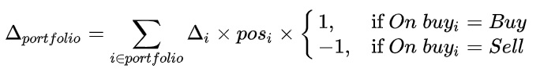

# 8. **C++**

## **8.1 Редактор формул**

Редактировать формулы на C++ вы можете во вкладке `Formulas`, которая находится в дереве по пути:

1. Portfolios -> "Название портфеля" -> Formulas;
2. Portfolios -> "Название портфеля" -> "Название инструмента" -> Formulas.

В первом случае будут отображены поля Trade formula](/docs/05-params-description.html#_5-2-32-trade-formula), [Extra field#1](/docs/05-params-description.html#_5-2-34-extra-field-1-%D0%B8-extra-field-2) и [Extra field#2](/docs/05-params-description.html#_5-2-34-extra-field-1-%D0%B8-extra-field-2).
Во втором [Count formula](/docs/05-params-description.html#_5-3-9-count-formula), [Ratio buy formula](/docs/05-params-description.html#_5-3-28-ratio-buy-formula), [Ratio sell formula](/docs/05-params-description.html#_5-3-29-ratio-sell-formula).

В редакторе формул существует возможность тестового выполнения выбранной формулы (кнопка `Test`), при этом на момент вычисления формулы создаётся временная копия портфеля, НО если вы в формуле изменяете значения полей портфеля, и у вас существует портфель с тем же именем, то изменения применятся к этому порфтелю.

## **8.2 Важно**

При написании формул на языке программирования C++ на код накладываются некоторые ограничения:

- Вы пишете только тело соответствующих функций, все функции должны возвращать значение типа `double`;
- Запрещено использование некоторых символов и слов: `\001`, `#nl`, `#tab`;
- Вы можете получить доступ к любому портфелю робота, к инструменту портфеля робота, а также к инструменту биржи, который фигурирует хотя бы в одном из ваших порфтелей;
- Вы можете изменять значения некоторых полей порфтелей и инструментов портфелей. При изменении занчений каких-то полей, вы можете "сломать" работу штатного алгоритма робота, имейте это в виду. В связи с этим для экстренного отключения торговли и выключения всех расчётов по формулам в меню действий с портфелями предусмотрен пункт `Stop formulas`;
- Портфель (структура `portfolio`) содержит методы `data()` и `extra()` которые позволяют получить доступ к словарям, в которые можно сохранять данные между вызовами формул.

**Важно:** если значение поля какой-либо бумаги еще не было получено с биржи или для бумаги с данной биржи нельзя получить значение этого поля, то вы получите 0. Нужно понимать что, например, на пустом стакане вы можете получить 0 в качестве цены бида или оффера, поэтому всегда проверяйте значения на равенство нулю в тех ситуациях, где это критично (например, при делении или при нахождении среднего арифметического бида и оффера).

**Важно:** рекомендуется пользоваться именно даннйо версией `API` формул, т.к. она дает больше возможностей и быстрее работает.

## **8.3. Доступ к биржевым данным по финансовым инструментам**

| Функция                                                 | Описание                                                                                                                    |
|---------------------------------------------------------|-----------------------------------------------------------------------------------------------------------------------------|
| struct security get_security(const std::string& s)      | получить инструмент по его [SecKey](/docs/05-params-description.html#_5-3-1-seckey) s |
| struct security get_security(const char* s)             | получить инструмент по его [SecKey](/docs/05-params-description.html#_5-3-1-seckey) s |
| struct security get_security()                          | получить инструмент, соответствующий главной бумаге текущего портфеля                                                       |
| struct security get_security(const security_fields& sf) | получить инструмент, соответствующий заданной бумаге портфеля                                                               |

Методы `security`:

| Метод                           | Описание                                         |
|---------------------------------|--------------------------------------------------|
| double theor_price()            | расчетная цена, есть только для опционов         |
| double yield_sell()             | доходность, рассчитанная по офферу               |
| double yield_buy()              | доходность, рассчитанная по биду                 |
| double bid()                    | лучшая цена на покупку                           |
| double offer()                  | лучшая цена на продажу                           |
| double exp_date()               | дата экспирации, в формате epoch                 |
| double strike()                 | цена страйк, есть только у опционов              |
| ~~long long offer_depth()~~     | объем оффера в лотах (устарел, используйте [amount_offer](#__amount_offer__))|
| ~~long long bid_depth()~~       | объем бида в лотах (устарел, используйте [amount_bid](#__amount_bid__))|
| <a name="__amount_offer__"/>long long amount_offer()        | объем оффера в лотах                             |
| <a name="__amount_bid__"/>long long amount_bid()          | объем бида в лотах                               |
| double limit_up()               | разрешенный верхний лимит цены                   |
| double limit_down()             | разрешенный нижний лимит цены                    |
| int trading_status()            | статус торгуемости бумаги на бирже (битовая маска, возможные взведенные биты [TRADING_CAN_PLACE](#__TRADING_CAN_PLACE__) и [TRADING_CAN_CANCEL](#__TRADING_CAN_CANCEL__), [пример](#__sec_status_check__)) |
| int conn_online()               | стауст активности маркет-дата подключения в роботе (битовая маска, возможные взведенные биты [MARKET_DATA_BESTS_ONLINE](#__MARKET_DATA_BESTS_ONLINE__) и [MARKET_DATA_OB_ONLINE](#__MARKET_DATA_OB_ONLINE__), [пример](#__sec_status_check__)) |
| double min_step()               | минимальный шаг цены                             |
| double lot_round()              | количество ценных бумаг в одном стандартном лоте |
| double funding_rate()           | ставка фондирования                              |
| long long funding_time()        | время следующего фондирования в формате epoch    |
| const spb_commons& spb_common() | структура с полями, описанными ниже              |
| order_book orderbook()          | структура с методами, описанными ниже            |

Поля `spb_commons` (названия и описания взяты из документации [СПб биржи](https://ftp.spbexchange.ru/TS/DOCS/MDbinary.pdf)):

| Название                 | Тип       | Описание                                              |
|--------------------------|-----------|-------------------------------------------------------|
| price_last               | double    | цена последней сделки                                 |
| price_open               | double    | цена первой сделки за сессию                          |
| price_close              | double    | официальная цена закрытия                             |
| price_high               | double    | сделка с максимальной ценой                           |
| price_low                | double    | сделка с минимальной ценой                            |
| price_auction_close_prev | double    | цена аукциона закрытия предыдущего дня                |
| price_halt               | double    | цена для определения приостановок                     |
| price_official_min_time  | long long | время последнего изменения минимальной текущей цены   |
| price_indicative         | double    | текущая цена рынка                                    |
| price_close_prev         | double    | официальная цена закрытия предыдущего дня             |
| price_official           | double    | официальная цена онлайн (текущая цена)                |
| price_vwap_day_prev      | double    | средневзвешенная цена основной сессии предыдущего дня |
| price_vwap_day           | double    | средневзвешенная цена основной сессии текущего дня    |
| price_current            | double    | текущая котировка                                     |
| price_average            | double    | средневзвешенная цена                                 |
| time_last                | long long | время последней сделки                                |
| price_prev_period_close  | double    | цена последней сделки предыдущего дня                 |

[_Пример:_ НЕОБХОДИМА ЯКОРНАЯ ССЫЛКА!]() доступа к полям структуры `spb_commons`.

Методы `order_book`:

| Метод                  | Описание                                                                                                                                                         |
|------------------------|------------------------------------------------------------------------------------------------------------------------------------------------------------------|
| bool is_available()    | доступен ли в данный момент для данной бумаги стакан                                                                                                             |
| bool has_next_bid()    | есть ли еще бид в списке бидов                                                                                                                                   |
| bool has_next_offer()  | есть ли еще оффер в списке офферов                                                                                                                               |
| std::pair next_bid()   | получить текущий бид в формате пара: цена + объем (если его нет, вы получите исключение std::out_of_range) и передвинуть указатель на следующий бид в списке     |
| std::pair next_offer() | получить текущий оффер в формате пара: цена + объем (если его нет, вы получите исключение std::out_of_range) и передвинуть указатель на следующий оффер в списке |

По своей сути `order_book` является итератором сразу для двух списков: бидов и офферов, оба списка проходятся в порядке от лучшей цены в сторону худших. Вы можете получить только следующую цену в списке, если нужно вернуться к предыдущей - сохраняйте ее или получите `order_book` заново.

[_Пример:_ НЕОБХОДИМА ЯКОРНАЯ ССЫЛКА!]() использования методов структуры `order_book`.

## **8.4. Доступ и изменение полей инструмента портфеля**

| Функция                                                                                | Описание                                                  |
|----------------------------------------------------------------------------------------|-----------------------------------------------------------|
| struct security_fields get_security_fields(const std::string& p, const std::string& s) | получить бумагу портфеля с именем p с [SecKey 5.3.1.](/docs/05-params-description.html#_5-3-1-seckey) s |
| struct security_fields get_security_fields()                                           | получить главную бумагу текущего портфеля                 |
| struct security_fields get_security_fields(const std::string& s)                       | получить бумагу текущего портфеля с [SecKey 5.3.1.](/docs/05-params-description.html#_5-3-1-seckey) s   |

Методы `security_fields`:

| Метод                                  | Описание                                                          |
|----------------------------------------|-------------------------------------------------------------------|
| order_pool orders()                    | получить пул заявок                                               |
| long long sec_type()                   | получить "Exchange" инструмента портфеля                          |
| std::string sec_key()                  | получить "SecKey" инструмента портфеля                            |
| int put()                              | получить "Put" инструмента портфеля                               |
| long long pos()                        | получить "Curpos" инструмента портфеля                            |
| long long count()                      | получить "Count" инструмента портфеля                             |
| int depth_ob()                         | получить "Depth OB" инструмента портфеля                          |
| int ob_c_p_t()                         | получить "Calc price OB" инструмента портфеля                     |
| int ob_t_p_t()                         | получить "Trading price OB" инструмента портфеля                  |
| int decimals()                         | получить "Decimals" инструмента портфеля                          |
| double d_pg()                          | получить "date pagination" инструмента портфеля                   |
| std::string client_code()              | получить "Client code" инструмента портфеля                       |
| bool is_first()                        | получить "Is first" инструмента портфеля                          |
| int on_buy()                           | получить "On buy" инструмента портфеля                            |
| int leverage()                         | получить "Leverage" инструмента портфеля                          |
| std::string sec_board()                | получить "SecBoard" инструмента портфеля                          |
| std::string sec_code()                 | получить "SecCode" инструмента портфеля                           |
| int count_type()                       | получить "Count type" инструмента портфеля                        |
| double k()                             | получить "k" инструмента портфеля                                 |
| bool sle()                             | получить "SLE" инструмента портфеля                               |
| double sl()                            | получить "SL" инструмента портфеля                                |
| double tp()                            | получить "TP" инструмента портфеля                                |
| double k_sl()                          | получить "k_sl" инструмента портфеля                              |
| bool te()                              | получить "TE" инструмента портфеля                                |
| int timer()                            | получить "Timer" инструмента портфеля                             |
| int ratio_sign()                       | получить "Ratio sign" инструмента портфеля                        |
| int ratio_type()                       | получить "Ratio type" инструмента портфеля                        |
| double percent_of_quantity()           | получить "Percent of quantity" инструмента портфеля               |
| double fin_res_mult()                  | получить "Fin res multiplier" инструмента портфеля                |
| int comission_sign()                   | получить "Commission type" инструмента портфеля                   |
| double comission()                     | получить "Commission" инструмента портфеля                        |
| bool mm()                              | получить "MM" инструмента портфеля                                |
| bool maker()                           | получить "Only maker" инструмента портфеля                        |
| bool move_limits()                     | получить "FUT move limits" инструмента портфеля                   |
| bool move_limits1()                    | получить "SPOT move limits" инструмента портфеля                  |
| int depth_ob()                         | получить "Depth OB" инструмента портфеля                          |
| int ob_c_p_t()                         | получить "Calc price OB" инструмента портфеля                     |
| int ob_t_p_t()                         | получить "Trading price OB" инструмента портфеля                  |
| double mc_level_to0()                  | получить "Level to0" инструмента портфеля                         |
| double mc_level_close()                | получить "Level close" инструмента портфеля                       |
| long long max_trans_musec()            | получить "Max trans time" инструмента портфеля                    |
| long long ban_period()                 | получить "Ban period" инструмента портфеля                        |
| void set_count(long long v)            | изменить "Count" инструмента портфеля на значение v               |
| void set_depth_ob(int v)               | изменить "Depth OB" инструмента портфеля на значение v            |
| void set_ob_c_p_t(int v)               | изменить "Calc price OB" инструмента портфеля на значение v       |
| void set_ob_t_p_t(int v)               | изменить "Trading price OB" инструмента портфеля на значение v    |
| void set_decimals(int v)               | изменить "Decimals" инструмента портфеля на значение v            |
| void set_client_code(std::string v)    | изменить "Client code" инструмента портфеля на значение v         |
| void set_on_buy(int v)                 | изменить "On buy" инструмента портфеля на значение v              |
| void set_leverage(int v)               | изменить "Leverage" инструмента портфеля на значение v            |
| void set_count_type(int v)             | изменить "Count type" инструмента портфеля на значение v          |
| void set_k(double v)                   | изменить "k" инструмента портфеля на значение v                   |
| void set_sle(bool v)                   | изменить "SLE" инструмента портфеля на значение v                 |
| void set_sl(double v)                  | изменить "SL" инструмента портфеля на значение v                  |
| void set_tp(double v)                  | изменить "TP" инструмента портфеля на значение v                  |
| void set_k_sl(double v)                | изменить "k_sl" инструмента портфеля на значение v                |
| void set_te(bool v)                    | изменить "TE" инструмента портфеля на значение v                  |
| void set_timer(int v)                  | изменить "Timer" инструмента портфеля на значение v               |
| void set_ratio_sign(int v)             | изменить "Ratio sign" инструмента портфеля на значение v          |
| void set_ratio_type(int v)             | изменить "Ratio type" инструмента портфеля на значение v          |
| void set_percent_of_quantity(double v) | изменить "Percent of quantity" инструмента портфеля на значение v |
| void set_fin_res_mult(double v)        | изменить "Fin res multiplier" инструмента портфеля на значение v  |
| void set_comission_sign(int v)         | изменить "Commission type" инструмента портфеля на значение v     |
| void set_comission(double v)           | изменить "Commission" инструмента портфеля на значение v          |
| void set_mm(bool v)                    | изменить "MM" инструмента портфеля на значение v                  |
| void set_maker(bool v)                 | изменить "Only maker" инструмента портфеля на значение v          |
| void set_move_limits(bool v)           | изменить "FUT move limits" инструмента портфеля на значение v     |
| void set_move_limits1(bool v)          | изменить "SPOT move limits" инструмента портфеля на значение v    |
| void set_depth_ob(int v)               | изменить "Depth OB" инструмента портфеля на значение v            |
| void set_ob_c_p_t(int v)               | изменить "Calc price OB" инструмента портфеля на значение v       |
| void set_ob_t_p_t(int v)               | изменить "Trading price OB" инструмента портфеля на значение v    |
| void set_mc_level_to0(double v)        | изменить "Level to0" инструмента портфеля на значение v           |
| void set_mc_level_close(double v)      | изменить "Level close" инструмента портфеля на значение v         |
| void set_max_trans_musec(long long v)  | изменить "Max trans time" инструмента портфеля на значение v      |
| void set_ban_period(long long v)       | изменить "Ban period" инструмента портфеля на значение v          |

Методы `order_pool`:

| Метод             | Описание                                                                                                                             |
|-------------------|--------------------------------------------------------------------------------------------------------------------------------------|
| bool has_next()   | есть ли еще заявка в списке заявок                                                                                                   |
| order_item next() | получить текущую заявку (если ее нет, вы получите исключение std::out_of_range) и передвинуть указатель на следующую заявку в списке |

По своей сути `order_pool` является итератором для списка заявок бумаги портфеля робота. Вы можете получить только следующую заявку в списке, если нужно вернуться к предыдущей - сохраняйте ее или получите `order_pool` заново.

Поля `order_item`:

| Название    | Тип       | Описание    |
|-------------|-----------|-------------|
| price       | double    | цена        |
| amount      | long long | количество  |
| amount_rest | long long | остаток     |
| dir         | int       | направление |
| status      | int       | статус      |

`order_item` является заявкой робота, возможные значения полей `dir` и `status` описаны в константах.

[_Пример:_ НЕОБХОДИМА ЯКОРНАЯ ССЫЛКА!]() использования структур `order_pool` и `order_item`

## **8.5. Доступ и изменение полей портфеля**

| Функция                                              | Описание                     |
|------------------------------------------------------|------------------------------|
| struct portfolio get_portfolio(const std::string& p) | получить портфель c именем p |
| struct portfolio get_portfolio()                     | получить текущий портфель    |

Методы `portfolio`:

| Метод                                                       | Описание                                                                                                 |
|-------------------------------------------------------------|----------------------------------------------------------------------------------------------------------|
| deal_item deal(const std::string& s)                        | получить сделку по бумаге c SecKey s (доступно только в Trade formula, т.е. на момент совершения сделки) |
| struct security_fields security_field(const std::string& s) | получить бумагу данного портфеля с SecKey s                                                              |
| struct security_fields security_field()                     | получить главную бумагу текущего портфеля                                                                |
| std::map<std::string, double>& data()                       | словарь для сохранения пользовательских значений, НЕ будет сохранен при выключении робота                |
| dict_double& extra()                                        | объект для сохранения пользовательских значений, будет сохранен при выключении робота                    |
| std::string name()                                          | получить "Name" портфеля                                                                                 |
| int decimals()                                              | получить "Decimals" портфеля                                                                             |
| bool tt_only_stop()                                         | получить "Timetable only stop" портфеля                                                                  |
| std::string comment()                                       | получить "Comment" портфеля                                                                              |
| bool re_sell()                                              | получить "re_sell" портфеля                                                                              |
| bool re_buy()                                               | получить "re_buy" портфеля                                                                               |
| bool use_tt()                                               | получить "Use timetable" портфеля                                                                        |
| int portfolio_type()                                        | получить "Type" портфеля                                                                                 |
| long long v_in_l()                                          | получить "v_in_left" портфеля                                                                            |
| long long v_in_r()                                          | получить "v_in_right" портфеля                                                                           |
| long long v_out_l()                                         | получить "v_out_left" портфеля                                                                           |
| long long v_out_r()                                         | получить "v_out_right" портфеля                                                                          |
| long long v_min()                                           | получить "v_min" портфеля                                                                                |
| long long v_max()                                           | получить "v_max" портфеля                                                                                |
| double k()                                                  | получить "K" портфеля                                                                                    |
| double k1()                                                 | получить "K1" портфеля                                                                                   |
| double k2()                                                 | получить "K2" портфеля                                                                                   |
| double tp()                                                 | получить "TP" портфеля                                                                                   |
| bool equal_prices()                                         | получить "Equal prices" портфеля                                                                         |
| bool always_limits_timer()                                  | получить "Always timer" портфеля                                                                         |
| double lim_s()                                              | получить "Lim_Sell" портфеля                                                                             |
| double lim_b()                                              | получить "Lim_Buy" портфеля                                                                              |
| double delta()                                              | получить "Delta" портфеля                                                                                |
| double first_delta()                                        | получить "First delta" портфеля                                                                          |
| long long mkt_volume()                                      | получить "Market volume" портфеля                                                                        |
| int type_trade()                                            | получить "Type trade" портфеля                                                                           |
| int price_type()                                            | получить "Type price" портфеля                                                                           |
| bool simply_first()                                         | получить "Simply first" портфеля                                                                         |
| bool quote()                                                | получить "Quote" портфеля                                                                                |
| double percent()                                            | получить "Percent" портфеля                                                                              |
| int timer()                                                 | получить "Limits timer" портфеля                                                                         |
| bool to0()                                                  | получить "To0" портфеля                                                                                  |
| bool virtual_0_pos()                                        | получить "Virt 0 pos" портфеля                                                                           |
| double opened()                                             | получить "Opened" портфеля                                                                               |
| double opened_comission()                                   | получить "Commission sum" портфеля                                                                       |
| double fin_res_wo_c()                                       | получить "Fin res wo C" портфеля                                                                         |
| double fin_res()                                            | получить "Fin res" портфеля                                                                              |
| long long pos()                                             | получить "Pos" портфеля                                                                                  |
| int n_perc_fill()                                           | получить "n_perc_fill" портфеля                                                                          |
| int max_not_hedged()                                        | получить "Max not hedged" портфеля                                                                       |
| double return_first()                                       | получить "Return first" портфеля                                                                         |
| double price_check()                                        | получить "Price check" портфеля                                                                          |
| int hedge_after()                                           | получить "Hedge (sec)" портфеля                                                                          |
| long long overlay()                                         | получить "Overlay" портфеля                                                                              |
| double ext_field1()                                         | получить "Extra field#1" портфеля                                                                        |
| double ext_field2()                                         | получить "Extra field#2" портфеля                                                                        |
| double sell()                                               | получить "Sell" портфеля                                                                                 |
| double buy()                                                | получить "Buy" портфеля                                                                                  |
| double price_s()                                            | получить "Price_s" портфеля                                                                              |
| double price_b()                                            | получить "Price_b" портфеля                                                                              |
| void set_decimals(int v)                                    | изменить "Decimals" портфеля на значение v                                                               |
| void set_tt_only_stop(bool v)                               | изменить "Timetable only stop" портфеля на значение v                                                    |
| void set_comment(std::string v)                             | изменить "Comment" портфеля на значение v                                                                |
| void set_re_sell(bool v)                                    | изменить "re_sell" портфеля на значение v                                                                |
| void set_re_buy(bool v)                                     | изменить "re_buy" портфеля на значение v                                                                 |
| void set_use_tt(bool v)                                     | изменить "Use timetable" портфеля на значение v                                                          |
| void set_portfolio_type(int v)                              | изменить "Type" портфеля на значение v                                                                   |
| void set_v_in_l(long long v)                                | изменить "v_in_left" портфеля на значение v                                                              |
| void set_v_in_r(long long v)                                | изменить "v_in_right" портфеля на значение v                                                             |
| void set_v_out_l(long long v)                               | изменить "v_out_left" портфеля на значение v                                                             |
| void set_v_out_r(long long v)                               | изменить "v_out_right" портфеля на значение v                                                            |
| void set_v_min(long long v)                                 | изменить "v_min" портфеля на значение v                                                                  |
| void set_v_max(long long v)                                 | изменить "v_max" портфеля на значение v                                                                  |
| void set_k(double v)                                        | изменить "K" портфеля на значение v                                                                      |
| void set_k1(double v)                                       | изменить "K1" портфеля на значение v                                                                     |
| void set_k2(double v)                                       | изменить "K2" портфеля на значение v                                                                     |
| void set_tp(double v)                                       | изменить "TP" портфеля на значение v                                                                     |
| void set_equal_prices(bool v)                               | изменить "Equal prices" портфеля на значение v                                                           |
| void set_always_limits_timer(bool v)                        | изменить "Always timer" портфеля на значение v                                                           |
| void set_lim_s(double v)                                    | изменить "Lim_Sell" портфеля на значение v                                                               |
| void set_lim_b(double v)                                    | изменить "Lim_Buy" портфеля на значение v                                                                |
| void set_delta(double v)                                    | изменить "Delta" портфеля на значение v                                                                  |
| void set_first_delta(double v)                              | изменить "First delta" портфеля на значение v                                                            |
| void set_mkt_volume(long long v)                            | изменить "Market volume" портфеля на значение v                                                          |
| void set_type_trade(int v)                                  | изменить "Type trade" портфеля на значение v                                                             |
| void set_price_type(int v)                                  | изменить "Type price" портфеля на значение v                                                             |
| void set_simply_first(bool v)                               | изменить "Simply first" портфеля на значение v                                                           |
| void set_quote(bool v)                                      | изменить "Quote" портфеля на значение v                                                                  |
| void set_percent(double v)                                  | изменить "Percent" портфеля на значение v                                                                |
| void set_timer(int v)                                       | изменить "Limits timer" портфеля на значение v                                                           |
| void set_to0(bool v)                                        | изменить "To0" портфеля на значение v                                                                    |
| void set_virtual_0_pos(bool v)                              | изменить "Virt 0 pos" портфеля на значение v                                                             |
| void set_opened(double v)                                   | изменить "Opened" портфеля на значение v                                                                 |
| void set_opened_comission(double v)                         | изменить "Commission sum" портфеля на значение v                                                         |
| void set_fin_res_wo_c(double v)                             | изменить "Fin res wo C" портфеля на значение v                                                           |
| void set_fin_res(double v)                                  | изменить "Fin res" портфеля на значение v                                                                |
| void set_n_perc_fill(int v)                                 | изменить "n_perc_fill" портфеля на значение v                                                            |
| void set_max_not_hedged(int v)                              | изменить "Max not hedged" портфеля на значение v                                                         |
| void set_return_first(double v)                             | изменить "Return first" портфеля на значение v                                                           |
| void set_price_check(double v)                              | изменить "Price check" портфеля на значение v                                                            |
| void set_hedge_after(int v)                                 | изменить "Hedge (sec)" портфеля на значение v                                                            |
| void set_overlay(long long v)                               | изменить "Overlay" портфеля на значение v                                                                |

Поля `deal_item`:

| Название | Тип       | Описание                                     |
|----------|-----------|----------------------------------------------|
| price    | double    | средневзвешенная цена сделки                 |
| amount   | long long | суммарный объем сделки в лотах               |
| dir      | int       | направление сделки: 1 - покупка, 2 - продажа |

Методы `dict_double`:

| Метод                       | Описание                                                                  |
|-----------------------------|---------------------------------------------------------------------------|
| double& operator[](int key) | получить/изменить значение по ключу (ключ - это число из отрезка [0, 29]) |
| void erase(int key)         | удалить значение по ключу                                                 |
| bool has(int key)           | проверить наличие значение по ключу                                       |
| std::string to_string()     | строковое представление объекта                                           |

## **8.6. Доступ и изменение позиций транзакционного подключения**

| Функция                                                | Описание                        |
|--------------------------------------------------------|---------------------------------|
| struct connection get_connection(const std::string& c) | получить подключение c именем c |

Методы `connection`:

| Метод                               | Описание                                                                                                                               |
|-------------------------------------|----------------------------------------------------------------------------------------------------------------------------------------|
| sec_item sec(const std::string& s)  | получить информацию о позиции инструмена на бирже (в качестве s необходимо использовать SecBoard из Параметры позиций по инструментам) |
| coin_item sec(const std::string& s) | получить информацию о балансе валюты на бирже (в качестве s необходимо использовать Currency из Параметры позиций по валютам)          |
| bool is_active()                    | получить информацию о том подключено ли подключение к бирже                                                                            |

Meтоды `sec_item`:

| Метод                         | Описание                                   |
|-------------------------------|--------------------------------------------|
| long long pos()               | получить поле "Pos" инструмента            |
| long long robot_pos()         | получить поле "Robot pos" инструмента      |
| double mark_price()           | получить поле "Mark. price" инструмента    |
| double liq_price()            | получить поле "Liq. price" инструмента     |
| long long pos_lag()           | получить поле "Pos lag" инструмента        |
| bool pos_eq()                 | получить поле "Check equality" инструмента |
| bool tgr()                    | получить поле "Tgr notify" инструмента     |
| void set_pos_lag(long long v) | изменить поле "Pos lag" инструмента        |
| void set_pos_eq(bool v)       | изменить поле "Check equality" инструмента |
| void set_tgr(bool v)          | изменить поле "Tgr notify" инструмента     |

Meтоды `coin_item`:

| Метод                      | Описание                                 |
|----------------------------|------------------------------------------|
| double pos()               | получить поле "Pos" (или "Limit") валюты |
| double robot_pos()         | получить поле "Robot pos" валюты         |
| double pos_lag()           | получить поле "Pos lag" валюты           |
| bool pos_eq()              | получить поле "Check equality" валюты    |
| bool tgr()                 | получить поле "Tgr notify" валюты        |
| void set_pos_lag(double v) | изменить поле "Pos lag" валюты           |
| void set_pos_eq(bool v)    | изменить поле "Check equality" валюты    |
| void set_tgr(bool v)       | изменить поле "Tgr notify" валюты        |

## **8.7. Дополнительные функции и константы**

### **8.7.1. Константы**

| Название       | Тип         | Значение/описание                                |
|----------------|-------------|--------------------------------------------------|
| BUY            | int         | 1, направление торговли - покупка                |
| SELL           | int         | 2, направление торговли - продажа                |
| FREE           | int         | 0, заявка не активна                             |
| ADDING         | int         | 1, заявка отправлена на биржу                    |
| RUNNING        | int         | 2, получен ответ о том, что заявка выставлена    |
| DELETING       | int         | 4, снятие заявки отправлено на биржу             |
| FIRST_DELETING | int         | 5, снятие котируемой заявки отправлено на биржу  |
| SL_DELETING    | int         | 6, снятие заявки по стопу отправлено на биржу    |
| MOVING         | int         | 7, запрос на изменение заявки отправлен на биржу |
| ADD_ERROR      | int         | 99, ошибка выставления заявки                    |
| TRADING_HALT   | int         | 0, выставления и снятие заявок запрещены         |
| <a name="__TRADING_CAN_PLACE__"/>TRADING_CAN_PLACE | int         | 1, разрешено выставления заявок               |
| <a name="__TRADING_CAN_CANCEL__"/>TRADING_CAN_CANCEL | int         | 2, разрешено снятие заявок                   |
| MARKET_DATA_OFFLINE   | int         | 0, маркет-дата подключение для данной бумаги оффлайн |
| <a name="__MARKET_DATA_BESTS_ONLINE__"/>MARKET_DATA_BESTS_ONLINE | int         | 1, для данной бумаги маркет-дата подключение с лучшими ценами на покупку/продажу онлайн|
| <a name="__MARKET_DATA_OB_ONLINE__"/>MARKET_DATA_OB_ONLINE | int         | 2, для данной бумаги маркет-дата подключение со стаканами онлайн |
| NAME           | std::string | имя текущего портфеля                            |

### **8.7.2. Функции**

| Функция                                | Описание                                      |
|----------------------------------------|-----------------------------------------------|
| long long nanosec_date_time()          | получить текущее время в epoch в наносекундах |
| struct tm global_tm()                  | получить текущее время                        |
| void log_info(const std::string& msg)  | отправить сообщение с уровнем INFO в лог      |
| void log_warn(const std::string& msg)  | отправить сообщение с уровнем WARNING в лог   |
| void log_error(const std::string& msg) | отправить сообщение с уровнем ERROR в лог     |

### **8.7.3. Функции для работы с опционами**

| delta()  | gamma()  | vega()   |
|----------|----------|----------|
| theta()  | iv()     | price()  |
| c()      | p()      | cdelta() |
| pdelta() | cgamma() | pgamma() |
| cvega()  | pvega()  | ctheta() |
| ptheta() | civ()    | piv()    |

**double S_delta(const std::string& s, double rate = 0) double P_delta(const std::string& p, double rate = 0)**  
вычисляет дельту финансового инструмента или портфеля со ставкой рефинансирования `rate` (указывается в процентах)

**double S_gamma(const std::string& s, double rate = 0) double P_gamma(const std::string& p, double rate = 0)**  
вычисляет гамму финансового инструмента или портфеля со ставкой рефинансирования `rate` (указывается в процентах)

**double S_vega(const std::string& s, double rate = 0) double P_vega(const std::string& p, double rate = 0)**  
вычисляет вегу финансового инструмента или портфеля со ставкой рефинансирования `rate` (указывается в процентах)

**double S_theta(const std::string& s, double rate = 0) double P_theta(const std::string& p, double rate = 0)**  
вычисляет тету финансового инструмента или портфеля со ставкой рефинансирования `rate` (указывается в процентах)

**double S_iv(const std::string& key, double rate = 0) double P_iv(const std::string& p, double rate = 0)**  
вычисляет ожидаемую волатильность опциона или портфеля со ставкой рефинансирования `rate` (указывается в процентах)

**double S_price(const std::string& s, double rate = 0)**  
вычисляет справедливую цену опциона со ставкой рефинансирования `rate` (указывается в процентах)

**double C(double futPrice, double strike, double expDate, double iv, double rate=0)**  
вычисляет справедливую цену опциона `call`

Аргументы:

| Название | Описание                                |
|----------|-----------------------------------------|
| s        | ключ инструмента SecKey                 |
| p        | имя портфеля                            |
| futPrice | цена базового актива                    |
| strike   | цена страйк опциона                     |
| expData  | дата экспирации опциона в формате epoch |
| iv       | ожидаемая волатильность                 |
| rate     | ставка рефинансирования в процентах     |

**double P(double futPrice, double strike, double expDate, double iv, double rate=0)**  
вычисляет справедливую цену опциона `put`, аргументы такие же, как для C()

**double CDELTA(double futPrice, double strike, double expDate, double iv, double rate=0)**  
вычисляет дельту опциона `call`, аргументы такие же, как для C()

**double PDELTA(double futPrice, double strike, double expDate, double iv, double rate=0)**
вычисляет дельту опциона `put`, аргументы такие же, как для C()

**double CGAMMMA(double futPrice, double strike, double expDate, double iv, double rate=0)**  
вычисляет гамму опциона `call`, аргументы такие же, как для C()

**double PGAMMA(double futPrice, double strike, double expDate, double iv, double rate=0)**  
вычисляет гамму опциона `put`, аргументы такие же, как для C()

**double CVEGA(double futPrice, double strike, double expDate, double iv, double rate=0)**  
вычисляет вегу опциона `call`, аргументы такие же, как для C()

**double PVEGA(double futPrice, double strike, double expDate, double iv, double rate=0)**  
вычисляет вегу опциона `put`, аргументы такие же, как для C()

**double CTHETA(double futPrice, double strike, double expDate, double iv, double rate=0)**  
вычисляет тету опциона `call`, аргументы такие же, как для C()

**double PTHETA(double futPrice, double strike, double expDate, double iv, double rate=0)**  
вычисляет тету опциона `put`, аргументы такие же, как для C()

**double CIV(double futPrice, double strike, double expDate, double call, double rate=0)**  
вычисляет implied volatility опциона `call`

**double PIV(double futPrice, double strike, double expDate, double put, double rate=0)**  
вычисляет implied volatility опциона `put`

Аргументы:

| Название | Описание                                |
|----------|-----------------------------------------|
| futPrice | цена базового актива                    |
| strike   | цена страйк опциона                     |
| expData  | дата экспирации опциона в формате epoch |
| call/put | цена опциона                            |
| rate     | ставка рефинансирования в процентах     |

## **8.8. Примеры доступа к параметрам портфеля, инструмента, сделки, позиций**

Пусть имеется портфель с именем "si" и в этом портфеле есть один инструмент - фьючерс на доллар "SiH6". Для того, чтобы получить, например, бид и объем бида по бумаге портфеля и сложить эти значения в переменные, надо написать следующий код:

```C
security s = get_security();
double bid = s.bid();
long long amount_bid = s.amount_bid();
```

___

Чтобы получить, например, позицию и сигнал на покупку портфеля надо написать:

```C
portfolio p = get_portfolio();
double lim_buy = p.lim_b();
long long pos = p.pos();
```

___

<a name="__sec_status_check__"/>Чтобы проверить, например, что в данный момент по инструменту можно выставлять заявки и в роботе есть активное подключение, получающее стаканы:

```C
security s = get_security();
if ((s.trading_status() & TRADING_CAN_PLACE) && (s.conn_online() & MARKET_DATA_OB_ONLINE))
{
    // TODO place your code here
}
```

___

Позицию портфеля можно посчитать самому, разделив позицию главной бумаги портфеля на ее вес в портфеле, вот так:

```C
security_fields sf = get_security_fields();
long long pos = sf.pos() / sf.count();
```

___

Для подсчета раздвижки по сделкам портфеля можно использовать формулу:

```C
portfolio p = get_portfolio();
return p.deal("SiH6").price;
```

___

Сохранить и загрузить значение из data можно так:

```C
portfolio p = get_portfolio("si");
p.data()["key"] = 10;
double p = p.data()["key"];
```

___

Сохранить и загрузить значение из extra можно так:

```C
portfolio p = get_portfolio("si");
p.extra()[0] = 10;
double p = p.extra()[0];
```

___

Чтобы получить, например, цену последней сделки для бумаги с СПб биржи (получение цены последней сделки по ключу возможно только для СПБ биржи):

```C
security s = get_security("SPB_AGGR_AAPL");
const spb_commons& c = s.spb_common();
double p = c.price_last;
```

___

Чтобы найти, например, средневзвешенный бид по первым 10-ти элементам стакана (настоятельно НЕ рекомендуется искать что-то по всему стакану, т.к. стакан меняется часто, то работать ваш код будет долго):

```C
double sum1 = 0, sum2 = 0, avg_bid = 0;
security s = get_security("SPB_AGGR_AAPL");
order_book ob = s.orderbook();
if (ob.is_available())
{
    
    int i = 0;
    while (i <= 10 && ob.has_next_bid())
    {

        i++;
        std::pair<double, long long> b = ob.next_bid();
        sum1 += b.first * b.second;
        sum2 += b.second;

    }
}
avg_bid = (sum2 != 0) ? (sum1 / sum2) : 0;
```

___

Чтобы найти, например, сумму объемов активных заявок портфеля по бумаге по заданной цене 100:

```C
security_fields sf = get_security_fields();
order_pool p = sf.orders();
long long amount = 0;
while (p.has_next())
{

    order_item o = p.next();
    if (o.status == RUNNING && fabs(o.price - 100) < 1e-9)
        {

        amount += o.amount_rest;

        }
}
```

___

Чтобы найти, например, текущую позицию по бумаге и текущий баланс по валюте:

```C
connection c = get_connection("okex_send_test");
coin_item ci = c.coin("BTC");
sec_item si = c.sec("isolated/BTC-USD-SWAP");
double coin_pos = ci.pos();
long long sec_pos = si.pos();
```

___

## **8.9. Примеры использования функций**

Пусть имеется портфель с именем "test" и в этом портфеле есть два инструмента: фьючерс на индекс РТС "RIH6" и его опцион call на страйк 70000 "RI70000BB6", позиция по обоим бумагам в портфеле равна 1, а направление торговли у обоих `On buy = Buy`.

Рассчитаем дельту одного из инструментов портфеля, например, "RIH6". Для этого воспользуемся функцией delta из модуля options. Дельта для фьючерса всегда равна 1, проверим, для этого надо написать:

```C
return S_delta("RIH6");
```

и выполнить этот код, в результате получим 1. Если хотим рассчитать дельту с учетом ставки рефинансирования, то укажем необязательный параметр rr, например, равный 6.25%:

```C
return P_delta("test");
```

здесь test - имя портфеля (для портфелей с другими именами нужно писать их имена). Дельта всего портфеля будет равна сумме дельт его инструментов с учетом позиции и направления торговли:



где i - i - i-ый инструмент портфеля, Δi - дельта i - го инструмента портфеля, posi - позиция i-го инструмента портфеля, On buyi - On buy i-го инструмента портфеля. Величины гамма, вега, тета и ожидаемая волатильность для портфеля рассчитываются аналогично. Функции для их рассчета вызываются аналогично примеру с дельтой. Функция price так же вызывается аналогично delta, но НЕ может быть вызвана для портфеля, может быть вызвана только для финансового инструмента.
___

Теперь рассмотрим пример использования функций, которые позволяют более "гибко" рассчитывать необходимые величины, так как им на вход можно передать более широкий набор аргументов, но эти функции работают исключительно для опционов и при использовании этих функций необходимо четко знать для опциона `call` или для опциона `put` вы хотите рассчитать значение. Например, рассчитаем ожидаемую волатильность опциона "RI70000BB6", в качестве цен опциона и базового актива возьмем их лучшие цены на покупку:

```C
security s1 = get_security("RIH6");
security s2 = get_security("RI70000BB6");
return CIV(s1.bid(), s2.strike(), s2.exp_date(), s2.bid());
```

___

## **8.10. Примеры написания Ratio buy/sell formula**

При написании формул можно использовать все те инструменты, которые используются в любом из портфелей, также можно использовать доступные значения других портфелей , например, их позиции по бумагам.

Для того, чтобы использовать поле `Ratio buy/sell formula` необходимо для выбранного инструмента портфеля выбрать `Ratio type = Ratio formula`. После этого двойным кликом войти в редактор и написать необходимое значение.

Пусть имеется портфель с именем "si" и в этом портфеле есть один инструмент - фьючерс на доллар "SiH6", направление торговли этого инструмента `On buy = Buy`.

Если `Ratio sign = "×"`, то ничего особо-то интересного с формулами не придумаешь, разве что какой-то хитрый множитель (и для покупки и для продажи), например, такой:

```C
security s = get_security("SiH6");
return sqrt(s.bid());
```

в таком случае для расчета `Buy` и `Sell` будет использован один и тот же множитель, если же вы хотите использовать разные множители надо вписать разные значения в `Ratio buy formula` и `Ratio sell formula`, например, так:

```C
security s = get_security("SiH6");
return sqrt(s.bid());
```

```C
security s = get_security("SiH6");
return sqrt(s.offer());
```

для покупки и продажи, соответственно.

В таком случае для расчета `Buy` будет использован квадратный корень из бида, а для расчета `Sell` будет использован квадратный корень из оффера.

Если же `Ratio sign = "+"`, то вы можете полностью изменить формулу расчета `Buy` и `Sell`, для этого надо для начала вычесть те значения, которые используются в данный момент, тем самым обнулив `Buy` и `Sell`:

```C
security s = get_security("SiH6");
return -s.bid();
```

```C
security s = get_security("SiH6");
return -s.offer();
```

для покупки и продажи, соответственно, а после этого прибавить к `Buy` и `Sell` новое значение, например, так:

```C
security s = get_security("SiH6");
double price = s.offer() * 3 + 5;
return -s.offer() + price;
```

и

```C
security s = get_security("SiH6");
double price = s.bid() * 3 + 5;
return -s.bid() + price;
```

теперь значения переменной `price` при расчете каждого из параметров будут новыми значениями для `Buy` и `Sell`. Хочется отметить, что без использования `Ratio formula` такое "хитрое" значение получить бы не удалось.
___

Рассмотрим еще один пример. Пусть имеется портфель с именем "test" и в этом портфеле есть два инструмента: фьючерс на доллар "SiH6", направление торговли этого инструмента `On buy = Buy` и он является [Is first](/docs/05-params-description.html#_5-3-11-is-first) и фьючерс на индекс РТС "RIH6", направление торговли этого инструмента тоже `On buy = Buy` (для примера направление не [Is first](/docs/05-params-description.html#_5-3-11-is-first) инструмента значения не имеет). Для того чтобы использовать эти два инструмента в одном портфеле нужно привести их цены в пунктах к одной размерности, как известно, доллар торгуется в рублях (1 : pt = 1 rub), а вот индекс торгуется не в рублях, для него 1 pt = 0.02 * `$`<sub>price</sub> rub (где `$`<sub>price</sub> - это курс доллара в рублях, но это не константа, а динамически изменяющаяся величина). Есть два варианта решения поставленной задачи, оба реализуемы только с использованием `Ratio formula` и оба приводят к абсолютно одинаковому результату. Вот они:

1. Для доллара просто зададим `Ratio` = 1, а вот для индекса РТС выберем `Ratio sign = "×"`, а в Ratio buy formula напишем следующее:

    ```C
    security s = get_security("SiH6");
    return (0.02 * s.offer() * 0.001);
    ```

    в `Ratio sell formula` напишем следующее:

    ```C
    security s = get_security("SiH6");
    return (0.02 * s.bid() * 0.001);
    ```

    таким образом при расчете `Buy` мы будем использовать бид доллара, а при расчете `Sell` - его оффер, и величину получим в рублях.

2. Для доллара просто зададим `Ratio` = 1, а вот для индекса РТС выберем `Ratio sign = "+"`, а в `Ratio buy formula` напишем следующее (вначале обнулим значение, как в предыдущем примере, а затем зададим новое):

    ```C
    security s1 = get_security("SiH6");
    security s2 = get_security("RIH6");
    double price = s2.offer() * 0.02 * s1.offer() * 0.001;
    return -s2.offer() + price;
    ```

    в `Ratio sell formula` напишем следующее:

    ```C
    security s1 = get_security("SiH6");
    security s2 = get_security("RIH6");
    double price = s2.bid() * 0.02 * s1.bid() * 0.001;
    return -s2.bid() + price;
    ```

    теперь значения переменной price и будут новыми значениями (так сказать, со стороны индекса РТС), используемыми для расчета `Buy` и `Sell`, соответственно.
