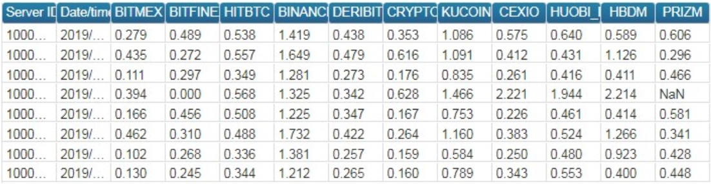

# 11. Часто задаваемые вопросы

- **Проблема с торговым подключением к бирже: робот не выставляет заявки/не видит сделки, но ситуация не позволяет остановить торговлю.**

1. Напишите письмо в поддержку с описанием проблемы;
2. Выключите торговлю по всем портфелям, торгующим через данное транзакционное подключение, убедитесь, что не осталось активных заявок;
3. [Сбросьте статусы заявок](/docs/03-getting-started.html#_3-4-3-%D1%81%D0%B1%D1%80%D0%BE%D1%81-%D1%81%D1%82%D0%B0%D1%82%D1%83%D1%81%D0%BE%D0%B2-%D0%B7%D0%B0%D1%8F%D0%B2%D0%BE%D0%BA-%D1%80%D0%BE%D0%B1%D0%BE%D1%82%D0%B0) по всем портфелям из пункта 2;
4. Преподключите проблемное транзакционное подключение;
5. Включите торговлю по портфелям из пункта 2;
6. Если в течении пары часов проблема повторится, то выключите торговлю по всем портфелям, торгующим через данное транзакционное подключение, и больше не включайте, пока не получите ответ от поддержки.

- **Торговля включается и выключается самопроизвольно. С чем это связано?**  
Скорее всего задано расписание для торговли.

- **Робот не торгует. Практически все подключения отключены. В чём может быть дело?**  
Самая вероятная причина такого поведения - истёк срок лицензии. Проверьте сколько дней осталось до окончания лицензии. Количество дней до окончания лицензии можно увидеть в строке над основной таблицей портфелей.

- **Отсутствует нужный инструмент в списке инструментов биржи. Где его взять?**  
Список бумаг в роботе обновляется каждое утро в 9:25 по Москве, чтобы выгрузить список бумаг нажмите Reload security list from exchanges. Важно: время на серверах с крипто-роботами -3 часа от Москвы. Если вы не видите какой-то бумаги в списке бумаг (при этом вы обновили список), а эта бумага уже есть на бирже, то либо дождитесь указанного выше времени и бумага добавится сама, либо переподключите дата подключение и после этого обновите список бумаг.

- **Робот ставит заявки по второй ноге в "непонятном", неправильном объеме. Как это исправить?**  
Данная ситуация может возникать после какого-либо сбоя на бирже, когда биржа не прислала необходимую информацию по заявкам робота и в роботе зависли внутренние статусы заявок. В данной ситуации необходимо остановить торговлю по проблемному портфелю, убедиться что по данному портфелю нет активных заявок в рынке и сбросить статусы заявок, нажав кнопку Reset statuses.

- **Добавил портфель, все подключения к биржам подключены, торговля включена, но заявки по первой ноге не выставляются. В чём дело?**  
При наведении на имя портфеля в списке портфелей появляется всплывающая подсказка. В ней отдельно для покупки и продажи первой ноги указывается, чего не хватает роботу для выставления заявки.
Например, строка всплывающей подсказки для продажи портфеля имеет такой вид: "sell: is signal=1, quantity=5, is valid market volume=1, is price check=0, is max not hedged=1, is orderbook valid=1". `is_signal` означает, есть ли сигнал на покупку (т.е. либо мы сейчас котируем, либо выполняется условие на 
[Sell](/docs/05-params-description.html#_5-2-39-sell-buy) и [Lim_Sell](/docs/05-params-description.html#_5-2-18-lim-sell-lim-buy)). Если сигнал есть, то 1, иначе 0. Значения всех проверок могут быть только 0 или 1, если не указано иное. `quantity` показывает заявку какого объёма мы хотим выставить, исходя из заданных параметров портфеля. Заявка будет выставлена только при положительном значении объёма. Отрицательный объём не является ошибкой, это лишь результат расчётов. `is valid market volume` указывает прошла ли проверка на одноименный параметр. `is price check` указывает прошла ли проверка на одноименный параметр. `is max not hedged` указывает на выполнение или невыполнение условия [Max not hedget](/docs/05-params-description.html#_5-2-16-max-not-hadget) для заявок по второй ноге. `is orderbook valid` отвечает за внешние признаки валидности стакана. Если стороны стакана на покупку и продажу пересекаются, то стакан не считается валидным. Таким образом, заявка выставляется только когда все значения больше нуля.

- **Добавил портфель, изменял настройки, а они не применились и портфель исчез, что происходит?**  
Проверьте, один ли Вы редактируете что-либо в роботе, возможно Ваш коллега делает тоже самое и вы мешаете друг другу.

- **Почему по несколько раз выставляется объем на одинаковой раздвижке? Параметр К у меня равен 1.**  

[Sell](/docs/05-params-description.html#_5-2-39-sell-buy) стал сильно больше [Lim_Sell](/docs/05-params-description.html#_5-2-18-lim-sell-lim-buy). И при подвижке на [K](/docs/05-params-description.html#_5-2-19-1-k) мы догоняли цену на бирже.
Пример: Вы хотите продать по 100, `К`=1. В какой то момент цена подскакивает и становится равна 105. И вы продаёте по 105, но при этом робот, по алгоритму продал по 100, затем подвинул на `К`, стал продавать по 101. Продал снова по 105, робот снова подвинул на `К`, стало 102 и снова продал по 105 и т.д.

- **Как уменьшить количество проскальзываний?**  
Увеличьте параметр [k](/docs/05-params-description.html#_5-3-12-k) (малое) для второй "ноги". Это действие уменьшит ваш `Take profit`, но увеличит вероятность хеджа.
Можете поставить второй ногой биржу с меньшим `Round trip`-ом.

- **У меня часто выскакивает ошибка REASON_FLOOD, что делать чтобы её избежать?**  
Если ошибка возникает при выставлении заявок по [Is first](/docs/05-params-description.html#_5-3-11-is-first) инструменту:
возниновение такой ошибки, означает использование режима котирования ([Quote](/docs/05-params-description.html#_5-2-6-quote)). Можно попробовать торговать не в режиме котирования, тогда транзакции будут отправляться реже. Если без режима котирования не обойтись, то стоит обратить внимание на параметры группы "Anti-spam", в частности на параметр [Delta](/docs/05-params-description.html#_5-2-12-delta).
`Delta` - это отклонение [Price_s/Price_b](/docs/05-params-description.html#_5-2-40-price-s-price-b) от цены выставленной заявки, после которого заявка переставляется, то есть отправляется транзакция. Вам необходимо выставлять её таким образом, чтобы заявка не переставлялась от малейших колебаний. То есть, например, вы торгуете BTCUSD, и его стоимость 10 000. Вы ставите [Delta](/docs/05-params-description.html#_5-2-12-delta) равным единице. Какова вероятность изменения [Price_s/Price_b](/docs/05-params-description.html#_5-2-40-price-s-price-b) на доллар в случае, когда инструмент стоит 10 000 долларов? Вероятность велика, за секунду может несколько раз измениться цена на этот доллар и каждый раз робот будет отправлять приказы на удаление старой заявки и установки новой. Так и происходит спам биржи. Если поставить [Delta](/docs/05-params-description.html#_5-2-12-delta) равным 5-10, то вероятность заспамить биржу уменьшится, так как должно произойти более весомое изменение, для отправления заявок.
Настройте параметр [Market volume](/docs/05-params-description.html#_5-2-14-market-volume). Если перед вами будет стоять большой объем, то особго смысла сейчас стоять нет и можно так же не спамить биржу переставлениями.  
**Важно:** в режиме торговли `bid/offer` данный параметр "видит" только объемы бида и оффера. Это значит, что если за ними еще стоят объемы, то робот их не увидит и будет ставить заявки. Потому используйте данный параметр преимущественно в режиме `orderbook` и `orderbook+filter`.  
Параметр [Price check](/docs/05-params-description.html#_5-2-15-price-check). Если [Price_s/Price_b](/docs/05-params-description.html#_5-2-40-price-s-price-b) отличается от `bid/offer` больше чем на [Price check](/docs/05-params-description.html#_5-2-15-price-check) шагов цены, то не выставляемся и снова не спамим биржу. Естественно чем меньше значение, тем меньше спама.
Также можно установить большой [TP](/docs/05-params-description.html#_5-3-26-tp), чтобы брать реже, но больше.  
**Если ошибка возникает при выставлении заявок по не Is first инструментам:**  
Видимо, заявку по первой ноге разбирают маленькими порциями, и после каждой такой сделки происходит выставление заявок по инструментам второй ноги. Обратите внимание на параметр [Overlay](/docs/05-params-description.html#_5-2-17-overlay), он позволяет выставлять хеджирующие заявки не после каждой сделки по первой ноге.

- **На московской бирже задержки у подключения очень большие, с чем это может быть связано и как исправить?**  
Эти задержки - индикатор загрузки биржевого шлюза в моменты бросания. Они отражают среднее время за весь день, требующееся МБ, чтобы обработать вашу заявку. Это значит, что вы часто бросаете заявки в моменты, когда торговый шлюз загружен. Задержки можно уменьшить, если работать одновременно через несколько фикс подключений к разным пром-серверам. Т.е. заказать еще дополнительно 2 фикс логина для фондового рынка к этому счету. Мы подключим их к резервным фикс серверам МБ. И объединим в группу - так называемый алгоритм бросания [Round robin](/docs/05-params-description.html#_5-3-24-client-code), который меряет `roundtrip` для "вкусных" заявок и первую заявку всегда бросает в самый быстрый коннект.

- **Сегодня на бирже были добавлены новые бумаги, но в роботе я их не вижу. Что делать?**  
Новые бумаги выгружаются рано утром и робот мог не успеть подгрузить их. Нужно переподключить дата подключение бирже. Затем обновить список бумаг и новые инструменты будут доступны.

- **Возможно ли как-то настроить робота, чтобы он перекрывал часть Is_first ноги, если по ней набрано меньше 5 контрактов? Условно 2 набрал по первой ноге, перекрыл 3 на второй ноге (При этом сохранив Count 5 к 8)?**  
Вводные данные: `Curpos`=19, `Count`=5  
По умолчанию позиция портфеля округляется вниз до целого значения `Curpos` деленный на `Count` (главная нога), соответственно и хедж будет происходить при изменении позиции портфеля.  
При n_perc_fill=0, округление по модулю вниз, т.е. |19/5=3|;  
При n_perc_fill=80:  
Предположим, позиция изменилась стала Curpos=18, целая часть от деления |18/5|=3 - не изменилась,
остаток от деления =3. (100 - n_perc_fill)=100-80=20, 20% от count (т.е. от 5) =1, 80% от count =4.  
Остаток от деления 3 находится в диапазоне между 1 и 4, значит позиция по портфелю не меняется. Pos=3.  
Таким образом видно, что позиция изменится в меньшую сторону при Curpos<=15 и в большую сторону при Curpos>=20.

- **Как настроить алерты по изменению спреда /цены базового актива?**

Алерты настраиваются у каждого портфеля отдельно в соответствующем меню или пройдя по 
[ссылке](https://bot.fkviking.com/#p=robots&r=3::portfolios::der::notifications) 
где вместо числа 3 поставbnm номер своего робота (например 9902), а вместо слова `der` имя своего портфеля.

- **в разделе Financial result, вместо дельты часто показывается цена актива который торгуется в портфеле Как это влияет на Average sell and buy?**
  
Расчеты ведутся на основании сделок за выбранный период для продаж и покупок отдельно, не на основании раздвижек (дельты). Соответственно, что пришло в Financial result (дельта или цена) не важно, это не влияет на подсчет Average sell and buy.

- **Как происходит набор арбитражной позиции (маркет лимит или маркет-маркет)?**

Допустима любая из настроек.

- **Как производится котирование на лимитной ноге если таковая имеется?**

Котируется только первая нога. Делается это лимитной заявкой (можно настроить, чтобы бид глубоко в стакан и пр.). Как только первая нога исполняется инициируется заявка на вторую ногу, тоже лимитка. (вторых ног может быть несколько). Бить в стакан можно на настраиваемую глубину (параметр [Depth OB](/docs/05-params-description.html#_5-2-32-depth-ob))

- **Сохраняется ли биллинговая информация по костам понесенным клиентом на заемное марджин-финансирование?**

Нет.

- **Сохраняется ли биллинговая информация по костам понесенным клиентом за уплату или получение своп-ставки по перпетуал-контрактам?**

Получать своп-ставку можно (настраивается в роботе), но делается это не в контексте "вот столько с нас списали/зачислили", а в контексте - "хочу знать какая текущая ставка по таким то инструментам" и дальше это можно умножать на текущую фактическую позу и дальше с этим значением что-то делать. Такие формулы можно писать в роботе, для этого есть специальное поле (подробнее, в разделе [C++](/docs/08-c-api.html#_8-c)).

- **Появляются ли дисбалансы при наборе арбитражной позиции?**

Только если биржа некорректно обрабатывает транзакции. В целом, мы отобрали только те биржи, по которым такие события происходят относительно редко. Кроме того, в роботе есть алгоритм который сравнивает текущую позу в роботе (как робот "думает" что у него куплено или продано) и позицию, которую получает из биржи, дальше можно настроить алерт для сообщения клиенту о событии.

- **Какие действия осуществляет робот при потере соединения на одной из ног?**

Зависит от того, на какой ноге и в какой момент. Если первая нога потеряла связь, портфель, в котором инструменты из биржи с потерянным соединением, перестает торговать. Если потерялась связь с второй ногой, а первая нога не успела пройти, то робот, также перестает торговать этот портфель. Если первая нога успела пройти, в этот момент вторая нога еще не встала, но успела потерять связь, то робот продолжает пытаться выставиться (рейт-лимиты конечно учитываются).

- **Поддерживаются ли Правила балансировки ног — coin/currency?**

Задается трейдером. Константами (параметр называется [Count](/docs/05-params-description.html#_5-3-8-count)), или через формулы (формулы тоже задает трейдер, см. раздел [C++](/docs/08-c-api.html#_8-c) в документации).

- **Сохраняется ли в БД или на диск история: капитал набранный на открывающем уровне и по какому спреду, капитал разгруженный на закрывающем уровне и по какому спреду?**

Сохраняется 5000 (по умолчанию) последних сделок (сделка это пара). Со всеми ценам по инструментам, временем, раздвижкой.

- **Загружается ли информация по набранным позициям после перезагрузки программы?**

Да. Программа для пользователя представляет собой кабинет трейдера на странице в браузере. Вы можете эту страницу закрыть, открыть в другом месте, одновременно с разных мест и т.д., это ни на что не влияет. Все операции происходят на наших серверах, к которым вы получаете доступ через свой кабинет при авторизации. Есть отдельная опция - запустить робота на Вашем сервере.

- **Какие системные требования?**  
Работа сайта тестировалась в браузере Google Chrome. Сайт передает большое количество данных, поэтому на компьютере рекомендуется иметь минимум 4ГБ оперативной памяти и минимум 2 ядра процессора. Также необходимо открыть доступ к сайту [bot.fkviking.com](https://bot.fkviking.com) в фаерволе.

## **11.1. Roundtrip торговых подключений**

Раундтрип заявок можно посмотреть в реальном времени для каждого торгового подключения в `Connections` робота. Нужно навести мышь на поле `Trans count` таблицы `Trade connections`.

## **11.2. Roudtrip статистикa серверов**

На всех серверах, с которых производится торговля на криптобиржах, осуществляется измерение двух значений: `Average ping speed in milliseconds:` и `Average HTTP reqest response speed in seconds:`.

`Average ping speed in milliseconds:` время из команды ping, является средним значением времени из 10 попыток. Время из пинга вынимается так:

`ping URL -c 1 | grep time= | awk -F"time=" '{print $2}' | awk '{ print $1; }'`

Данный запрос позволяет лишь судить о расстоянии от сервера до биржи, но не учитывает время обработки заявки на бирже.

`Average HTTP reqest response speed in seconds`: %{time_total} из запроса отправленного с помощью [cURL](https://ru.wikipedia.org/wiki/CURL), является средним из 10 попыток.

По сути своей показывает время, между отправкой запроса робота на получение необходимой ему информации и получением ответа от биржи.

**НЕ** нужно сравнивать одну биржу с другой по этим данным, особенно по http запросам/ответам. Данные значения позволяют судить о текущей скорости доступа к одной бирже с разных серверов.
